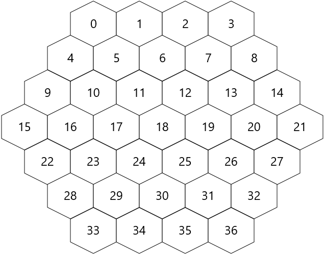

# COMP1140 Assignment 2

*This assignment is only for those enrolled in COMP1140.
COMP1110 and COMP6710 students should look [here](https://gitlab.cecs.anu.edu.au/comp1110/comp1110-ass2).*

## Academic Honesty and Integrity

Honesty and integrity are of utmost importance. These goals are *not* at odds
with being resourceful and working collaboratively. You *should* be resourceful
and you should discuss the assignment
and other aspects of the course with others taking the class. However, *you must
never misrepresent the work of others as your own*. If you have taken ideas from
elsewhere or used code sourced from elsewhere, you must say so with *utmost
clarity*. At each stage of the assignment you will be asked to submit a statement
of originality, either as a group or as individuals. This statement is the place
for you to declare which ideas or code contained in your submission were sourced
from elsewhere.

Please read the ANU's [official position](http://academichonesty.anu.edu.au/) on
academic honesty. If you have any questions, please ask me.

For each phase, you must complete a statement of originality (in the 
[admin directory](admin).
Edit the statement and update it as you complete each task, ensuring that when you 
complete each phase of the assignment, a truthful statement is committed
and pushed to your repo.

## Purpose

In this assignment you will exercise a number of major themes of the course,
including software design and implementation, using development tools such as
Git and IntelliJ, using JavaFX to build a user interface.  For COMP1140 students,
this assignment has the additional purpose of exploring strategies for writing
agents that play games *(there is a guest lecture in week four for 1140 students
that addresses this element of the assignment)*.  Above all, this assignment will
emphasize group work.

## Assignment Deliverables

The assignment is worth 25% of your total assessment, and it will be marked out
of 25. So each mark in the assignment corresponds to a mark in your final
assessment for the course. Note that for some stages of the assignment you 
will get a _group_ mark, and for others you will be _individually_ marked. The
mark breakdown and the due dates are described on the
[deliverables](https://cs.anu.edu.au/courses/comp1110/assessments/deliverables/) page.

Your work will be marked via your tutor accessing GitLab, so it is essential that
you carefully follow instructions for setting up and maintaining your group
repository. At each deadline you will be marked according to whatever is
committed to your repository at the time of the deadline. You will be assessed
on how effectively you use Git as a development tool.

## Problem Description

In this assignment, you will use Java to create a simplified version of a two-player
abstract strategy game called [Blooms](https://nickbentley.games/2018/03/14/blooms-rules/)
created by game designer [Nick Bentley](https://nickbentley.games/).
As well as Bentley's overview of the rules, there is a working implementation distributed as part of Stephen Tavener's [AiAi System](http://mrraow.com/index.php/aiai-home/).
You can use this implementation to help understand the rules and practice game play, but you may not use any part of it in your assignment submission.

#### The Board

The game is played on a [hexagonal board](https://www.redblobgames.com/grids/hexagons/) of arbitrary size.
Your version of the game must support a board with 4 cells per side, like the one shown below, or a larger board with 5 cells per side.
You may support other size boards if you wish.

Each space is numbered, starting at the top-left of the board and moving from left to right across each row,
according to the scheme shown below.

#### Rules

The following rules are taken from Nick Bentley's published [rules of Blooms](https://nickbentley.games/2018/03/14/blooms-rules/).
In case of any ambiguity, the published rules are definitive.

1. To start, Player 1 places a stone of either of her colors on any empty space.
2. From then on, starting with Player 2, the players take turns. 
  - On your turn, you must place one stone of either of your colors, or one stone of each of your colors. Alternatively, you may pass your turn.
  - You can place your stones on any empty spaces, with one restriction: you must place them such that, at the end of your turn (after you’ve captured all fenced enemy blooms – see below), none of your blooms is fenced.
  - After placing your stones, capture all fenced enemy blooms. Return the captured stones to your opponent.
3. The game ends when one player resigns or when both players pass consecutively. In the latter case, your score is the number of stones you have on the board plus the number of spaces in your territory. The player with the highest score wins. In the event of a tie, the player who passed first in the game wins.

##### Definitions

A *bloom* is a connected group of pieces of the same colour.

A bloom is *fenced* if it is completely surrounded by pieces of different colours.

If one or more empty spaces are completely surrounded by one player's pieces (of either colour), those spaces belong to the player's *territory*.

Players take it in turn to place pieces on the board so as to control territory.
On the first turn, the first player places a single piece anywhere on the board.
On subsequent turns, each player chooses to play either a single piece, or one piece of each of their colours, on empty spaces.
A piece may be placed on any empty square so long as at the end of the player's turn, the bloom of which it is a part is not fenced (by pieces of any other colour, including the player's own pieces).
After placement is complete, any of the opponent's blooms which are now fenced are removed from the board.

#### Encoding Game State

Game states are encoded as strings.  Your game will need to be able to initialize
itself using these strings and some of your tasks relate directly to these strings.
An example of such an encoded game state is given [below](#Example_Game).

##### Piece Placement String

A *piece placement string* consists of two or more characters indicating the colour of the piece and its location on the board.

* The first character identifies the colour of the piece ('a' to 'd').
* The remaining characters identify the number of the space in which the piece is placed.

##### Board String

A *board string* is encoded as a sequence of piece placement strings.
Initially, the board string is empty, and it is modified every time a player takes a turn, by adding and/or removing pieces according to the rules.
If a player skips a turn, the board string is not modified.

##### Move Sequence String

A *move sequence string* is also encoded as a sequence of piece placement strings.
Initially, the move sequence string is empty, and it is appended to every time a player takes a turn placing one or two pieces.
If a player skips a turn, or chooses not to place one of their pieces, the move sequence is appended with the special skip character '.'.
Note that, unlike the board string, the move sequence string may include piece placements representing pieces that were later captured and removed from the board.

#### Example Game

The following diagram shows an example game on a 4-cell board, after the fifth turn.
On this board, the colours are assigned as follows:
- 'a' = red
- 'b' = orange
- 'c' = green
- 'd' = blue

The following sequence shows the progression of turns that led to the board
layout above.
The move sequence string is shown for each step.

##### a6
Player 1 places a red piece ('a') on space number 6.

##### a6c35d25
Player 2 places a green piece ('c') on space 35, and a blue piece ('d') on space 25.

##### a6c35d25a18b31
Player 1 places a red piece on space 18, and an orange piece on space 31.

##### a6c35d25a18b31c24d14
Player 2 places a green piece on space 24, and a blue piece on space 14.

##### a6c35d25a18b31c24d14a19b30
Player 1 places a red piece on space 19, and an orange piece on space 30.

##### a6c35d25a18b31c24d14a19b30c12d8

Player 2 places a green piece on space 12, and a blue piece on space 8.

##### a6c35d25a18b31c24d14a19b30c12d8a17b26

Player 1 places a red piece on space 17, and an orange piece on space 26.
The blue piece on space 25 is now fenced (completely surrounded by pieces of
other colours), and is therefore removed from the board.

## Legal and Ethical Issues

First, as with any work you do, you must abide by the principles of 
[honesty and integrity](http://academichonesty.anu.edu.au). 
I expect you to demonstrate honesty and integrity in everything you do.

In addition to those ground rules, you are to follow the rules one would 
normally be subject to in a commercial setting. In particular, you may make use
of the works of others under two fundamental conditions: 
a) your use of their work must be clearly acknowledged, and 
b) your use of their work must be legal (for example, consistent with any
copyright and licensing that applies to the given material). 
*Please understand that violation of these rules is a very serious offence.*
However, as long as you abide by these rules, you are explicitly invited to
conduct research and make use of a variety of sources. 
You are also given an explicit means with which to declare your use of other
sources (via originality statements you must complete).
It is important to realize that you will be assessed on the basis of your
original contributions to the project. 
While you won't be penalized for correctly attributed use of others' ideas,
the work of others will not be considered as part of your contribution.
Therefore, these rules allow you to copy another student's work entirely if:
a) they gave you permission to do so, and
b) you acknowledged that you had done so.
Notice, however, that if you were to do this you would have no original
contribution and so would receive no marks for the assignment (but you would
not have broken any rules either).

## Evaluation Criteria

It is essential that you refer to the [deliverables page](https://cs.anu.edu.au/courses/comp1110/assessments/deliverables/) to check that you understand each of the deadlines and what is required.   Your assignment will be marked via GitLab, so all submittable materials will need to be in GitLab and in the *correct* locations, as prescribed by the [deliverables page](https://cs.anu.edu.au/courses/comp1110/assessments/deliverables/).

**The mark breakdown is described on the
[deliverables](https://cs.anu.edu.au/courses/comp1110/assessments/deliverables/) page.**

### Part One

In the first part of the assignment you will:
* Create a skeleton of your *initial* design for the final assignment (Task #2).
* Implement parts of the text interface to the game (Tasks #3, #4, #6, #7 and #8).
* Implement a simple viewer that allows you to visualise game states (Task #5).

The criteria for the [completion of part one](https://gitlab.cecs.anu.edu.au/comp1110/comp1110/wikis/deliverables#d2c-assignment-2-stage-c-2-marks-group)
is as follows:

**Pass**
* Tasks #2, #3, and #4.

**Credit**
* Tasks #5 and #6 *(in addition to all tasks required for Pass)*.

**Distinction**
* Tasks #7 and #8 *(in addition to all tasks required for Credit)*.

### Part Two

Create a fully working game, using JavaFX to implement a playable graphical
version of the game in a 933x700 window.
You will be able to play your game against another human or against the
computer.

Notice that aside from the window size, the details of exactly how the game
looks and plays are **intentionally** left up to you.
The diagrams above are for illustration purposes only.
However, you are provided with images for each of the thirty-three pieces,
which you may use.

The only **firm** requirements are that:

* you use Java and JavaFX,
* the game respects the specification of the game given here,
* the game be easy to play,
* it runs in a 933x700 window, and
* that it is executable on a standard lab machine from a jar file called `game.jar`,

Your game must successfully run from `game.jar` from within another user's (i.e.
your tutor's) account on a standard lab machine (in other words, your game must
not depend on features not self-contained within that jar file and the Java 8 
runtime).

**Pass**
* Correctly implements all of the <b>Part One</b> criteria.
* Appropriate use of Git (as demonstrated by the history of your repo).
* Completion of Task #9.
* Executable on a standard lab computer from a runnable jar file, game.jar, which resides in the root level of your group repo.

**Credit**
* _All of the Pass-level criteria, plus the following..._
* Task #10.

**Distinction**
* _All of the Credit-level criteria, plus the following..._
* Tasks #11 and #12.

**High Distinction**
* _All of the Distinction-level criteria, plus the following..._
* Task #13.
