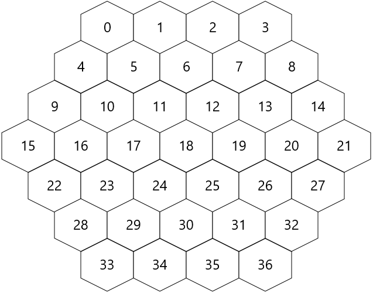
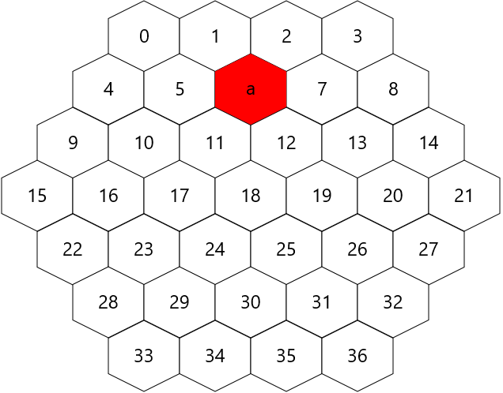
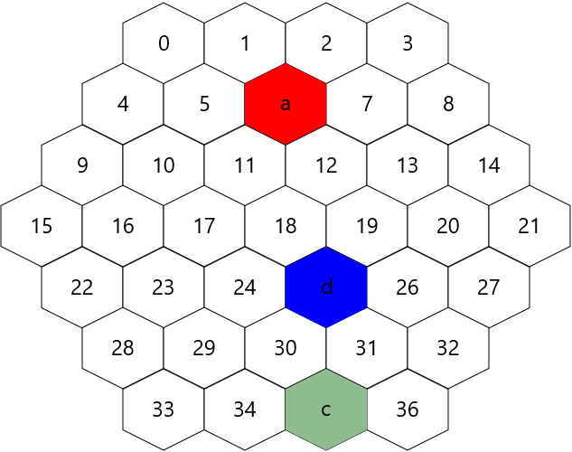
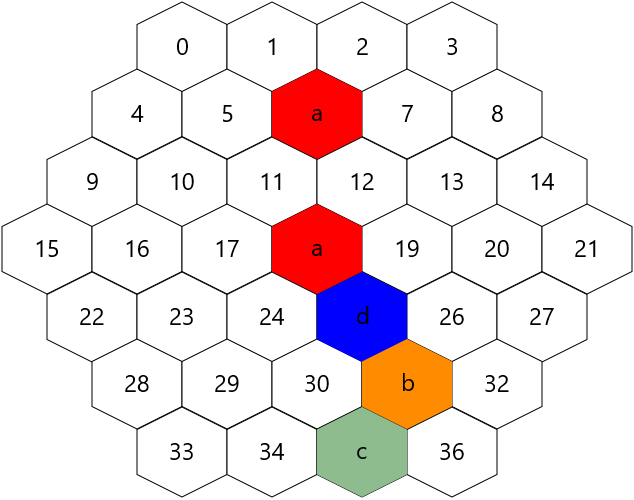
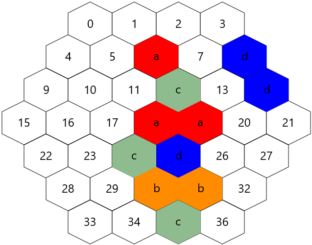

# Assignment Two Feedback

## Group members: u6683369,u6684916

## Tutor Comment
Great work guys. Very impressive work for a pair.

Good extensions (the menus were fantastic looking).

You used OOP principles well. Your git usage was good for the most part but you had a lot of commits with the commit message. It's important to use distinct descriptive messages to allow you to find your way back to a particular place.

The code was well commented for the most part and authorship details were clear. A bit more commenting in the JUnit tests would've been good though. There was a fair bit of copy-pasted code in the viewers which as I'm sure you know at this point is something you should try avoid. As you pointed out in your presentation it would've been a better design to have only one viewer class.

I found the menus somewhat laggy. Some other things which might've been nice are animations for placing pieces and having the menus all in one window instead of opening a new one whenever you click.

You edited the signatures of the tests which is something you're not supposed to do. I went through and saw that it was because you wanted to have your methods in different classes to the ones they were given to you in. The correct way to do this is to have the method in the original class just call the method from the class where you want it to be. I had to deduct one mark from you because of this. The results of the tests run on Steve's machine are the ones in the table.

## Mark

**  /11.0**

## Miscellaneous marks

| Level | Requirement | Result |
|:-:|---|:-:|
||All files correct                     | .25/.25 |
||Authorship clear for all classes      | .25/.25 |
||Appropriate use of git                | .25/.5  |
||Program runs from jar                 | .25/.25 |
|P|Appropriate use of OO features       | .5/.5  |
|P|Presentation pdf complete            | .5/.5  |
|CR|Program well designed               | .5/.5  |
|CR|Comments clear and sufficient       | .5/.5  |
|CR|Coding style good                   | .25/.5  |
|CR|Appropriate use of JUnit tests      | .5/.5  |
|D|Design and code of very high quality | 0/.25 |
|D|Demonstrates interesting extensions  | 0.25/.25 |
|D|Works well and easy to run           | 0/.25 |
|HD|Game is exceptional                 | .25/.5  |

**Total for miscellaneous marks:**  4.25/5.5

## Game marks (manual)

| Level | Requirement | Result |
|:-:|---|:-:|
|CR|Pieces snap into place           | .25/.25 |
|CR|Handle skip moves                | .25/.25 |
|CR|Only valid placements allowed    | .25/.25 |
|D |Display score                    | .25/.25 |
|D |Basic computer opponent          | .25/.25 |
|HD|Advanced computer opponent       | .5/.5  |

**Total for manual marks:** 1.75/1.75

## Test results

| Task | Test | Result | Marks |
|:-:|---|:-:|:-:|
| |Compiled|.25/.25|.25|
|3|PiecePlacementWellFormed|0/2|0|
|4|GetNeighbours|0/4|0|
|6|GetBloom|7/7|.5|
|7|IsFenced|4/4|.75|
|8|IsPlacementValid|0/5|0|
|9|GetScore|0/4|0|

**Total for tests:** 2.75/3.75
Note: all tests actually pass but one mark was deducted for changing the spec.

## Originality statements

#### Originality statement G
We declare that the work we have submitted for Stage G of this assignment and all stages before it is entirely our own work, with the following documented exceptions:


* The code in Task6 in class BloomGame is based on a solution we found when researching the problem (URL provided in source code comments)
     Task6
     - sort an Arraylist,
     url: https://stackoverflow.com/questions/16252269/how-to-sort-an-arraylist

     - concat integer arraylist to a string,
     url: https://stackoverflow.com/questions/599161/best-way-to-convert-an-arraylist-to-a-string

  The Node(Tree) structure and two methods(addChild and addChildren) in class Node is based on a solution I found when researching about tree structure. url: https://www.javagists.com/java-tree-data-structure

  The minimax and abPruning methods are learnt from Wikipedia and the pseudocode provided online.

  The code in all tests I written uses ideas from other given tests and examples provided in lectures.

* The code in Task5 in class Viewer is based on the lecture code that Steve has been shown in the class and the assignment1's Viewer(idea of tilecode)

* The idea of using coordinate in Task4 in class Placement in based on the website that have been given in readme.md:
  url:https://www.redblobgames.com/grids/hexagons/

* Java Fx part is learnt from YouTube tutorial and Oracle's Java Fx tutorials.
  url:https://www.youtube.com/watch?v=N2EmtYGLh4U&index=1&list=PL4h6ypqTi3RQWPZfR6t73rxZK_TFkyURe
  url:https://docs.oracle.com/javase/8/javafx/user-interface-tutorial/slider.htm#CCHDJDFE
  url:https://stackoverflow.com/questions/23202272/how-to-play-sounds-with-javafx
  url:http://docs.oracle.com/javafx/2/text/jfxpub-text.htm
  url:https://docs.oracle.com/javase/8/javafx/user-interface-tutorial/slider.htm#CCHDJDFE

* Receive idea from Aditya Chilukuri(u6679031) store board somewhere to increase speed. However, I(Yihan Zhou) have not successfully implement idea, and I write function setBoard() to modify my code.


Signed: Jinming Dong(u6683369),Yihan Zhou(u6684916)


#### Originality statement F
We declare that the work we have submitted for Stage F of this assignment and all stages before it is entirely our own work, with the following documented exceptions:

* The code in Task6 in class BloomGame is based on a solution we found when researching the problem (URL provided in source code comments)
     Task6
     - sort an Arraylist,
     url: https://stackoverflow.com/questions/16252269/how-to-sort-an-arraylist
  
     - concat integer arraylist to a string,
     url: https://stackoverflow.com/questions/599161/best-way-to-convert-an-arraylist-to-a-string
  
  The Node(Tree) structure and two methods(addChild and addChildren) in class Node is based on a solution I found when researching about tree structure. url: https://www.javagists.com/java-tree-data-structure
  
  The minimax and abPruning methods are learnt from Wikipedia and the pseudocode provided online.
  
  The code in all tests I written uses ideas from other given tests and examples provided in lectures.
  
* The code in Task5 in class Viewer is based on the lecture code that Steve has been shown in the class and the assignment1's Viewer(idea of tilecode)

* The idea of using coordinate in Task4 in class Placement in based on the website that have been given in readme.md:
  url:https://www.redblobgames.com/grids/hexagons/
  
* Java Fx part is learnt from YouTube tutorial and Oracle's Java Fx tutorials.
  url:https://www.youtube.com/watch?v=N2EmtYGLh4U&index=1&list=PL4h6ypqTi3RQWPZfR6t73rxZK_TFkyURe

Signed: Jinming Dong(u6683369),Yihan Zhou(u6684916)

#### Originality statements E
I declare that the work I have submitted for Stage E of this assignment and all stages before it is entirely my own work, with the
following documented exceptions:

* I got ideas from tests in homework and the code that professor has been shown in the lecture.

Signed: Jinming Dong (u6683369)
I declare that the work I have submitted for Stage E of this assignment and all stages before it is entirely my own work, with the
following documented exceptions:


The code in Task6 in class BloomGame is based on a solution we found when researching the problem (URL provided in source code comments)
   Task6
   - sort an Arraylist,
   url: https://stackoverflow.com/questions/16252269/how-to-sort-an-arraylist

   - concat integer arraylist to a string,
   url: https://stackoverflow.com/questions/599161/best-way-to-convert-an-arraylist-to-a-string

The Node(Tree) structure and two methods(addChild and addChildren) in class Node is based on a solution I found when researching about tree structure. url: https://www.javagists.com/java-tree-data-structure

The minimax and abPruning methods are learnt from Wikipedia and the pseudocode provided online.

The code in all tests I written uses ideas from other given tests and examples provided in lectures.

Signed: Yihan Zhou (u6684916)

#### Originality statements D
I declare that the work I have submitted for Stage D of this assignment and all stages before it is entirely my own work, with the following documented exceptions:

* The code in Task5 in class Viewer is based on the lecture code that Steve has been shown in the class and the assignment1's Viewer(idea of tilecode)
* The idea of using coordinate in Task4 in class Placement in based on the website that have been given in readme.md:
  url:https://www.redblobgames.com/grids/hexagons/

Signed: Jinming Dong (u6683369)
I declare that the work I have submitted for Stage D of this assignment and all stages before it is entirely my own work, with the following documented exceptions:

The code in Task6 in class BloomGame is based on a solution we found when researching the problem (URL provided in source code comments)
   Task6
   - sort an Arraylist,
   url: https://stackoverflow.com/questions/16252269/how-to-sort-an-arraylist

   - concat integer arraylist to a string,
   url: https://stackoverflow.com/questions/599161/best-way-to-convert-an-arraylist-to-a-string
 
The Node(Tree) structure and two methods(addChild and addChildren) in class Node is based on a solution I found when researching about tree structure. url: https://www.javagists.com/java-tree-data-structure

The minimax and abPruning methods are learnt from Wikipedia and the pseudocode provided online. 
 
Signed: Yihan Zhou (u6684916)

   
#### Originality statement C
We declare that the work we have submitted for Stage C of this assignment and all stages before it is entirely our own work, with the following documented exceptions:

* The idea of using <...> to make the game run faster came from a discussion with <...> (noted in source code comments)

* The code in class <...> is based on a solution we found when researching the problem (URL provided in source code comments)

* The code in Task6 in class BloomGame is based on a solution we found when researching the problem (URL provided in source code comments)
   Task6
   - sort an Arraylist 
   - concat integer arraylist to a string
   
* The code in Task5 in class Viewer is based on the lecture code that Steve has been shown in the class and the assignment1's Viewer(idea of tilecode) which you can see
  in my comments
  
* The idea of using coordinate in Task4 in class Placement in based on the website that have been given in readme.md which you can also see the details in my comments


Signed: Yihan Zhou(u6684916), Jinming Dong (u6683369)

#### Originality statement B
We declare that the work we have submitted for Stage B of this assignment and all stages before it is entirely our own work, with the following documented exceptions:

* The idea of using <...> to make the game run faster came from a discussion with <...> (noted in source code comments)

* The code in class <...> is based on a solution we found when researching the problem (URL provided in source code comments)

* The code in Task6 in class BloomGame is based on a solution we found when researching the problem (URL provided in source code comments)
   Task6
   - sort an Arraylist 
   - concat integer arraylist to a string


Signed: Yihan Zhou(u6684916), Jinming Dong (u6683369)

## Git Log
```
commit a4c56cead7d18bb62e4741090b14e6dfbc98e7af
Author: Jinming Dong <u6683369@anu.edu.au>
Date:   Thu Oct 18 22:17:22 2018 +1100

    add presentation

commit cbf53f353518e731ba07d7beb19f95db145671fe
Merge: db4d065 8b5c90b
Author: Jinming Dong <u6683369@anu.edu.au>
Date:   Thu Oct 18 22:15:58 2018 +1100

    Merge remote-tracking branch 'origin/master'

commit db4d0657854e83558be4db2c73b76c197d2e4373
Author: Jinming Dong <u6683369@anu.edu.au>
Date:   Thu Oct 18 22:14:47 2018 +1100

    add presentation

commit 8b5c90b82fe80df9b565a8e0ab70cf765eb67137
Merge: 93c5565 5e7589f
Author: YiHan Zhou <u6684916@anu.edu.au>
Date:   Thu Oct 18 22:10:20 2018 +1100

    Merge remote-tracking branch 'origin/master'

commit 93c55655ee905609d9ae1125f999f0c2419b1507
Author: Allie <u6684916@anu.edu.au>
Date:   Thu Oct 18 22:10:06 2018 +1100

    task11

commit 5e7589f7519fffad483e0423aecf39324fa6b462
Author: Yi Han Zhou <u6684916@anu.edu.au>
Date:   Thu Oct 18 22:04:42 2018 +1100

    Presentation

commit 63e07639ea8f2c025b709a1adb106de8a59f0f52
Author: Yi Han Zhou <u6684916@anu.edu.au>
Date:   Thu Oct 18 22:04:22 2018 +1100

    Delete Presentation.pdf

commit 54640c47289d891ba36c3c901eb277b3a2702976
Author: Yi Han Zhou <u6684916@anu.edu.au>
Date:   Thu Oct 18 21:36:46 2018 +1100

    Presentation

commit 6c5f085a07b2689bfc26888b175f44caae7303bf
Merge: 51260c5 de1210c
Author: Jinming Dong <u6683369@anu.edu.au>
Date:   Thu Oct 18 21:36:40 2018 +1100

    Merge remote-tracking branch 'origin/master'

commit 51260c5b5bb4cb008571406851003429e1b310d2
Author: Jinming Dong <u6683369@anu.edu.au>
Date:   Thu Oct 18 21:36:16 2018 +1100

    add presentation

commit de1210c0acde88f78832638d321325bc10207fa4
Author: Yi Han Zhou <u6684916@anu.edu.au>
Date:   Thu Oct 18 21:34:34 2018 +1100

    Delete presentation.pdf

commit 784a45d88ac78e136d860a30e3e565fbb8cff513
Author: Yi Han Zhou <u6684916@anu.edu.au>
Date:   Thu Oct 18 21:27:35 2018 +1100

    presentation

commit 6adcbb77b0e73319a3bb9dcbc5f683080f48fb38
Author: Yi Han Zhou <u6684916@anu.edu.au>
Date:   Thu Oct 18 21:24:03 2018 +1100

    Delete Bloom game.pdf

commit be867f52cd6e962111523cf438d2b13babeddee0
Author: Jinming Dong <u6683369@anu.edu.au>
Date:   Thu Oct 18 21:20:16 2018 +1100

    add presentation

commit 7330dda6dc947cfdf3a1746b779364b9fe389ca1
Author: Jinming Dong <u6683369@anu.edu.au>
Date:   Thu Oct 18 21:13:25 2018 +1100

    add presentation

commit 7cd7c472da547e0eba6394ca869a4fa18b29e4cc
Author: Jinming Dong <u6683369@anu.edu.au>
Date:   Thu Oct 18 21:01:19 2018 +1100

    add comments

commit d101cc87c35805d971aa34cda0f7ea255d5c6643
Author: Jinming Dong <u6683369@anu.edu.au>
Date:   Thu Oct 18 20:22:41 2018 +1100

    modify instruction

commit 8425a7a0b46e6cab670b10ee1f72313fa3d27f5a
Author: Jinming Dong <u6683369@anu.edu.au>
Date:   Thu Oct 18 20:20:02 2018 +1100

    modify instruction

commit 760e6ef1e75cac5a0e829f6abd581de9d4121e8e
Author: Jinming Dong <u6683369@anu.edu.au>
Date:   Thu Oct 18 17:05:30 2018 +1100

    modify instruction

commit 0ca95dbc12c8406057e7fe8790e8b150adf8d9f5
Author: Jinming Dong <u6683369@anu.edu.au>
Date:   Thu Oct 18 16:52:43 2018 +1100

    modify instruction

commit 6c3e1286925475ece0fbba4250a7c225a068e2ec
Author: Jinming Dong <u6683369@anu.edu.au>
Date:   Thu Oct 18 16:34:24 2018 +1100

    modify instruction

commit 35824dc3efe29765e72a5346476e33bfef2f4984
Author: Jinming Dong <u6683369@anu.edu.au>
Date:   Thu Oct 18 16:31:12 2018 +1100

    modify instruction

commit fbd72affc9b479e6985a8d92a895f87e79140c57
Author: Jinming Dong <u6683369@anu.edu.au>
Date:   Thu Oct 18 16:17:11 2018 +1100

    fx

commit d7b556a118968b75bf4e3f1a1fba6fa747e78792
Author: Jinming Dong <u6683369@anu.edu.au>
Date:   Thu Oct 18 16:14:42 2018 +1100

    fx

commit 959001c65288b0aeb8b007b610be2e5006c80aa9
Author: Jinming Dong <u6683369@anu.edu.au>
Date:   Thu Oct 18 15:58:24 2018 +1100

    fx

commit 0e919f5d07b5670364656fe9b9acdf70ba1d198d
Author: YiHan Zhou <you@example.com>
Date:   Thu Oct 18 15:55:32 2018 +1100

    tree

commit 4f4ca28548e7bd72a54b716a570317ad4959ed61
Author: Allie <u6684916@anu.edu.au>
Date:   Thu Oct 18 15:47:26 2018 +1100

    tree

commit fb3e7eb097d1dc1cc12e1e5b5560d3347f5d28fa
Author: Allie <u6684916@anu.edu.au>
Date:   Thu Oct 18 15:45:24 2018 +1100

    isFinish

commit 5d04e6f7c830c2fa858ec806efeed6a0ed0e5e62
Author: Allie <u6684916@anu.edu.au>
Date:   Thu Oct 18 15:37:50 2018 +1100

    tree layer

commit 518882f912a53635b582677857270083f83db6a0
Merge: 6b3c6bc 3538bb2
Author: YiHan Zhou <you@example.com>
Date:   Thu Oct 18 15:35:18 2018 +1100

    Merge remote-tracking branch 'origin/master'

commit 6b3c6bcd3e9876447a9f20cba33986464dcbec42
Author: Allie <u6684916@anu.edu.au>
Date:   Thu Oct 18 15:35:04 2018 +1100

    add comments

commit 3538bb2ee3f1d1b365e40f3d086f9bebc7fa1edb
Author: Jinming Dong <u6683369@anu.edu.au>
Date:   Thu Oct 18 15:34:49 2018 +1100

    Finished instructions

commit 32945c35c8846a8a57accd1594c15b33c9d5d79f
Author: Allie <u6684916@anu.edu.au>
Date:   Thu Oct 18 15:16:04 2018 +1100

    add comments

commit cf52341f5e0b04aa1389e1a00aa530e67fbc0547
Author: YiHan Zhou <you@example.com>
Date:   Thu Oct 18 15:13:24 2018 +1100

    add comments

commit 37af01a189b1506fbfe7d2298f0b5239f5b52f98
Author: Allie <u6684916@anu.edu.au>
Date:   Thu Oct 18 14:20:08 2018 +1100

    Finished instructions

commit a3a351e3ccff87088f3f66391b186c208fcaa082
Author: YiHan Zhou <you@example.com>
Date:   Thu Oct 18 14:19:33 2018 +1100

    Finished instructions

commit 6a7a93a34a54c56ec740abc98f0d30eb020cd3bc
Author: YiHan Zhou <you@example.com>
Date:   Thu Oct 18 14:17:59 2018 +1100

    Finished instructions

commit ed02ece47f7586ed2b760d3dfb674649e9aedefc
Author: Jinming Dong <u6683369@anu.edu.au>
Date:   Thu Oct 18 01:57:45 2018 +1100

    Finished instructions

commit abed4ae1ca9f2b5bad0655f02c01704e2ff533b5
Author: Jinming Dong <u6683369@anu.edu.au>
Date:   Thu Oct 18 01:10:27 2018 +1100

    Finished instructions

commit a116b4bfaa1400da1a420dc3efdfa9fcf2495a8d
Author: Jinming Dong <u6683369@anu.edu.au>
Date:   Thu Oct 18 00:06:53 2018 +1100

    alreadyonboard need to fix

commit 7ef4eb19645584231e01d8e8ef5d0e3409a4be01
Author: Jinming Dong <u6683369@anu.edu.au>
Date:   Wed Oct 17 23:51:18 2018 +1100

    alreadyonboard need to fix

commit e4940b8f13d56bdc09e9e1e772c5c4acb9e3c400
Author: Jinming Dong <u6683369@anu.edu.au>
Date:   Wed Oct 17 23:26:25 2018 +1100

    alreadyonboard need to fix

commit 94d073227072581dfb03563f8393cde56786a747
Author: Jinming Dong <u6683369@anu.edu.au>
Date:   Wed Oct 17 22:39:07 2018 +1100

    alreadyonboard need to fix

commit 6aa80e7f929ec61a2857c2c9532929865baed523
Author: Jinming Dong <u6683369@anu.edu.au>
Date:   Wed Oct 17 21:13:24 2018 +1100

    alreadyonboard need to fix

commit 7f8940ae683f213e620a8982c038fc40e98a46ff
Author: Jinming Dong <u6683369@anu.edu.au>
Date:   Wed Oct 17 21:05:51 2018 +1100

    alreadyonboard need to fix

commit 9b4bd54fdf33472a1cd4dc231d53c2bdde7fac0a
Author: Allie <u6684916@anu.edu.au>
Date:   Wed Oct 17 20:58:59 2018 +1100

    isFinished modify

commit 6506520a9bcdb11b5fa728aed45fdfa79dee324a
Author: Allie <u6684916@anu.edu.au>
Date:   Wed Oct 17 20:56:56 2018 +1100

    isFinished modify

commit cf7de07694b8abbc3dff533ed90d6ddd9cc0c4a4
Author: Allie <u6684916@anu.edu.au>
Date:   Wed Oct 17 20:50:50 2018 +1100

    isFence

commit b015100469b7cb2b28bc7bfce7c1a80ae0d769cf
Author: Jinming Dong <u6683369@anu.edu.au>
Date:   Wed Oct 17 20:36:27 2018 +1100

    alreadyonboard need to fix

commit 4da999e76af077263d58a0d7cecb4e93ea25f7fd
Merge: 42d7545 60ce706
Author: Jinming Dong <u6683369@anu.edu.au>
Date:   Wed Oct 17 20:19:50 2018 +1100

    Merge remote-tracking branch 'origin/master'

commit 42d754544638cbb2b9b170e8a8466bc517a67e45
Author: Jinming Dong <u6683369@anu.edu.au>
Date:   Wed Oct 17 20:19:32 2018 +1100

    alreadyonboard need to fix

commit 60ce706b08ecf8477f5d5f43c82509b60cde7595
Author: Allie <u6684916@anu.edu.au>
Date:   Wed Oct 17 19:50:04 2018 +1100

    featurea

commit 7454ee2bc03595bfba10a0c14ec1e45362c36fce
Merge: e53e8f7 42abab2
Author: Jinming Dong <u6683369@anu.edu.au>
Date:   Wed Oct 17 19:31:20 2018 +1100

    Merge remote-tracking branch 'origin/master'

commit e53e8f7a5d40c371ed0f1c3579593257cfa085ab
Author: Jinming Dong <u6683369@anu.edu.au>
Date:   Wed Oct 17 19:30:59 2018 +1100

    alreadyonboard need to fix

commit 42abab2af0e458ea90520cd56f0ffc43331fcbba
Author: Allie <u6684916@anu.edu.au>
Date:   Wed Oct 17 18:53:37 2018 +1100

    isFence

commit 05a3f1796a47b2b25fc96e66cf61df8664506ebd
Author: Jinming Dong <u6683369@anu.edu.au>
Date:   Wed Oct 17 18:46:21 2018 +1100

    alreadyonboard need to fix

commit 7ec8e6b1c200e08e311c586634d6e649b2fb9b48
Author: Jinming Dong <u6683369@anu.edu.au>
Date:   Wed Oct 17 18:29:20 2018 +1100

    alreadyonboard need to fix

commit a38f64a9f7d1296f462b48a884e4c0598c14a76c
Merge: 093993b 236e306
Author: YiHan Zhou <you@example.com>
Date:   Wed Oct 17 16:54:16 2018 +1100

    Merge remote-tracking branch 'origin/master'

commit 093993bd9c184cdd8e0fb75514af4ff6db9002a9
Author: YiHan Zhou <you@example.com>
Date:   Wed Oct 17 16:53:58 2018 +1100

    COmment

commit 236e3063a80a219d0bb785252816f3a12af101f1
Merge: 35b3d0c c4c27ca
Author: Jinming Dong <u6683369@anu.edu.au>
Date:   Wed Oct 17 16:53:36 2018 +1100

    Merge remote-tracking branch 'origin/master'

commit 35b3d0c82d59c18e159f2bd6f9bdcfa022bc8ce7
Author: Jinming Dong <u6683369@anu.edu.au>
Date:   Wed Oct 17 16:53:21 2018 +1100

    alreadyonboard need to fix

commit c4c27ca516371d4fee40d5a4d75dcaae1df31d99
Author: Allie <u6684916@anu.edu.au>
Date:   Wed Oct 17 16:45:15 2018 +1100

    COmment

commit fcb02633d6600ca1dde090c97d96167f197b06c6
Merge: 6e4ce64 e66d8b6
Author: YiHan Zhou <you@example.com>
Date:   Wed Oct 17 16:43:25 2018 +1100

    Merge remote-tracking branch 'origin/master'

commit e66d8b66a2a0308eac3e5be1be4e1bc961043175
Author: Jinming Dong <u6683369@anu.edu.au>
Date:   Wed Oct 17 16:42:43 2018 +1100

    alreadyonboard need to fix

commit 6e4ce64c8c3c824cd5c656ba62eb7ecc4282a1bf
Merge: 4386598 0e1cfab
Author: YiHan Zhou <you@example.com>
Date:   Wed Oct 17 16:37:55 2018 +1100

    Merge remote-tracking branch 'origin/master'

commit 0e1cfabf444301361e75f5e11d2fa5c6058a65ea
Author: Jinming Dong <u6683369@anu.edu.au>
Date:   Wed Oct 17 16:36:25 2018 +1100

    alreadyonboard need to fix

commit 43865980fa61617e6af5ab41da08dc372849efcd
Author: YiHan Zhou <you@example.com>
Date:   Wed Oct 17 14:54:40 2018 +1100

    files

commit 1388b02985a4efe35d17679162ac0965b646719b
Merge: 8ed9732 c0856e5
Author: YiHan Zhou <you@example.com>
Date:   Wed Oct 17 14:35:37 2018 +1100

    Merge remote-tracking branch 'origin/master'

commit 8ed9732c0bd5f38d9eaee7a00623264929acf4ee
Author: YiHan Zhou <you@example.com>
Date:   Wed Oct 17 14:35:18 2018 +1100

    isFinish

commit c0856e5eeeaf9cf6511a575d06b20d859b4bec2b
Merge: ff0368a 8178cf0
Author: Jinming Dong <u6683369@anu.edu.au>
Date:   Wed Oct 17 14:25:11 2018 +1100

    Merge remote-tracking branch 'origin/master'

commit ff0368a4a8d780feffbe0f9a4aaa449bc4ea4cbd
Author: Jinming Dong <u6683369@anu.edu.au>
Date:   Wed Oct 17 14:24:55 2018 +1100

    alreadyonboard need to fix

commit 8178cf033af104f4b3b786a962407616ed41f88e
Author: YiHan Zhou <you@example.com>
Date:   Wed Oct 17 14:22:48 2018 +1100

    isFinish

commit bf912167ec1867a6309947f55f553d0a27c43eff
Merge: fbc58e8 c6b958e
Author: Jinming Dong <u6683369@anu.edu.au>
Date:   Wed Oct 17 14:14:46 2018 +1100

    Merge remote-tracking branch 'origin/master'

commit fbc58e8f7b5b2be463e417437a039254a7ba6a8d
Author: Jinming Dong <u6683369@anu.edu.au>
Date:   Wed Oct 17 14:14:29 2018 +1100

    alreadyonboard need to fix

commit c6b958eb2ed45e4f4c99d9c36ce3e2e1f68fd1ad
Merge: ed5a7c9 5fde139
Author: YiHan Zhou <you@example.com>
Date:   Wed Oct 17 13:53:46 2018 +1100

    Merge remote-tracking branch 'origin/master'

commit ed5a7c9e543b92d027b07ef6dab5b1f417c67f6e
Author: Allie <u6684916@anu.edu.au>
Date:   Wed Oct 17 13:53:28 2018 +1100

    isFinish

commit 5fde1392385a51ea39109023db5dab42f34d1371
Author: Jinming Dong <u6683369@anu.edu.au>
Date:   Wed Oct 17 13:53:12 2018 +1100

    alreadyonboard need to fix

commit 1a5e615b1143c596efe529c6050a2028d8937271
Author: Jinming Dong <u6683369@anu.edu.au>
Date:   Wed Oct 17 13:48:03 2018 +1100

    alreadyonboard need to fix

commit 10820a6a2987ca3c759a10a8328b299673195c92
Merge: 55a5386 53ddaf4
Author: Jinming Dong <u6683369@anu.edu.au>
Date:   Wed Oct 17 13:47:51 2018 +1100

    Merge remote-tracking branch 'origin/master'
    
    # Conflicts:
    #       game.jar
    #       src/comp1140/ass2/gui/SinglePlayer.java

commit 55a53867e917afd61a2788e2d84734a4f6a5e490
Author: Jinming Dong <u6683369@anu.edu.au>
Date:   Wed Oct 17 13:47:21 2018 +1100

    alreadyonboard need to fix

commit 53ddaf46d4ed577f78fa5b8166f65352abecdacd
Author: YiHan Zhou <you@example.com>
Date:   Wed Oct 17 13:35:24 2018 +1100

    alreadyonboard need to fix

commit cd088d8e086572201d5806450eb6613a1db866fe
Author: Allie <u6684916@anu.edu.au>
Date:   Wed Oct 17 12:05:21 2018 +1100

    Testing

commit 8f07d5d88c034c278f4fd21982eac8f2e44181db
Author: YiHan Zhou <u6684916@anu.edu.au>
Date:   Tue Oct 16 21:02:21 2018 +1100

    score modify

commit 556990d853be36db5c1979df38b83bd14f8d907b
Author: YiHan Zhou <u6684916@anu.edu.au>
Date:   Tue Oct 16 20:02:17 2018 +1100

    score modify

commit 9c8001c76268dba3eeee8b91f46d0746ef39cad4
Author: YiHan Zhou <u6684916@anu.edu.au>
Date:   Tue Oct 16 19:58:58 2018 +1100

    score modify

commit 59d8e144f4e9e0a9434989297f8741d0a989a23d
Author: Jinming Dong <u6683369@anu.edu.au>
Date:   Tue Oct 16 17:48:47 2018 +1100

    alreadyonboard need to fix

commit 692cd164b605c8f0ed3a44e8000108f4da18a612
Author: Jinming Dong <u6683369@anu.edu.au>
Date:   Tue Oct 16 17:03:17 2018 +1100

    alreadyonboard need to fix

commit c86605f656cf7200e8d0959fe605f88625ea845a
Merge: 0ea0217 ab786cd
Author: Jinming Dong <u6683369@anu.edu.au>
Date:   Tue Oct 16 17:02:55 2018 +1100

    Merge remote-tracking branch 'origin/master'
    
    # Conflicts:
    #       .idea/workspace.xml

commit ab786cdf1747666fd3d1ab44f98022a6aee9efc4
Author: YiHan Zhou <you@example.com>
Date:   Tue Oct 16 17:02:37 2018 +1100

    still have score function required

commit 0ea02172eda9dc1e77eb5b95cc0dbb4381df97c2
Author: Jinming Dong <u6683369@anu.edu.au>
Date:   Tue Oct 16 17:02:34 2018 +1100

    alreadyonboard need to fix

commit 23de135e36a858624fda69f9e8462fdcd9b04bd0
Merge: a17af64 0a69aaf
Author: YiHan Zhou <you@example.com>
Date:   Tue Oct 16 16:57:15 2018 +1100

    Merge remote-tracking branch 'origin/master'

commit a17af64d3652c60eec83dbf8378d02327f6e5f5b
Author: YiHan Zhou <you@example.com>
Date:   Tue Oct 16 16:57:03 2018 +1100

    isFinish

commit 0a69aaf0d9687c9add1f13b3de220ff91db4525a
Author: Jinming Dong <u6683369@anu.edu.au>
Date:   Tue Oct 16 16:49:07 2018 +1100

    alreadyonboard need to fix

commit e6d5ab4c07dbca6ecf859b7f6024ac030ea58f91
Author: Allie <u6684916@anu.edu.au>
Date:   Tue Oct 16 16:15:52 2018 +1100

    makemove

commit 72713c7f95213ee7f544cc9361d4134c1d9dd216
Author: YiHan Zhou <you@example.com>
Date:   Tue Oct 16 16:07:39 2018 +1100

    alreadyonboard need to fix

commit b6733dcad7fbf321a016d41fa37e131df4853eab
Merge: d4a7eaf 90b630e
Author: YiHan Zhou <you@example.com>
Date:   Tue Oct 16 16:03:44 2018 +1100

    Merge remote-tracking branch 'origin/master'
    
    # Conflicts:
    #       .idea/workspace.xml
    #       game.jar

commit d4a7eaf7e41a3cde646c4bd040e0759f271079a8
Author: YiHan Zhou <you@example.com>
Date:   Tue Oct 16 16:03:20 2018 +1100

    alreadyonboard need to fix

commit 90b630e6b456c1174141cea9ecc7bbdc0c83af80
Author: Jinming Dong <u6683369@anu.edu.au>
Date:   Tue Oct 16 16:00:21 2018 +1100

    alreadyonboard need to fix

commit 00c0caa9a6bc49bc31704c26622a7c958c39388f
Author: Jinming Dong <u6683369@anu.edu.au>
Date:   Tue Oct 16 15:44:46 2018 +1100

    alreadyonboard need to fix

commit 670fa4420b89033a526a12e286aec75ff4affeeb
Merge: e64764f ebd9f72
Author: Jinming Dong <u6683369@anu.edu.au>
Date:   Tue Oct 16 15:38:04 2018 +1100

    Merge remote-tracking branch 'origin/master'

commit e64764fb0a11b57dfd3e9cd782e6d29bacf4ae6a
Author: Jinming Dong <u6683369@anu.edu.au>
Date:   Tue Oct 16 15:37:43 2018 +1100

    alreadyonboard need to fix

commit ebd9f72989fdd5f6a6febc213ff9cb599a18c9c4
Merge: 7790c98 dfcd2d8
Author: YiHan Zhou <u6684916@anu.edu.au>
Date:   Tue Oct 16 14:09:51 2018 +1100

    Merge remote-tracking branch 'origin/master'
    
    # Conflicts:
    #       src/comp1140/ass2/Board.java

commit 7790c98a2c39b43b4ba3522148a87e2769c27f05
Author: Allie <u6684916@anu.edu.au>
Date:   Tue Oct 16 13:54:27 2018 +1100

    isFinish

commit dfcd2d8b9283b59a65d9314785713b77d441f3b5
Author: Jinming Dong <u6683369@anu.edu.au>
Date:   Tue Oct 16 02:32:58 2018 +1100

    alreadyonboard need to fix

commit 8b52c73c38683ed866ee8a2ec5bb03c4fa2812f3
Author: Jinming Dong <u6683369@anu.edu.au>
Date:   Tue Oct 16 02:15:27 2018 +1100

    alreadyonboard need to fix

commit 8137683f0d3e039f5ece776bf70b87fdaec6fb0f
Author: Jinming Dong <u6683369@anu.edu.au>
Date:   Tue Oct 16 02:13:08 2018 +1100

    alreadyonboard need to fix

commit 93acceda7392ea06dfbe1c9a307fffbbeb079ff6
Author: Jinming Dong <u6683369@anu.edu.au>
Date:   Tue Oct 16 02:09:17 2018 +1100

    alreadyonboard need to fix

commit fbaa110c832f8ae0f7a64c632936c86f25e7f0ee
Author: Jinming Dong <u6683369@anu.edu.au>
Date:   Tue Oct 16 02:03:40 2018 +1100

    alreadyonboard need to fix

commit 910871c8c392df974c3e4ed0e00ca6279f793da5
Author: Jinming Dong <u6683369@anu.edu.au>
Date:   Mon Oct 15 23:45:15 2018 +1100

    fx

commit 41597bf1249e6be85067321d54ea7c71be8a2ead
Author: Jinming Dong <u6683369@anu.edu.au>
Date:   Mon Oct 15 22:36:32 2018 +1100

    fx

commit 07c5bb20951628a0837374b9fcea4ef28dbfbd18
Author: Jinming Dong <u6683369@anu.edu.au>
Date:   Mon Oct 15 20:57:55 2018 +1100

    fx

commit 01ff241c03e6399212c980969131891ee1f203e6
Author: Jinming Dong <u6683369@anu.edu.au>
Date:   Sat Oct 13 20:01:40 2018 +1100

    fx

commit 286cf37dcad4524aafe3ca681ac5c49444bccee1
Author: Jinming Dong <u6683369@anu.edu.au>
Date:   Sat Oct 13 19:48:41 2018 +1100

    fx

commit 4b89ec236592d8b6e154c48878927c491ea777fd
Merge: 3089644 73f0c89
Author: Jinming Dong <u6683369@anu.edu.au>
Date:   Sat Oct 13 16:15:49 2018 +1100

    Merge remote-tracking branch 'origin/master'

commit 3089644b549ef02e14692e96ea568cf4085e3edb
Author: Jinming Dong <u6683369@anu.edu.au>
Date:   Sat Oct 13 16:15:31 2018 +1100

    fx

commit 73f0c89433232818d9db6501d1d6d6f6d9264bd6
Merge: 4148aae f6de929
Author: YiHan Zhou <u6684916@anu.edu.au>
Date:   Sat Oct 13 14:55:30 2018 +1100

    Merge remote-tracking branch 'origin/master'
    
    # Conflicts:
    #       .idea/workspace.xml
    #       game.jar

commit 4148aaecccdffecc0a785acf1b18de511cd9ead8
Author: Allie <u6684916@anu.edu.au>
Date:   Sat Oct 13 14:55:03 2018 +1100

    make move

commit f6de92977bccdda867eaecb4ab89d660d0585dd5
Author: Jinming Dong <u6683369@anu.edu.au>
Date:   Sat Oct 13 14:54:57 2018 +1100

    fx

commit 3cb31c7caf9890fd43e3dbf7514ea1b901787b18
Merge: 69519d5 fca9d0f
Author: Jinming Dong <u6683369@anu.edu.au>
Date:   Sat Oct 13 14:26:28 2018 +1100

    Merge remote-tracking branch 'origin/master'

commit 69519d5bb6d2f954a2042a55570ece9d016a6b55
Author: Jinming Dong <u6683369@anu.edu.au>
Date:   Sat Oct 13 14:26:12 2018 +1100

    fx

commit 70f3bf03f462bff60e3c1200fa683b974866b9ef
Author: YiHan Zhou <u6684916@anu.edu.au>
Date:   Sat Oct 13 13:29:03 2018 +1100

    generate tree

commit fca9d0f90124cb9b02df56bb9eee5a44937add92
Author: Allie <u6684916@anu.edu.au>
Date:   Thu Oct 11 13:37:17 2018 +1100

    generate tree

commit df97b4d0c109707208937f464dfaf2b2bb970f87
Author: Allie <u6684916@anu.edu.au>
Date:   Wed Oct 10 15:52:34 2018 +1100

    tree

commit f33dac60046191fb4f31700332e5150d53550378
Merge: 2f13340 3853b26
Author: YiHan Zhou <u6684916@anu.edu.au>
Date:   Wed Oct 10 15:47:37 2018 +1100

    Merge remote-tracking branch 'origin/master'

commit 3853b2631a3490e9ebada6dc1a3d676bcaf4c1ac
Author: Allie <u6684916@anu.edu.au>
Date:   Wed Oct 10 15:35:23 2018 +1100

    originality

commit 2f133409f91878cd98911d00ec78a4ddf925270e
Merge: cd158aa 1b30e2a
Author: YiHan Zhou <u6684916@anu.edu.au>
Date:   Thu Oct 4 16:46:09 2018 +1000

    Merge remote-tracking branch 'origin/master'
    
    # Conflicts:
    #       .idea/workspace.xml

commit cd158aaaedbd705898a7c0d4afe7b056482204b4
Author: YiHan Zhou <u6684916@anu.edu.au>
Date:   Thu Oct 4 16:45:46 2018 +1000

    generate tree try2

commit 74fca9defcf42ff53e4678ec4f0c1df745948903
Author: YiHan Zhou <u6684916@anu.edu.au>
Date:   Thu Oct 4 14:27:00 2018 +1000

    comment

commit 1b30e2a7fbe629bed875f991a81bbb6171c6b356
Author: Jinming Dong <u6683369@anu.edu.au>
Date:   Thu Oct 4 13:40:36 2018 +1000

    fx

commit 6449154d9407914753fe355dd0b5b71cd8d9091c
Author: Jinming Dong <u6683369@anu.edu.au>
Date:   Thu Oct 4 13:34:08 2018 +1000

    fx

commit 2ccd09016c103a68a981d8311de1d6db83be3af3
Author: Allie <u6684916@anu.edu.au>
Date:   Thu Oct 4 13:28:56 2018 +1000

    comments

commit 71bc0c636a9e3a9f41a46cce61ef5cd65f0432af
Author: YiHan Zhou <u6684916@anu.edu.au>
Date:   Thu Oct 4 13:16:03 2018 +1000

    add comments

commit d21d152a23e6f7c77c69581794c7d7b0753e21f4
Merge: c5855fa ea4daa9
Author: Jinming Dong <u6683369@anu.edu.au>
Date:   Thu Oct 4 13:03:33 2018 +1000

    Merge remote-tracking branch 'origin/master'

commit c5855fac3567edf4ee977a6e89ba6055bc6d3efe
Author: Jinming Dong <u6683369@anu.edu.au>
Date:   Thu Oct 4 13:03:18 2018 +1000

    fx

commit ea4daa9a31b326bf43a6208a5d19639d4f239148
Merge: c4d3a27 5d85a91
Author: YiHan Zhou <u6684916@anu.edu.au>
Date:   Thu Oct 4 12:48:24 2018 +1000

    Merge remote-tracking branch 'origin/master'

commit c4d3a27d2517312cf2d7b1b9ad0ba962ad2ec1c1
Author: Allie <u6684916@anu.edu.au>
Date:   Thu Oct 4 12:48:15 2018 +1000

    add comments

commit 5d85a91bdfd2c697c98ab2ced68ead32f37df17b
Author: Jinming Dong <u6683369@anu.edu.au>
Date:   Thu Oct 4 12:46:03 2018 +1000

    fx

commit bbc16db42a49d1720a7a4359c89bc6b32561ac96
Author: Jinming Dong <u6683369@anu.edu.au>
Date:   Thu Oct 4 12:41:38 2018 +1000

    fx

commit e284979f5336cd75feeec294fca8e9d7ab46828c
Author: Jinming Dong <u6683369@anu.edu.au>
Date:   Thu Oct 4 12:27:28 2018 +1000

    fx

commit f80653809008b6e38f0878459d15ec5fbaf67071
Author: YiHan Zhou <you@example.com>
Date:   Thu Oct 4 11:48:54 2018 +1000

    try to check

commit c6c397e901c3181ae50aa78cc0b099f5dfcd6fbe
Author: YiHan Zhou <you@example.com>
Date:   Thu Oct 4 11:19:52 2018 +1000

    Finished test

commit 7d2af87cc935dfb9ddcd79185ad366d210320b88
Author: YiHan Zhou <you@example.com>
Date:   Wed Oct 3 18:24:22 2018 +1000

    try to do tree

commit f6f9c187be005e8d6089d39c782708455cbcce63
Author: Jinming Dong <u6683369@anu.edu.au>
Date:   Tue Oct 2 15:28:47 2018 +1000

    Finished test

commit 01f8fbb5928c35756f7245f305958f4c5bf3e054
Merge: f04aaf9 e1f8d00
Author: YiHan Zhou <u6684916@anu.edu.au>
Date:   Sun Sep 30 20:01:24 2018 +1000

    Merge remote-tracking branch 'origin/master'

commit f04aaf9588e574b5da1e87d7de56e154f4a4350a
Author: YiHan Zhou <u6684916@anu.edu.au>
Date:   Sun Sep 30 20:01:14 2018 +1000

    F

commit e1f8d00197777564f65f88caf1ab505ad815ad3d
Author: Jinming Dong <u6683369@anu.edu.au>
Date:   Sun Sep 30 17:35:24 2018 +1000

    Fixing JavaFx

commit 6475fd0be57b26f75b9f53033824d6099171d5fd
Author: Jinming Dong <u6683369@anu.edu.au>
Date:   Sun Sep 30 12:45:48 2018 +1000

    Finished test

commit ae80b9a9e16e536401ad800278c0a5535ec68885
Merge: 5334c6d 920a42c
Author: Jinming Dong <u6683369@anu.edu.au>
Date:   Thu Sep 27 17:56:14 2018 +1000

    Merge remote-tracking branch 'origin/master'

commit 5334c6d813faa26ddf9bdd5271a0cd68e0a74ca8
Author: Jinming Dong <u6683369@anu.edu.au>
Date:   Thu Sep 27 17:55:50 2018 +1000

    Finished test

commit 920a42c00dc15f99eb0b0ae45cef81746e497d03
Author: YiHan Zhou <you@example.com>
Date:   Thu Sep 27 14:56:00 2018 +1000

    originality

commit 9bf796e58a45755b34b8c63fdad5d8442ead0e0c
Author: Jinming Dong <u6683369@anu.edu.au>
Date:   Thu Sep 27 13:56:27 2018 +1000

    Finished test

commit 018058747216776faf33f11cad10869456fe958f
Author: Jinming Dong <u6683369@anu.edu.au>
Date:   Thu Sep 27 13:15:06 2018 +1000

    Finished test

commit 296d1619398ca583298d2aa9f3c5d419acea9bc6
Merge: 9c140c1 a96cd8c
Author: Jinming Dong <u6683369@anu.edu.au>
Date:   Thu Sep 27 13:14:46 2018 +1000

    Merge remote-tracking branch 'origin/master'
    
    # Conflicts:
    #       .idea/workspace.xml

commit 9c140c16c53a7ccfde8e296a24d887ebe5cccb3c
Author: Jinming Dong <u6683369@anu.edu.au>
Date:   Thu Sep 27 13:14:24 2018 +1000

    Finished test

commit a96cd8c0e06e232be09685d8f95d731c9c5da68f
Author: Allie <u6684916@anu.edu.au>
Date:   Wed Sep 26 20:55:38 2018 +1000

    Finished test

commit 7ca1967e447cee24f3df1490ec487c4c78f1d75b
Author: Allie <u6684916@anu.edu.au>
Date:   Wed Sep 26 17:48:21 2018 +1000

    tests

commit 270b264ace4933a41ae282bc84fbaef43bc31698
Author: Allie <u6684916@anu.edu.au>
Date:   Wed Sep 26 17:47:08 2018 +1000

    tests

commit 01f0978c8e7d87484c5676fc633f3e4606a67358
Author: Jinming Dong <u6683369@anu.edu.au>
Date:   Tue Sep 25 16:15:41 2018 +1000

    Finished test

commit f73325ed2e14c8c50d8000571ad9671babeba371
Author: Jinming Dong <u6683369@anu.edu.au>
Date:   Tue Sep 25 16:10:11 2018 +1000

    Finished test

commit 87ff6966eec6f1a4e2c491a23c55add337fbc00b
Author: Jinming Dong <u6683369@anu.edu.au>
Date:   Tue Sep 25 16:07:52 2018 +1000

    Finished test

commit a2ab180a440325f31075dc2717843f1b5b0c04ac
Author: Allie <u6684916@anu.edu.au>
Date:   Sun Sep 23 23:43:48 2018 +1000

    getMaxTest

commit b98a08785dd3c407efff5ea70e07e74e219f510c
Author: Allie <u6684916@anu.edu.au>
Date:   Sun Sep 23 23:38:18 2018 +1000

    emptySpaceBloomTest

commit 491b0292472a3fce848c03845ed522f151de721b
Merge: ebee420 36be19d
Author: YiHan Zhou <u6684916@anu.edu.au>
Date:   Sun Sep 23 17:31:24 2018 +1000

    Merge branch 'master' of https://gitlab.cecs.anu.edu.au/comp1110/comp1140-ass2

commit ebee42034b433d07a4cf334f1ceda9c1344d75bf
Author: Allie <u6684916@anu.edu.au>
Date:   Sun Sep 23 17:30:55 2018 +1000

    test

commit 414cf0a0398aba7436505e27782d2fc32848582e
Merge: cb2795e 32d9fa7
Author: YiHan Zhou <u6684916@anu.edu.au>
Date:   Sun Sep 23 17:23:57 2018 +1000

    Merge remote-tracking branch 'origin/master'
    
    # Conflicts:
    #       .idea/workspace.xml
    #       comp1140-ass2-dev.jar

commit cb2795e778cdbc69d6b33bdb5706717766f073d2
Author: Allie <u6684916@anu.edu.au>
Date:   Sun Sep 23 17:23:34 2018 +1000

    test

commit 36be19d31ffa191a4db5aeb2009d0c8bcaaef3cb
Author: COMP1110 2018 S1 <josh.milthorpe+comp1110-2018s1@anu.edu.au>
Date:   Wed Sep 19 10:10:44 2018 +1000

    add missing .gitignore

commit 32d9fa7508ee4765ac1a8820fd1f8e7062372dcb
Author: Jinming Dong <u6683369@anu.edu.au>
Date:   Tue Sep 18 20:37:06 2018 +1000

    Uploard d-originality file and working on task10

commit 965ac27810da2a1375ffee94baec98a352175fbe
Author: Jinming Dong <u6683369@anu.edu.au>
Date:   Tue Sep 18 20:36:09 2018 +1000

    Uploard d-originality file and working on task10

commit 35b7d9e9cdceffde3a3b7135bbe6703a20b7c6d2
Author: Jinming Dong <u6683369@anu.edu.au>
Date:   Tue Sep 18 20:35:47 2018 +1000

    Uploard d-originality file and working on task10

commit 2898b22f746ad73cd498f30feef81733919daa23
Merge: 972cf69 65d1cf4
Author: Jinming Dong <u6683369@anu.edu.au>
Date:   Tue Sep 18 13:49:48 2018 +1000

    Merge remote-tracking branch 'origin/master'

commit 972cf69c1370874739e61dc99978c877cc3a850a
Author: Jinming Dong <u6683369@anu.edu.au>
Date:   Tue Sep 18 13:49:33 2018 +1000

    Uploard d-originality file and working on task10

commit 65d1cf4138cef0eab221dae620ff33a077410798
Author: YiHan Zhou <u6684916@anu.edu.au>
Date:   Tue Sep 18 11:49:22 2018 +1000

    write originality

commit 560fd358665c0abc43dec185c8a9b6bc0e64724c
Author: Allie <u6684916@anu.edu.au>
Date:   Fri Sep 14 15:26:18 2018 +1000

    write originality

commit 604f3022be0f054afddb44578f188c8ebe349c7a
Author: Allie <u6684916@anu.edu.au>
Date:   Sat Sep 8 15:03:14 2018 +1000

    clean up a bit and modify alpha beta pruning

commit 9a8e67ae8674319020342c2373bb9c33929bc351
Author: Allie <u6684916@anu.edu.au>
Date:   Sat Sep 8 00:35:35 2018 +1000

    ab purning first attempt

commit 427d83ddc0d0630df922e3fdf98794bb5a3d8782
Author: Allie <u6684916@anu.edu.au>
Date:   Fri Sep 7 16:05:40 2018 +1000

    minimax() modify

commit 55f1f2b5853a4533b47b4b9832b39990135d97b6
Author: Allie <u6684916@anu.edu.au>
Date:   Fri Sep 7 13:22:20 2018 +1000

    minimax() and Node class

commit f5708072cfd17420b18d783e839f247beaa2ca85
Author: Allie <u6684916@anu.edu.au>
Date:   Wed Sep 5 00:03:03 2018 +1000

    updateBoard()

commit b01c33a29cce37589c7cb5b313252d91d2fd8b1a
Author: Allie <u6684916@anu.edu.au>
Date:   Sat Sep 1 17:49:01 2018 +1000

    D-originality

commit 4971640557636de9ece74a40300c88c2408d430b
Merge: d10195a fdbfcad
Author: YiHan Zhou <u6684916@anu.edu.au>
Date:   Fri Aug 31 23:26:22 2018 +1000

    Merge branch 'master' of https://gitlab.cecs.anu.edu.au/comp1110/comp1140-ass2

commit d10195a13f4814b8a3b75f536f147a9fa560008b
Author: YiHan Zhou <u6684916@anu.edu.au>
Date:   Thu Aug 30 14:36:10 2018 +1000

    Finished task5

commit 05f31eafca25d7677c6ae6e53fdc6db672bf507f
Merge: 6edffca a3f7057
Author: YiHan Zhou <u6684916@anu.edu.au>
Date:   Thu Aug 30 14:09:06 2018 +1000

    Merge remote-tracking branch 'origin/master'
    
    # Conflicts:
    #       .idea/workspace.xml

commit 6edffcab8b7d48b5880f2241c2abc4d57a091f4b
Author: YiHan Zhou <u6684916@anu.edu.au>
Date:   Thu Aug 30 14:08:55 2018 +1000

    add picture

commit a3f70576a655358fdfa979ee54ed5368b5704062
Author: Jinming Dong <u6683369@anu.edu.au>
Date:   Thu Aug 30 14:06:33 2018 +1000

    Finished task5

commit fdbfcadf8238cae31f6c92763dee37e9a8177b47
Author: COMP1110 2018 S1 <josh.milthorpe+comp1110-2018s1@anu.edu.au>
Date:   Thu Aug 30 10:13:39 2018 +1000

    README: minor clarification to board string

commit 013335495ad057410984cf86910c9c160668ce3d
Merge: 1f188dc cc2c5de
Author: Jinming Dong <u6683369@anu.edu.au>
Date:   Wed Aug 29 21:56:41 2018 +1000

    Merge remote-tracking branch 'origin/master'

commit 1f188dc76ef8d68fddc6079980b2e03631c62397
Author: Jinming Dong <u6683369@anu.edu.au>
Date:   Wed Aug 29 21:56:22 2018 +1000

    Finished task5

commit cc2c5de6211ec1fa5c0bea0e3da61ce2246dc4e7
Author: YiHan Zhou <you@example.com>
Date:   Wed Aug 29 19:23:58 2018 +1000

    task 11 working

commit 30785d7e166e9d16ff6d19da06b34dd0b2a10b6c
Author: YiHan Zhou <you@example.com>
Date:   Wed Aug 29 18:01:08 2018 +1000

    task 11 working

commit b49c02dcbadfcc67fac117168a4fb20aa1806614
Merge: d23b784 bdb5f62
Author: YiHan Zhou <you@example.com>
Date:   Wed Aug 29 17:57:45 2018 +1000

    Merge branch 'master' of https://gitlab.cecs.anu.edu.au/comp1110/comp1140-ass2

commit d23b78471f18c2a71a693d3bae7c9c8c33f7dd82
Author: YiHan Zhou <you@example.com>
Date:   Wed Aug 29 17:50:39 2018 +1000

    task 11 working

commit 77a292f60e026ddd97923d7d39f8972df5b2ed7c
Author: YiHan Zhou <you@example.com>
Date:   Wed Aug 29 17:40:05 2018 +1000

    task 11 working

commit 5417387b6a0cc0114c747f6ffa701469f6b37061
Author: Allie <u6684916@anu.edu.au>
Date:   Wed Aug 29 17:29:51 2018 +1000

    task 11 working

commit 1dbb0fb51a751f36d80e76b46d4acee477623499
Merge: 7069f48 d64a34e
Author: YiHan Zhou <u6684916@anu.edu.au>
Date:   Wed Aug 29 16:58:17 2018 +1000

    Merge remote-tracking branch 'origin/master'

commit 7069f48fef8aa7f329e928d2b37e3ff9f12dab1c
Author: YiHan Zhou <u6684916@anu.edu.au>
Date:   Wed Aug 29 16:58:05 2018 +1000

    add picture

commit d64a34e152595d437867350e87ea7b2e504d07fd
Author: Jinming Dong <u6683369@anu.edu.au>
Date:   Wed Aug 29 14:43:26 2018 +1000

    Finished task5

commit f18c7cb047d405a8cf33abc9b4d4a7416484d28c
Author: Jinming Dong <u6683369@anu.edu.au>
Date:   Wed Aug 29 14:15:25 2018 +1000

    Finished task5

commit 4f557dc74ba8a81b01233600c446dcb875151dc0
Author: YiHan Zhou <u6684916@anu.edu.au>
Date:   Wed Aug 29 14:04:14 2018 +1000

    add picture

commit 2861334d2cc3ae0d29ce750dfdce18d31d9c938f
Merge: 5fbbe8c 760baa2
Author: YiHan Zhou <u6684916@anu.edu.au>
Date:   Wed Aug 29 11:56:26 2018 +1000

    Merge remote-tracking branch 'origin/master'
    
    # Conflicts:
    #       src/comp1140/ass2/Board.java

commit 5fbbe8c4b97c18216a78a0e406ef754d7c9c9422
Author: YiHan Zhou <u6684916@anu.edu.au>
Date:   Wed Aug 29 11:56:04 2018 +1000

    add comments and descriptions on menthods

commit 760baa2bd6c0774d5c2a7f1fe22f55fbb07a9450
Author: Jinming Dong <u6683369@anu.edu.au>
Date:   Wed Aug 29 00:04:25 2018 +1000

    Finished task5

commit f15acce58439d20fdb48df71a7859fbea0021d8c
Author: Jinming Dong <u6683369@anu.edu.au>
Date:   Wed Aug 29 00:00:07 2018 +1000

    Finished task5

commit 2ed42917dfe90331a3a92ea91ebb9da826f57392
Author: Jinming Dong <u6683369@anu.edu.au>
Date:   Sun Aug 26 22:27:55 2018 +1000

    Improve interface

commit bdb5f6272498c5397a779747933a637497a45075
Author: COMP1110 2018 S1 <josh.milthorpe+comp1110-2018s1@anu.edu.au>
Date:   Sun Aug 26 12:15:39 2018 +1000

    fix definition of territory in README
    
    Thanks to Isabel Longbottom for finding the error

commit 46b72749e4bf2a0c0320b6fe4553d485fd64b442
Author: YiHan Zhou <u6684916@anu.edu.au>
Date:   Fri Aug 24 12:48:56 2018 +1000

    add comments and descriptions on menthods

commit c9d94d7a20e9afb7832352a1ec8333045b028af2
Author: YiHan Zhou <u6684916@anu.edu.au>
Date:   Fri Aug 24 12:42:26 2018 +1000

    add comments and descriptions on menthods

commit 603df17fa5b46eaee5b97dcf845d4883fe59223c
Author: YiHan Zhou <u6684916@anu.edu.au>
Date:   Fri Aug 24 12:32:57 2018 +1000

    add comments and descriptions on menthods

commit dd5061c3b1928e6b99faec321ca5fd4cff97d989
Author: Allie <u6684916@anu.edu.au>
Date:   Fri Aug 24 12:17:53 2018 +1000

    add comments and descriptions on menthods

commit 01ed007ba4505f401c3de121f8e4753e998f018f
Author: Allie <u6684916@anu.edu.au>
Date:   Fri Aug 24 12:05:17 2018 +1000

    task 9

commit 01fc34652591fd729a8600573719432b78986050
Merge: e2cd12c 3f16f72
Author: YiHan Zhou <u6684916@anu.edu.au>
Date:   Thu Aug 23 22:52:25 2018 +1000

    Merge remote-tracking branch 'origin/master'

commit e2cd12ce1f08284ad1e0731c3f3f0bf86086562d
Author: Allie <u6684916@anu.edu.au>
Date:   Thu Aug 23 22:52:11 2018 +1000

    write getMax method in board

commit 3f16f72b215ec0a5ddc4a897da9621d0f2bdc765
Author: Jinming Dong <u6683369@anu.edu.au>
Date:   Thu Aug 23 21:36:18 2018 +1000

    working on task9

commit af18670b80c9119042ddfcea1c3dae1ade6f7631
Merge: 30327af a4d1e90
Author: YiHan Zhou <u6684916@anu.edu.au>
Date:   Thu Aug 23 17:11:24 2018 +1000

    Merge remote-tracking branch 'origin/master'

commit 30327af03023db67cbc5fc51ed1c78ccf6b70b16
Author: YiHan Zhou <u6684916@anu.edu.au>
Date:   Thu Aug 23 17:11:12 2018 +1000

    rearrange all the functions

commit a4d1e90e4c7236a68e2ca4aba8c4a46ab7aa68e8
Merge: 104f582 850cd74
Author: Jinming Dong <u6683369@anu.edu.au>
Date:   Thu Aug 23 16:04:24 2018 +1000

    Merge remote-tracking branch 'origin/master'
    
    # Conflicts:
    #       src/comp1140/ass2/gittest/Main.java

commit 104f582109028be158e8e556311e0d0a9cad58f5
Author: Jinming Dong <u6683369@anu.edu.au>
Date:   Thu Aug 23 16:04:06 2018 +1000

    Merge branch 'master' of /students/u6683369/comp1100/comp1140-ass2-thu14v with conflicts.

commit 850cd74da615f9f339ce2c3feb3b3569caffd89c
Author: YiHan Zhou <u6684916@anu.edu.au>
Date:   Thu Aug 23 16:00:58 2018 +1000

    working on task9

commit fd49c253699a2721ee3aad5155b169e9654001fa
Merge: ac85b03 df88322
Author: Jinming Dong <u6683369@anu.edu.au>
Date:   Thu Aug 23 15:55:35 2018 +1000

    Merge remote-tracking branch 'origin/master'

commit df8832267a2d15e234ca10ca51cc4a4e8dfc8a61
Author: Alice <u6684916@anu.edu.au>
Date:   Thu Aug 23 15:55:21 2018 +1000

    working on task9

commit ac85b030fac8a686c510a1c0ca838e93318bf917
Author: Jinming Dong <u6683369@anu.edu.au>
Date:   Thu Aug 23 15:53:13 2018 +1000

    working on task9

commit 891e84519d561c822bcfe01a51fe1792f1f05adc
Merge: ee0a287 10cd44e
Author: Jinming Dong <u6683369@anu.edu.au>
Date:   Thu Aug 23 15:50:34 2018 +1000

    Merge branch 'master' of https://gitlab.cecs.anu.edu.au/u6683369/comp1140-ass2-thu14v

commit ee0a28745a935444f2ca744d94032c2e141ae7f6
Author: Jinming Dong <u6683369@anu.edu.au>
Date:   Thu Aug 23 15:49:00 2018 +1000

    working on task9

commit 10cd44ea6a6673f0346c6cf2488a1c0a82cf3211
Merge: b7a4ebe 490679a
Author: YiHan Zhou <u6684916@anu.edu.au>
Date:   Thu Aug 23 15:35:14 2018 +1000

    Merge remote-tracking branch 'origin/master'
    
    # Conflicts:
    #       .idea/workspace.xml
    #       comp1140-ass2-dev.jar

commit b7a4ebe7067cc7190b4c9190202e1c566320d571
Author: YiHan Zhou <u6684916@anu.edu.au>
Date:   Thu Aug 23 15:34:55 2018 +1000

    working on task9

commit b76c883201cc41b573cd377478f30f8134c8586b
Author: Alice <u6684916@anu.edu.au>
Date:   Thu Aug 23 15:14:02 2018 +1000

    working on task9

commit 591cf55b5bfa4bf61bd8f6c62f597c0010cf1be5
Author: YiHan Zhou <u6684916@anu.edu.au>
Date:   Thu Aug 23 15:13:23 2018 +1000

    working on task9

commit a01f4c55a6c85984e0fd7cfb594b2a2ed135c39e
Author: YiHan Zhou <u6684916@anu.edu.au>
Date:   Thu Aug 23 13:19:46 2018 +1000

    working on task9

commit 490679a504622b5e5d0ff48bee3ca07bb07507d6
Merge: 6a03bd1 a01f4c5
Author: Jinming Dong <u6683369@anu.edu.au>
Date:   Thu Aug 23 13:19:41 2018 +1000

    Merge remote-tracking branch 'origin/master'

commit 6a03bd15850daeab2e63ddab12fbbf55fb41ee51
Author: Jinming Dong <u6683369@anu.edu.au>
Date:   Thu Aug 23 13:18:46 2018 +1000

    working on task9

commit fa5ec5ffdd14bff837e46355336eb1c208e0532d
Author: YiHan Zhou <u6684916@anu.edu.au>
Date:   Thu Aug 23 00:11:21 2018 +1000

    working on task9

commit 8cbbdc50ab1b97b0fa6a503e0590da3c6ae193c2
Merge: 46163f4 ea3bd87
Author: YiHan Zhou <u6684916@anu.edu.au>
Date:   Wed Aug 22 23:16:55 2018 +1000

    Merge remote-tracking branch 'origin/master'
    
    # Conflicts:
    #       .idea/workspace.xml

commit 46163f44ab4c10a053b3635717885722d0d5cc50
Author: YiHan Zhou <u6684916@anu.edu.au>
Date:   Wed Aug 22 23:16:15 2018 +1000

    working on task9

commit ea3bd87b49df5a72ba466deb98ff81f9902f603c
Merge: 27b2fa5 e18c735
Author: Jinming Dong <u6683369@anu.edu.au>
Date:   Wed Aug 22 23:04:10 2018 +1000

    Merge remote-tracking branch 'origin/master'

commit 27b2fa52918043eef82fa0c163e4acad7e04fecd
Author: Jinming Dong <u6683369@anu.edu.au>
Date:   Wed Aug 22 23:03:49 2018 +1000

    Skeleton

commit e18c735de0a25960f2bdc1fb0792567ad269876e
Merge: efe59e3 81cdba9
Author: YiHan Zhou <u6684916@anu.edu.au>
Date:   Wed Aug 22 17:40:59 2018 +1000

    Merge remote-tracking branch 'origin/master'

commit efe59e3e2952e8997fad02d4ff12192040d4f19d
Author: YiHan Zhou <u6684916@anu.edu.au>
Date:   Wed Aug 22 17:40:50 2018 +1000

    modified task8 - allie

commit 81cdba9e172c0b017bb7b077a4e8f21789790ac7
Author: Jinming Dong <u6683369@anu.edu.au>
Date:   Wed Aug 22 16:33:48 2018 +1000

    working on task9

commit e0a3a370f7245f8af0909830a6b9235bc47feeb3
Author: Jinming Dong <u6683369@anu.edu.au>
Date:   Wed Aug 22 01:22:26 2018 +1000

    working on task9

commit 2b19caf949430510b72c45d2078bc7ef62fe89ac
Author: Jinming Dong <u6683369@anu.edu.au>
Date:   Wed Aug 22 00:50:17 2018 +1000

    working on task9

commit 0bc4ec472d0099585c151192830bac54ddb29dd4
Merge: a93c618 cb69520
Author: Jinming Dong <u6683369@anu.edu.au>
Date:   Wed Aug 22 00:49:26 2018 +1000

    Merge remote-tracking branch 'origin/master'
    
    # Conflicts:
    #       .idea/workspace.xml
    #       comp1140-ass2-dev.jar

commit a93c618b4e2e647a119f921cf540032fc25f676e
Author: Jinming Dong <u6683369@anu.edu.au>
Date:   Wed Aug 22 00:48:00 2018 +1000

    initial ui

commit cb695202362aafc5b5aa6e15c29768001dd9b30b
Author: YiHan Zhou <u6684916@anu.edu.au>
Date:   Tue Aug 21 22:51:26 2018 +1000

    working on task9

commit 7772b9c644cd4d24fc003538c07431902f32e2ea
Author: YiHan Zhou <u6684916@anu.edu.au>
Date:   Tue Aug 21 21:42:27 2018 +1000

    working on task9

commit af7bfe1e6b9cbca39f90aae9e87c570f9c3336c6
Merge: 79397ae 1a87bde
Author: YiHan Zhou <u6684916@anu.edu.au>
Date:   Tue Aug 21 21:42:15 2018 +1000

    allie

commit 79397aeea7fbbe9e910bed0d635fd41213e8e1b0
Author: YiHan Zhou <u6684916@anu.edu.au>
Date:   Tue Aug 21 19:27:04 2018 +1000

    changed task 8 - Allie

commit 07adb418cb026d8455cef70105168a4df813097f
Author: YiHan Zhou <u6684916@anu.edu.au>
Date:   Tue Aug 21 19:26:21 2018 +1000

    changed task 8 - Allie

commit 1a87bdec3a1806b0255692fcb6ea94d3719a3343
Author: Jinming Dong <u6683369@anu.edu.au>
Date:   Tue Aug 21 17:56:02 2018 +1000

    initial ui

commit dc68baebd9e156978ae542db827353f760349434
Author: Jinming Dong <u6683369@anu.edu.au>
Date:   Tue Aug 21 15:37:07 2018 +1000

    Finished task9,but a bug need to fix

commit c482132e896b128bcd0044d68b7ebe1fe4383b59
Merge: 568a10d b2ff693
Author: Jinming Dong <u6683369@anu.edu.au>
Date:   Mon Aug 20 21:37:26 2018 +1000

    working on task9

commit 568a10df932d369172a39a7d2db0c7712829fc8f
Author: Jinming Dong <u6683369@anu.edu.au>
Date:   Mon Aug 20 21:33:36 2018 +1000

    working on task9

commit b2ff693325230553dfa4fc5e342de1c531051576
Author: YiHan Zhou <u6684916@anu.edu.au>
Date:   Mon Aug 20 21:28:23 2018 +1000

    changed task 8 - Allie

commit 3fec5a34e2c7fb371cf2e23c9ceafbbe1fd13622
Merge: 8541ed0 ae7a795
Author: YiHan Zhou <u6684916@anu.edu.au>
Date:   Mon Aug 20 21:24:07 2018 +1000

    Merge branch 'master' of https://gitlab.cecs.anu.edu.au/comp1110/comp1140-ass2

commit 8541ed090d0c65639dd5500ad3d276a8d859bff6
Author: YiHan Zhou <u6684916@anu.edu.au>
Date:   Mon Aug 20 20:50:59 2018 +1000

    working on task9

commit 53e5b32f86bd8b8dc9d1c652470239e0ed126f29
Merge: ee55b02 6baf208
Author: YiHan Zhou <u6684916@anu.edu.au>
Date:   Mon Aug 20 20:40:54 2018 +1000

    Merge remote-tracking branch 'origin/master'

commit ee55b020818d38bfc03588663492a0d94b11f286
Author: YiHan Zhou <u6684916@anu.edu.au>
Date:   Mon Aug 20 20:40:42 2018 +1000

    more comprehensive tests

commit 51464653ebe596e70b7ce36ad7ac3dd3921a434b
Author: YiHan Zhou <u6684916@anu.edu.au>
Date:   Mon Aug 20 20:39:37 2018 +1000

    more comprehensive tests

commit 6baf2081890cabc238eba89730451b5d52526933
Merge: 695651d 240d154
Author: Jinming Dong <u6683369@anu.edu.au>
Date:   Mon Aug 20 16:09:07 2018 +1000

    working on task9

commit 695651db2b2e020d46a0a763de3c62dba5ff189e
Author: Jinming Dong <u6683369@anu.edu.au>
Date:   Mon Aug 20 15:46:38 2018 +1000

    working on task9

commit 240d15474471c0c8d90f425c18d420573fd011eb
Merge: 41d5051 73b497f
Author: YiHan Zhou <u6684916@anu.edu.au>
Date:   Mon Aug 20 14:37:36 2018 +1000

    Merge remote-tracking branch 'origin/master'

commit 41d505105fcc1f501043772fa348c58b136f7357
Author: YiHan Zhou <u6684916@anu.edu.au>
Date:   Mon Aug 20 14:37:27 2018 +1000

    more comprehensive tests

commit 73b497fbd57d48750729125da97193dc0da91cab
Merge: e6da6a6 edca45d
Author: Jinming Dong <u6683369@anu.edu.au>
Date:   Mon Aug 20 14:00:17 2018 +1000

    Merge remote-tracking branch 'origin/master'

commit e6da6a66f09afe232e82c94a5f992f373c830c50
Author: Jinming Dong <u6683369@anu.edu.au>
Date:   Mon Aug 20 13:59:51 2018 +1000

    working on task9

commit edca45d62e5a8d6cadc475eb1d6b971e649efd69
Author: YiHan Zhou <u6684916@anu.edu.au>
Date:   Mon Aug 20 13:37:07 2018 +1000

    more comprehensive tests

commit 9093005614b3dd7cee3bbb9cff2e21e74e83b9a4
Author: YiHan Zhou <u6684916@anu.edu.au>
Date:   Mon Aug 20 13:26:58 2018 +1000

    more comprehensive tests

commit bfe8d4b4c941b4b381b27ba3d0601be0cb1be3a3
Author: YiHan Zhou <u6684916@anu.edu.au>
Date:   Mon Aug 20 11:31:06 2018 +1000

    more comprehensive tests

commit cb9fd6413b377456d69e221f447fe1fc8afa5842
Author: YiHan Zhou <u6684916@anu.edu.au>
Date:   Mon Aug 20 11:30:15 2018 +1000

    more comprehensive tests

commit 911e1ba0001e06f9e0c7664643acd79e04fc9ac1
Author: YiHan Zhou <u6684916@anu.edu.au>
Date:   Mon Aug 20 11:07:43 2018 +1000

    more comprehensive tests

commit ae7a79518448daa9b99ef9f742524cebbb542c10
Author: COMP1110 2018 S1 <josh.milthorpe+comp1110-2018s1@anu.edu.au>
Date:   Mon Aug 20 09:28:58 2018 +1000

    BloomsGame: remove reference to q and r coordinates in Javadoc for getNeighbours and getBloom

commit 72aa045ee66001976bce9fe04a80cc272b3f2fcc
Author: COMP1110 2018 S1 <josh.milthorpe+comp1110-2018s1@anu.edu.au>
Date:   Mon Aug 20 09:05:51 2018 +1000

    clarify that the example game uses move sequence strings, not board strings

commit 1aba752f2f8b83eda57684d7d24cc8a590dd3306
Merge: 585f064 6865c1c
Author: YiHan Zhou <u6684916@anu.edu.au>
Date:   Mon Aug 20 08:50:42 2018 +1000

    Merge remote-tracking branch 'origin/master'
    
    # Conflicts:
    #       src/comp1140/ass2/BloomsGame.java

commit 585f06449a5ec7e209cd862884388db904e3c257
Author: YiHan Zhou <u6684916@anu.edu.au>
Date:   Mon Aug 20 08:49:04 2018 +1000

    more comprehensive tests

commit 6865c1c5185dd75e5651f7e06cfc7d14334fdfb1
Author: Jinming Dong <u6683369@anu.edu.au>
Date:   Mon Aug 20 00:45:28 2018 +1000

    add comments

commit 7d98af03d9d04d6ddcf1b80db36ccb203c30173b
Merge: fc1c60d 1c6f2e1
Author: Jinming Dong <u6683369@anu.edu.au>
Date:   Mon Aug 20 00:44:53 2018 +1000

    Merge remote-tracking branch 'origin/master'
    
    # Conflicts:
    #       src/comp1140/ass2/BloomsGame.java

commit fc1c60df0056201ada2d943fb55d5a32ef77cc37
Author: Jinming Dong <u6683369@anu.edu.au>
Date:   Mon Aug 20 00:41:29 2018 +1000

    add comments

commit ac2e47f2ffdd31c00fb262cec3533135e0050634
Author: Jinming Dong <u6683369@anu.edu.au>
Date:   Mon Aug 20 00:36:28 2018 +1000

    add comments

commit 1c6f2e137b51c06f17701c8382d83b18b221a8f2
Author: YiHan Zhou <u6684916@anu.edu.au>
Date:   Mon Aug 20 00:18:12 2018 +1000

    more comprehensive tests

commit 542a289d7fbba6116ec123bd76749ee7c1fba680
Author: YiHan Zhou <u6684916@anu.edu.au>
Date:   Mon Aug 20 00:17:17 2018 +1000

    more comprehensive tests

commit 5bbbc8279f299effcf387e02d8eb8a7cc2a4f6f6
Merge: a91f467 600202f
Author: YiHan Zhou <u6684916@anu.edu.au>
Date:   Mon Aug 20 00:01:45 2018 +1000

    Merge remote-tracking branch 'origin/master'
    
    # Conflicts:
    #       .idea/workspace.xml
    #       src/comp1140/ass2/BloomsGame.java

commit a91f46723563a9681efc6c9929bb16bb4a260e54
Author: YiHan Zhou <u6684916@anu.edu.au>
Date:   Mon Aug 20 00:00:07 2018 +1000

    more comprehensive tests

commit 600202f097420669f6752f881f17f033a80c24e0
Author: Jinming Dong <u6683369@anu.edu.au>
Date:   Sun Aug 19 23:38:44 2018 +1000

    eliminate errors

commit 01865d8a7fe32c2e630c841c05a1101037d24804
Author: Jinming Dong <u6683369@anu.edu.au>
Date:   Sun Aug 19 23:31:35 2018 +1000

    Some minor fixes towards task7

commit bde94ecf5b0d536ef2c3e1c2b6e87c50e5cb9833
Merge: 74f164d d6aa3d0
Author: YiHan Zhou <u6684916@anu.edu.au>
Date:   Sun Aug 19 23:27:44 2018 +1000

    Merge remote-tracking branch 'origin/master'
    
    # Conflicts:
    #       .idea/workspace.xml
    #       src/comp1140/ass2/BloomsGame.java

commit 74f164d9307f81969cf9d3942651b0cce0a2ecf9
Author: YiHan Zhou <u6684916@anu.edu.au>
Date:   Sun Aug 19 23:26:20 2018 +1000

    more comprehensive tests

commit d6aa3d0be31664f92946c391fc80601ff700516f
Merge: cd6238f e37a9a8
Author: Jinming Dong <u6683369@anu.edu.au>
Date:   Sun Aug 19 23:03:21 2018 +1000

    Merge remote-tracking branch 'origin/master'
    
    # Conflicts:
    #       src/comp1140/ass2/BloomsGame.java

commit cd6238f81213b31b4ec39b87e59847f7267cb95a
Author: Jinming Dong <u6683369@anu.edu.au>
Date:   Sun Aug 19 23:03:07 2018 +1000

    Finished task 4 and 7

commit 6d4a97ace29034c0e25cf8b1936afea7c5e26b5d
Author: Jinming Dong <u6683369@anu.edu.au>
Date:   Sun Aug 19 23:02:18 2018 +1000

    Finished task 4 and 7

commit e37a9a87e25192f3ae993972214a6f8219f1335b
Author: YiHan Zhou <u6684916@anu.edu.au>
Date:   Sun Aug 19 17:48:20 2018 +1000

    more comprehensive tests

commit 3c71f4b22f6f70bc94bab28d3b28042256af72fb
Author: YiHan Zhou <u6684916@anu.edu.au>
Date:   Sun Aug 19 17:27:28 2018 +1000

    more comprehensive tests

commit 7e42211467a69f920686da7dad5bf1ae68df5578
Merge: f170b30 560a557
Author: YiHan Zhou <u6684916@anu.edu.au>
Date:   Sun Aug 19 13:27:38 2018 +1000

    Merge remote-tracking branch 'origin/master'

commit 560a5579d92337814aa1d1405f95e8325d6880d3
Author: Jinming Dong <u6683369@anu.edu.au>
Date:   Sun Aug 19 12:47:25 2018 +1000

    working on task4

commit f7daa2ff97dea098c687f412bef6cdc6a9f1f827
Merge: 3dba864 0a582f1
Author: Jinming Dong <u6683369@anu.edu.au>
Date:   Sun Aug 19 12:45:22 2018 +1000

    Merge remote-tracking branch 'origin/master'
    
    # Conflicts:
    #       .idea/workspace.xml

commit 3dba86408f79856c4892a3e5b1964c4b21697408
Author: Jinming Dong <u6683369@anu.edu.au>
Date:   Sun Aug 19 12:44:12 2018 +1000

    working on task4

commit f170b30dcf9202fcdb72ec4f7b9e3bd385e3b8f9
Author: YiHan Zhou <u6684916@anu.edu.au>
Date:   Sat Aug 18 23:57:08 2018 +1000

    more comprehensive tests

commit 77bc56a313a087570d38033553afa99a28055e33
Author: Jinming Dong <u6683369@anu.edu.au>
Date:   Sat Aug 18 21:55:55 2018 +1000

    working on task4

commit 97f2d0b40ce83dc3e7e50f8f8f4c15c4e53092a2
Author: Jinming Dong <u6683369@anu.edu.au>
Date:   Sat Aug 18 21:53:41 2018 +1000

    working on task4

commit c6eb5956dda45de2ef4649f8a88e56230e9603b1
Author: COMP1110 2018 S1 <josh.milthorpe+comp1110-2018s1@anu.edu.au>
Date:   Fri Aug 17 17:48:42 2018 +1000

    README: fix link to deliverables page

commit 0a582f1e980f18198f5acfbdbd06d236b3a78b10
Author: YiHan Zhou <u6684916@anu.edu.au>
Date:   Fri Aug 17 11:16:41 2018 +1000

    more comprehensive tests

commit 73ce1b25b30fe81245c9c6c0d3e6fed3701fa17b
Author: YiHan Zhou <u6684916@anu.edu.au>
Date:   Fri Aug 17 11:16:02 2018 +1000

    more comprehensive tests

commit f175e5203518add69db18672156bdaf43e4d737e
Author: YiHan Zhou <u6684916@anu.edu.au>
Date:   Thu Aug 16 15:10:55 2018 +1000

    more comprehensive tests

commit 50cedfe64889ba7b21779cf68930dacd2b101377
Author: milthorpe <josh.milthorpe@gmail.com>
Date:   Mon Aug 13 22:17:30 2018 +1000

    Initial commit
```
## Changes
``` diff
Only in comp1140-ass2/.idea/artifacts: comp1140_ass2_dev_jar.xml
diff -ru -x .git ../master/comp1140-ass2/.idea/artifacts/game.xml comp1140-ass2/.idea/artifacts/game.xml
--- ../master/comp1140-ass2/.idea/artifacts/game.xml	2018-10-19 19:06:52.021312405 +1100
+++ comp1140-ass2/.idea/artifacts/game.xml	2018-10-19 19:15:26.350827061 +1100
@@ -1,10 +1,10 @@
 <component name="ArtifactManager">
   <artifact type="jar" build-on-make="true" name="game">
     <output-path>$PROJECT_DIR$</output-path>
-    <root id="archive" name="comp1140-ass2-dev.jar">
-      <element id="module-test-output" name="comp1140-ass2-dev" />
-      <element id="extracted-dir" path="$APPLICATION_HOME_DIR$/lib/junit-4.12.jar" path-in-jar="/" />
-      <element id="extracted-dir" path="$APPLICATION_HOME_DIR$/lib/hamcrest-core-1.3.jar" path-in-jar="/" />
+    <root id="archive" name="game.jar">
+      <element id="directory" name="META-INF">
+        <element id="file-copy" path="$PROJECT_DIR$/META-INF/MANIFEST.MF" />
+      </element>
       <element id="module-output" name="comp1140-ass2-dev" />
     </root>
   </artifact>
diff -ru -x .git ../master/comp1140-ass2/.idea/misc.xml comp1140-ass2/.idea/misc.xml
--- ../master/comp1140-ass2/.idea/misc.xml	2018-10-19 19:06:52.021312405 +1100
+++ comp1140-ass2/.idea/misc.xml	2018-10-19 19:15:26.350827061 +1100
@@ -1,12 +1,9 @@
 <?xml version="1.0" encoding="UTF-8"?>
 <project version="4">
-  <component name="EntryPointsManager">
-    <entry_points version="2.0" />
-  </component>
   <component name="ProjectKey">
     <option name="state" value="project://e79810c8-c5c8-43b1-b19c-90c1f4095425" />
   </component>
-  <component name="ProjectRootManager" version="2" languageLevel="JDK_1_8" project-jdk-name="1.8" project-jdk-type="JavaSDK">
+  <component name="ProjectRootManager" version="2" languageLevel="JDK_1_9" default="false" project-jdk-name="1.8" project-jdk-type="JavaSDK">
     <output url="file://$PROJECT_DIR$/out" />
   </component>
 </project>
\ No newline at end of file
diff -ru -x .git ../master/comp1140-ass2/.idea/runConfigurations/Viewer.xml comp1140-ass2/.idea/runConfigurations/Viewer.xml
--- ../master/comp1140-ass2/.idea/runConfigurations/Viewer.xml	2018-10-19 19:06:52.021312405 +1100
+++ comp1140-ass2/.idea/runConfigurations/Viewer.xml	2018-10-19 19:15:26.350827061 +1100
@@ -5,7 +5,7 @@
     <option name="WORKING_DIRECTORY" value="file://$PROJECT_DIR$" />
     <extension name="coverage">
       <pattern>
-        <option name="PATTERN" value="comp1140.ass2.gui.*" />
+        <option name="PATTERN" value="comp1140.ass2.*" />
         <option name="ENABLED" value="true" />
       </pattern>
     </extension>
diff -ru -x .git ../master/comp1140-ass2/.idea/workspace.xml comp1140-ass2/.idea/workspace.xml
--- ../master/comp1140-ass2/.idea/workspace.xml	2018-10-19 19:06:52.025312479 +1100
+++ comp1140-ass2/.idea/workspace.xml	2018-10-19 19:15:26.350827061 +1100
@@ -2,11 +2,17 @@
 <project version="4">
   <component name="ArtifactsWorkspaceSettings">
     <artifacts-to-build>
+      <artifact name="ass2-1140-tests" />
+      <artifact name="comp1140-ass2-dev:jar" />
       <artifact name="game" />
     </artifacts-to-build>
   </component>
   <component name="ChangeListManager">
-    <list default="true" id="cdb932d9-7e58-4d94-93a9-e7b232ef17da" name="Default" comment="" />
+    <list default="true" id="cdb932d9-7e58-4d94-93a9-e7b232ef17da" name="Default" comment="">
+      <change beforePath="$PROJECT_DIR$/game.jar" beforeDir="false" afterPath="$PROJECT_DIR$/game.jar" afterDir="false" />
+      <change beforePath="$PROJECT_DIR$/src/comp1140/ass2/gui/MultiPlayer.java" beforeDir="false" afterPath="$PROJECT_DIR$/src/comp1140/ass2/gui/MultiPlayer.java" afterDir="false" />
+      <change beforePath="$PROJECT_DIR$/src/comp1140/ass2/gui/SinglePlayer.java" beforeDir="false" afterPath="$PROJECT_DIR$/src/comp1140/ass2/gui/SinglePlayer.java" afterDir="false" />
+    </list>
     <ignored path="JavaFxApplication.iws" />
     <ignored path=".idea/workspace.xml" />
     <ignored path="$PROJECT_DIR$/out/" />
@@ -18,6 +24,18 @@
     <option name="LAST_RESOLUTION" value="IGNORE" />
   </component>
   <component name="CoverageDataManager">
+    <SUITE FILE_PATH="coverage/comp1140_ass2_thu14v$Task_6_GetBloomTest.ic" NAME="Task 6 GetBloomTest Coverage Results" MODIFIED="1534737714759" SOURCE_PROVIDER="com.intellij.coverage.DefaultCoverageFileProvider" RUNNER="idea" COVERAGE_BY_TEST_ENABLED="false" COVERAGE_TRACING_ENABLED="false">
+      <FILTER>comp1140.ass2.*</FILTER>
+    </SUITE>
+    <SUITE FILE_PATH="coverage/comp1140_ass2_thu14v$SinglePlayer.ic" NAME="SinglePlayer Coverage Results" MODIFIED="1539402943938" SOURCE_PROVIDER="com.intellij.coverage.DefaultCoverageFileProvider" RUNNER="idea" COVERAGE_BY_TEST_ENABLED="false" COVERAGE_TRACING_ENABLED="false">
+      <FILTER>comp1140.ass2.gui.*</FILTER>
+    </SUITE>
+    <SUITE FILE_PATH="coverage/comp1140_ass2_thu14v$Task_7_IsFencedTest.ic" NAME="Task 7 IsFencedTest Coverage Results" MODIFIED="1534737946680" SOURCE_PROVIDER="com.intellij.coverage.DefaultCoverageFileProvider" RUNNER="idea" COVERAGE_BY_TEST_ENABLED="false" COVERAGE_TRACING_ENABLED="false">
+      <FILTER>comp1140.ass2.*</FILTER>
+    </SUITE>
+    <SUITE FILE_PATH="coverage/comp1140_ass2_thu14v$GetScoreTest_testOnlyPieces4.ic" NAME="GetScoreTest.testOnlyPieces4 Coverage Results" MODIFIED="1534908052577" SOURCE_PROVIDER="com.intellij.coverage.DefaultCoverageFileProvider" RUNNER="idea" COVERAGE_BY_TEST_ENABLED="false" COVERAGE_TRACING_ENABLED="false">
+      <FILTER>comp1140.ass2.*</FILTER>
+    </SUITE>
     <SUITE FILE_PATH="coverage/comp1140_ass2_dev$Table.coverage" NAME="Table Coverage Results" MODIFIED="1508893415975" SOURCE_PROVIDER="com.intellij.coverage.DefaultCoverageFileProvider" RUNNER="idea" COVERAGE_BY_TEST_ENABLED="false" COVERAGE_TRACING_ENABLED="false">
       <FILTER>comp1140.ass2.gui.*</FILTER>
     </SUITE>
@@ -68,25 +86,28 @@
   </component>
   <component name="FileEditorManager">
     <leaf SIDE_TABS_SIZE_LIMIT_KEY="300">
-      <file leaf-file-name="BloomsGame.java" pinned="false" current-in-tab="true">
-        <entry file="file://$PROJECT_DIR$/src/comp1140/ass2/BloomsGame.java">
+      <file leaf-file-name="SinglePlayer.java" pinned="false" current-in-tab="false">
+        <entry file="file://$PROJECT_DIR$/src/comp1140/ass2/gui/SinglePlayer.java">
           <provider selected="true" editor-type-id="text-editor">
-            <state relative-caret-position="81">
-              <caret line="60" column="42" selection-start-line="60" selection-start-column="42" selection-end-line="60" selection-end-column="42" />
+            <state relative-caret-position="-4654">
+              <caret line="646" column="53" selection-start-line="646" selection-start-column="53" selection-end-line="646" selection-end-column="53" />
+              <folding>
+                <element signature="imports" expanded="true" />
+                <element signature="e#13241#13242#0" expanded="true" />
+                <element signature="e#13311#13312#0" expanded="true" />
+              </folding>
             </state>
           </provider>
         </entry>
       </file>
-      <file leaf-file-name="tasks.md" pinned="false" current-in-tab="false">
-        <entry file="file://$PROJECT_DIR$/admin/tasks.md">
-          <provider selected="true" editor-type-id="split-provider[text-editor;MarkdownPreviewEditor]">
-            <state split_layout="SPLIT">
-              <first_editor relative-caret-position="85">
-                <caret line="5" column="9" selection-start-line="5" selection-start-column="9" selection-end-line="5" selection-end-column="9" />
-              </first_editor>
-              <second_editor>
-                <markdownNavigatorState />
-              </second_editor>
+      <file leaf-file-name="MultiPlayer.java" pinned="false" current-in-tab="true">
+        <entry file="file://$PROJECT_DIR$/src/comp1140/ass2/gui/MultiPlayer.java">
+          <provider selected="true" editor-type-id="text-editor">
+            <state relative-caret-position="-1841">
+              <caret line="1514" column="46" selection-start-line="1514" selection-start-column="24" selection-end-line="1514" selection-end-column="46" />
+              <folding>
+                <element signature="imports" expanded="true" />
+              </folding>
             </state>
           </provider>
         </entry>
@@ -104,36 +125,36 @@
   </component>
   <component name="FindInProjectRecents">
     <findStrings>
-      <find>covered</find>
-      <find>receiveButtonPayoff</find>
-      <find>7x7</find>
-      <find>generated</find>
-      <find>placePatch</find>
-      <find>receives</find>
-      <find>getValue</find>
-      <find>patchCirlc</find>
-      <find> </find>
-      <find>Advance</find>
-      <find>patchString</find>
-      <find>setFit</find>
-      <find>setPivot</find>
-      <find>placePi</find>
-      <find>player1</find>
-      <find>System.out</find>
-      <find>onBoard</find>
-      <find>add(p</find>
-      <find>axial</find>
-      <find>connected</find>
-      <find>d16</find>
-      <find>a7</find>
-      <find>isFenced</find>
-      <find>removeF</find>
-      <find>getPla</find>
-      <find>getBloom</find>
-      <find>new BloomsBoard</find>
-      <find>skip</find>
-      <find>finish</find>
-      <find>PLACEMENT_SKIP</find>
+      <find>SinglePlayer</find>
+      <find>setU</find>
+      <find>makeControls</find>
+      <find>//</find>
+      <find>try</find>
+      <find>makeScore</find>
+      <find>makePlacement</find>
+      <find>makeMove</find>
+      <find>diff</find>
+      <find>resign</find>
+      <find>button6</find>
+      <find>t3</find>
+      <find>addba</find>
+      <find>rule</find>
+      <find>below</find>
+      <find>GameOptions</find>
+      <find>data</find>
+      <find>turn</find>
+      <find>restart</find>
+      <find>c</find>
+      <find>sing</find>
+      <find>player 1</find>
+      <find>makescore</find>
+      <find>difficulty</find>
+      <find>text</find>
+      <find>makemove</find>
+      <find>pla=</find>
+      <find>pla =</find>
+      <find>comp</find>
+      <find>completionText1.setTex</find>
     </findStrings>
     <replaceStrings>
       <replace>game](src/comp1140/ass2/gui/assets</replace>
@@ -148,62 +169,68 @@
     </FindUsagesManager>
   </component>
   <component name="Git.Settings">
+    <option name="PREVIOUS_COMMIT_AUTHORS">
+      <list>
+        <option value="Allie &lt;u6684916@anu.edu.au&gt;" />
+      </list>
+    </option>
+    <option name="UPDATE_TYPE" value="MERGE" />
     <option name="RECENT_GIT_ROOT_PATH" value="$PROJECT_DIR$" />
   </component>
   <component name="IdeDocumentHistory">
     <option name="CHANGED_PATHS">
       <list>
-        <option value="$PROJECT_DIR$/src/comp1140/ass2/gui/PlayerBoard.java" />
-        <option value="$PROJECT_DIR$/src/comp1140/ass2/gui/DraggablePatch.java" />
-        <option value="$PROJECT_DIR$/src/comp1140/ass2/gui/PatchView.java" />
-        <option value="$PROJECT_DIR$/src/comp1140/ass2/Minimax.java" />
-        <option value="$PROJECT_DIR$/src/comp1140/ass2/PatchworkGameTest.java" />
-        <option value="$PROJECT_DIR$/src/comp1140/ass2/Patch.java" />
-        <option value="$PROJECT_DIR$/tests/comp1140/ass2/TilePlacementWellFormedTest.java" />
-        <option value="$PROJECT_DIR$/tests/comp1140/ass2/GenerateMoveTest.java" />
-        <option value="$PROJECT_DIR$/bin/createzip.sh" />
-        <option value="$PROJECT_DIR$/src/comp1140/ass2/Viewer.java" />
-        <option value="$PROJECT_DIR$/src-dev/comp1140/ass2/PatchworkAI.java" />
-        <option value="$PROJECT_DIR$/exclude.lst" />
-        <option value="$PROJECT_DIR$/src-dev/comp1140/ass2/Patch.java" />
-        <option value="$PROJECT_DIR$/src-dev/comp1140/ass2/MyPatchworkGame.java" />
-        <option value="$PROJECT_DIR$/src-dev/comp1140/ass2/MyPatchworkAI.java" />
-        <option value="$PROJECT_DIR$/tests/comp1140/ass2/GeneratePatchPlacementTest.java" />
-        <option value="$PROJECT_DIR$/tests/comp1140/ass2/PlacementValidTest.java" />
-        <option value="$PROJECT_DIR$/tests/comp1140/ass2/PlacementWellFormedTest.java" />
-        <option value="$PROJECT_DIR$/tests/comp1140/ass2/ScoreFromPlacementTest.java" />
-        <option value="$PROJECT_DIR$/src-dev/comp1140/ass2/TournamentAIInterface.java" />
-        <option value="$PROJECT_DIR$/src-dev/comp1140/ass2/Tournament.java" />
-        <option value="$PROJECT_DIR$/src-dev/comp1140/ass2/TournamentGame.java" />
-        <option value="$PROJECT_DIR$/src-dev/comp1140/ass2/gui/Table.java" />
-        <option value="$PROJECT_DIR$/src-dev/comp1140/ass2/tournament/Tournament.java" />
-        <option value="$PROJECT_DIR$/src-dev/comp1140/ass2/tournament/SubmissionClassLoader.java" />
-        <option value="$PROJECT_DIR$/src-dev/comp1140/ass2/tournament/SandboxSecurityPolicy.java" />
-        <option value="$PROJECT_DIR$/src-dev/comp1140/ass2/tournament/TournamentGame.java" />
-        <option value="$PROJECT_DIR$/src/comp1140/ass2/PatchworkAI.java" />
-        <option value="$PROJECT_DIR$/src/comp1140/ass2/gui/QuiltBoard.java" />
-        <option value="$PROJECT_DIR$/src/comp1140/ass2/gui/TimeBoard.java" />
-        <option value="$PROJECT_DIR$/tests/comp1140/ass2/PatchPlacementWellFormedTest.java" />
-        <option value="$PROJECT_DIR$/src-dev/Test.java" />
-        <option value="$PROJECT_DIR$/src/comp1140/ass2/PatchworkGame.java" />
-        <option value="$PROJECT_DIR$/tests/StringTest.java" />
-        <option value="$PROJECT_DIR$/src/comp1140/ass2/Colour.java" />
-        <option value="$PROJECT_DIR$/src/comp1140/ass2/gui/Table.java" />
-        <option value="$PROJECT_DIR$/tests/comp1140/ass2/TestUtility.java" />
-        <option value="$PROJECT_DIR$/admin/G-features.md" />
-        <option value="$PROJECT_DIR$/tests/comp1140/ass2/GetConnectedTest.java" />
-        <option value="$PROJECT_DIR$/src/comp1140/ass2/gui/Game.java" />
         <option value="$PROJECT_DIR$/src-dev/comp1140/ass2/BloomsBoard.java" />
-        <option value="$PROJECT_DIR$/src/comp1140/ass2/gui/Viewer.java" />
-        <option value="$PROJECT_DIR$/tests/comp1140/ass2/PiecePlacementWellFormedTest.java" />
-        <option value="$PROJECT_DIR$/tests/comp1140/ass2/GetNeighboursTest.java" />
         <option value="$PROJECT_DIR$/tests/comp1140/ass2/GetBloomTest.java" />
-        <option value="$PROJECT_DIR$/src/comp1140/ass2/BloomsGame.java" />
-        <option value="$PROJECT_DIR$/tests/comp1140/ass2/IsPlacementValidTest.java" />
-        <option value="$PROJECT_DIR$/tests/comp1140/ass2/GetScoreTest.java" />
         <option value="$PROJECT_DIR$/README.md" />
-        <option value="$PROJECT_DIR$/admin/tasks.md" />
         <option value="$PROJECT_DIR$/tests/comp1140/ass2/IsFencedTest.java" />
+        <option value="$PROJECT_DIR$/admin/B-contribution.md" />
+        <option value="$PROJECT_DIR$/src/comp1140/ass2/gittest/Main.java" />
+        <option value="$PROJECT_DIR$/admin/tasks.md" />
+        <option value="$PROJECT_DIR$/src/comp1140/Board.java" />
+        <option value="$PROJECT_DIR$/tests/comp1140/ass2/GetNeighboursTest.java" />
+        <option value="$PROJECT_DIR$/tests/comp1140/ass2/IsPlacementValidTest.java" />
+        <option value="$PROJECT_DIR$/tests/comp1140/ass2/PiecePlacementWellFormedTest.java" />
+        <option value="$PROJECT_DIR$/tests/comp1140/ass2/GetScoreTest.java" />
+        <option value="$PROJECT_DIR$/admin/C-originality.md" />
+        <option value="$PROJECT_DIR$/src/comp1140/ass2/Piece.java" />
+        <option value="$PROJECT_DIR$/admin/D-originality-u6683369.md" />
+        <option value="$PROJECT_DIR$/src/comp1140/ass2/gui/SinglePlayerView.java" />
+        <option value="$PROJECT_DIR$/src/comp1140/ass2/HighScore.java" />
+        <option value="$PROJECT_DIR$/src/comp1140/ass2/gui/HighScoreBoard.java" />
+        <option value="$PROJECT_DIR$/src/comp1140/ass2/gui/HighScoreBoardFX.java" />
+        <option value="$PROJECT_DIR$/admin/E-originality-u6683369.md" />
+        <option value="$PROJECT_DIR$/src/comp1140/ass2/HighScoreBoardIO.java" />
+        <option value="$PROJECT_DIR$/src/comp1140/ass2/HighScoreBoard.java" />
+        <option value="$PROJECT_DIR$/tests/comp1140/ass2/HighScoreTest.java" />
+        <option value="$PROJECT_DIR$/tests/comp1140/ass2/GenerateMoveTest.java" />
+        <option value="$PROJECT_DIR$/src/comp1140/ass2/gui/MainMenuView.java" />
+        <option value="$PROJECT_DIR$/src/comp1140/ass2/gui/MultiPlayerView.java" />
+        <option value="$PROJECT_DIR$/src/comp1140/ass2/gui/BoardView.java" />
+        <option value="$PROJECT_DIR$/src/comp1140/ass2/gui/Civ6Title.java" />
+        <option value="$PROJECT_DIR$/src/comp1140/ass2/gui/Civ6MenuItem.java" />
+        <option value="$PROJECT_DIR$/admin/F-contribution.md" />
+        <option value="$PROJECT_DIR$/admin/F-review-u6684916.md" />
+        <option value="$PROJECT_DIR$/admin/F-review-u6683369.md" />
+        <option value="$PROJECT_DIR$/admin/F-originality.md" />
+        <option value="$PROJECT_DIR$/src/comp1140/ass2/BloomsGame.java" />
+        <option value="$PROJECT_DIR$/src/comp1140/ass2/gui/MenuTitle.java" />
+        <option value="$PROJECT_DIR$/src/comp1140/ass2/gui/MenuItem.java" />
+        <option value="$PROJECT_DIR$/src/comp1140/ass2/gui/Viewer.java" />
+        <option value="$PROJECT_DIR$/src/comp1140/ass2/Placement.java" />
+        <option value="$PROJECT_DIR$/src/comp1140/ass2/gui/GameOptions.java" />
+        <option value="$PROJECT_DIR$/src/comp1140/ass2/ComputerPlayer.java" />
+        <option value="$PROJECT_DIR$/src/comp1140/ass2/gui/assets/instructions.html" />
+        <option value="$PROJECT_DIR$/admin/G-features.md" />
+        <option value="$PROJECT_DIR$/admin/G-best-u6684916.md" />
+        <option value="$PROJECT_DIR$/admin/G-best-u6683369.md" />
+        <option value="$PROJECT_DIR$/admin/G-originality.md" />
+        <option value="$PROJECT_DIR$/admin/G-contribution.md" />
+        <option value="$PROJECT_DIR$/src/comp1140/ass2/Board.java" />
+        <option value="$PROJECT_DIR$/src/comp1140/ass2/gui/Board.java" />
+        <option value="$PROJECT_DIR$/src/comp1140/ass2/gui/Instructions.java" />
+        <option value="$PROJECT_DIR$/src/comp1140/ass2/gui/SinglePlayer.java" />
+        <option value="$PROJECT_DIR$/src/comp1140/ass2/gui/MultiPlayer.java" />
       </list>
     </option>
   </component>
@@ -215,45 +242,75 @@
   </component>
   <component name="PhpWorkspaceProjectConfiguration" backward_compatibility_performed="true" />
   <component name="ProjectFrameBounds" extendedState="6">
-    <option name="x" value="-8" />
-    <option name="y" value="-8" />
-    <option name="width" value="758" />
-    <option name="height" value="488" />
+    <option name="x" value="596" />
+    <option name="y" value="112" />
+    <option name="width" value="1190" />
+    <option name="height" value="687" />
   </component>
   <component name="ProjectLevelVcsManager" settingsEditedManually="true" />
   <component name="ProjectReloadState">
-    <option name="STATE" value="0" />
+    <option name="STATE" value="2" />
   </component>
   <component name="ProjectView">
     <navigator proportions="" version="1">
       <foldersAlwaysOnTop value="true" />
     </navigator>
     <panes>
-      <pane id="Scope" />
-      <pane id="AndroidView" />
       <pane id="PackagesPane" />
       <pane id="ProjectPane">
         <subPane>
           <expand>
             <path>
-              <item name="comp1140-ass2-dev" type="b2602c69:ProjectViewProjectNode" />
-              <item name="comp1140-ass2-dev" type="462c0819:PsiDirectoryNode" />
+              <item name="comp1140-ass2-thu14v" type="b2602c69:ProjectViewProjectNode" />
+              <item name="comp1140-ass2-thu14v" type="462c0819:PsiDirectoryNode" />
+            </path>
+            <path>
+              <item name="comp1140-ass2-thu14v" type="b2602c69:ProjectViewProjectNode" />
+              <item name="comp1140-ass2-thu14v" type="462c0819:PsiDirectoryNode" />
+              <item name="admin" type="462c0819:PsiDirectoryNode" />
+            </path>
+            <path>
+              <item name="comp1140-ass2-thu14v" type="b2602c69:ProjectViewProjectNode" />
+              <item name="comp1140-ass2-thu14v" type="462c0819:PsiDirectoryNode" />
+              <item name="assets" type="462c0819:PsiDirectoryNode" />
+            </path>
+            <path>
+              <item name="comp1140-ass2-thu14v" type="b2602c69:ProjectViewProjectNode" />
+              <item name="comp1140-ass2-thu14v" type="462c0819:PsiDirectoryNode" />
+              <item name="out" type="462c0819:PsiDirectoryNode" />
             </path>
             <path>
-              <item name="comp1140-ass2-dev" type="b2602c69:ProjectViewProjectNode" />
-              <item name="comp1140-ass2-dev" type="462c0819:PsiDirectoryNode" />
-              <item name="tests" type="462c0819:PsiDirectoryNode" />
+              <item name="comp1140-ass2-thu14v" type="b2602c69:ProjectViewProjectNode" />
+              <item name="comp1140-ass2-thu14v" type="462c0819:PsiDirectoryNode" />
+              <item name="src" type="462c0819:PsiDirectoryNode" />
             </path>
             <path>
-              <item name="comp1140-ass2-dev" type="b2602c69:ProjectViewProjectNode" />
-              <item name="comp1140-ass2-dev" type="462c0819:PsiDirectoryNode" />
-              <item name="tests" type="462c0819:PsiDirectoryNode" />
+              <item name="comp1140-ass2-thu14v" type="b2602c69:ProjectViewProjectNode" />
+              <item name="comp1140-ass2-thu14v" type="462c0819:PsiDirectoryNode" />
+              <item name="src" type="462c0819:PsiDirectoryNode" />
               <item name="ass2" type="462c0819:PsiDirectoryNode" />
             </path>
+            <path>
+              <item name="comp1140-ass2-thu14v" type="b2602c69:ProjectViewProjectNode" />
+              <item name="comp1140-ass2-thu14v" type="462c0819:PsiDirectoryNode" />
+              <item name="src" type="462c0819:PsiDirectoryNode" />
+              <item name="ass2" type="462c0819:PsiDirectoryNode" />
+              <item name="gui" type="462c0819:PsiDirectoryNode" />
+            </path>
+            <path>
+              <item name="comp1140-ass2-thu14v" type="b2602c69:ProjectViewProjectNode" />
+              <item name="comp1140-ass2-thu14v" type="462c0819:PsiDirectoryNode" />
+              <item name="src" type="462c0819:PsiDirectoryNode" />
+              <item name="ass2" type="462c0819:PsiDirectoryNode" />
+              <item name="gui" type="462c0819:PsiDirectoryNode" />
+              <item name="assets" type="462c0819:PsiDirectoryNode" />
+            </path>
           </expand>
           <select />
         </subPane>
       </pane>
+      <pane id="Scope" />
+      <pane id="AndroidView" />
     </panes>
   </component>
   <component name="PropertiesComponent">
@@ -269,8 +326,8 @@
     <property name="create.test.in.the.same.root" value="true" />
     <property name="dynamic.classpath" value="false" />
     <property name="extract.method.default.visibility" value="private" />
-    <property name="last_opened_file_path" value="$PROJECT_DIR$/../comp1140-ass2-master" />
-    <property name="project.structure.last.edited" value="Libraries" />
+    <property name="last_opened_file_path" value="$USER_HOME$/Downloads/Blockus-Java-master" />
+    <property name="project.structure.last.edited" value="Project" />
     <property name="project.structure.proportion" value="0.15" />
     <property name="project.structure.side.proportion" value="0.2" />
     <property name="recentsLimit" value="5" />
@@ -288,26 +345,28 @@
       <recent name="PatchworkGame" />
     </key>
     <key name="MoveClassesOrPackagesDialog.RECENTS_KEY">
-      <recent name="comp1140.ass2.gui" />
       <recent name="comp1140.ass2" />
+      <recent name="comp1140" />
+      <recent name="comp1140.ass2.gui" />
       <recent name="" />
     </key>
     <key name="CopyClassDialog.RECENTS_KEY">
       <recent name="comp1140.ass2" />
+      <recent name="comp1140.ass2.gui" />
     </key>
     <key name="CopyFile.RECENT_KEYS">
+      <recent name="$PROJECT_DIR$/src/comp1140/ass2/gui/assets" />
+      <recent name="$PROJECT_DIR$" />
       <recent name="C:\git\comp1140-ass2-dev\tests\comp1140\ass2" />
       <recent name="C:\git\comp1140-ass2-dev\src-dev\comp1140\ass2" />
       <recent name="C:\git\comp1140-ass2-dev" />
-      <recent name="C:\git\comp1140-ass2-dev\assets" />
-      <recent name="C:\git\comp1140-ass2-dev\src\comp1140\ass2" />
     </key>
     <key name="MoveFile.RECENT_KEYS">
+      <recent name="$PROJECT_DIR$/src/comp1140/ass2/gui" />
       <recent name="C:\git\comp1140-ass2-dev\src\comp1140\ass2\gui\assets" />
       <recent name="C:\git\comp1140-ass2-dev\assets" />
       <recent name="C:\git\comp1140-ass2-dev\src-dev\comp1140\ass2" />
       <recent name="C:\git\comp1140-ass2-dev\.idea" />
-      <recent name="C:\git\comp1140-ass2-dev\src-dev" />
     </key>
   </component>
   <component name="RunDashboard">
@@ -322,13 +381,80 @@
       </list>
     </option>
   </component>
-  <component name="RunManager" selected="JUnit.Task 3 PiecePlacementWellFormedTest">
+  <component name="RunManager" selected="JAR Application.game.jar">
     <configuration default="true" type="Applet" factoryName="Applet">
       <option name="POLICY_FILE" value="$APPLICATION_HOME_DIR$/bin/appletviewer.policy" />
     </configuration>
+    <configuration name="Board" type="Application" factoryName="Application" temporary="true" nameIsGenerated="true">
+      <option name="MAIN_CLASS_NAME" value="comp1140.ass2.gui.Board" />
+      <module name="comp1140-ass2-dev" />
+      <option name="WORKING_DIRECTORY" value="$PROJECT_DIR$" />
+      <extension name="coverage">
+        <pattern>
+          <option name="PATTERN" value="comp1140.ass2.gui.*" />
+          <option name="ENABLED" value="true" />
+        </pattern>
+      </extension>
+    </configuration>
+    <configuration name="Instructions" type="Application" factoryName="Application" temporary="true" nameIsGenerated="true">
+      <option name="MAIN_CLASS_NAME" value="comp1140.ass2.gui.Instructions" />
+      <module name="comp1140-ass2-dev" />
+      <option name="WORKING_DIRECTORY" value="$PROJECT_DIR$" />
+      <extension name="coverage">
+        <pattern>
+          <option name="PATTERN" value="comp1140.ass2.gui.*" />
+          <option name="ENABLED" value="true" />
+        </pattern>
+      </extension>
+    </configuration>
+    <configuration name="MultiPlayer" type="Application" factoryName="Application" temporary="true" nameIsGenerated="true">
+      <option name="MAIN_CLASS_NAME" value="comp1140.ass2.gui.MultiPlayer" />
+      <module name="comp1140-ass2-dev" />
+      <option name="WORKING_DIRECTORY" value="$PROJECT_DIR$" />
+      <extension name="coverage">
+        <pattern>
+          <option name="PATTERN" value="comp1140.ass2.gui.*" />
+          <option name="ENABLED" value="true" />
+        </pattern>
+      </extension>
+    </configuration>
+    <configuration name="SinglePlayer" type="Application" factoryName="Application" temporary="true" nameIsGenerated="true">
+      <option name="MAIN_CLASS_NAME" value="comp1140.ass2.gui.SinglePlayer" />
+      <module name="comp1140-ass2-dev" />
+      <option name="WORKING_DIRECTORY" value="$PROJECT_DIR$" />
+      <extension name="coverage">
+        <pattern>
+          <option name="PATTERN" value="comp1140.ass2.gui.*" />
+          <option name="ENABLED" value="true" />
+        </pattern>
+      </extension>
+    </configuration>
     <configuration default="true" type="Application" factoryName="Application">
       <option name="WORKING_DIRECTORY" value="$PROJECT_DIR$" />
     </configuration>
+    <configuration name="Stage E GenerateMoveTest" type="JUnit" factoryName="JUnit">
+      <module name="comp1140-ass2-dev" />
+      <extension name="coverage">
+        <pattern>
+          <option name="PATTERN" value="comp1140.ass2.*" />
+          <option name="ENABLED" value="true" />
+        </pattern>
+      </extension>
+      <option name="ALTERNATIVE_JRE_PATH_ENABLED" value="false" />
+      <option name="ALTERNATIVE_JRE_PATH" />
+      <option name="PACKAGE_NAME" value="comp1140.ass2" />
+      <option name="MAIN_CLASS_NAME" value="comp1140.ass2.GenerateMoveTest" />
+      <option name="METHOD_NAME" value="" />
+      <option name="TEST_OBJECT" value="class" />
+      <option name="VM_PARAMETERS" value="-ea" />
+      <option name="PARAMETERS" value="" />
+      <option name="WORKING_DIRECTORY" value="file://$PROJECT_DIR$" />
+      <option name="PASS_PARENT_ENVS" value="true" />
+      <option name="TEST_SEARCH_SCOPE">
+        <value defaultName="moduleWithDependencies" />
+      </option>
+      <patterns />
+    </configuration>
     <configuration default="true" type="JUnit" factoryName="JUnit">
       <option name="ALTERNATIVE_JRE_PATH_ENABLED" value="false" />
       <option name="ALTERNATIVE_JRE_PATH" />
@@ -345,36 +471,10 @@
       </option>
       <patterns />
     </configuration>
-    <configuration default="true" type="AndroidTestRunConfigurationType" factoryName="Android Tests">
-      <module name="" />
-      <option name="TESTING_TYPE" value="0" />
-      <option name="INSTRUMENTATION_RUNNER_CLASS" value="" />
-      <option name="METHOD_NAME" value="" />
-      <option name="CLASS_NAME" value="" />
-      <option name="PACKAGE_NAME" value="" />
-      <option name="EXTRA_OPTIONS" value="" />
-      <option name="TARGET_SELECTION_MODE" value="SHOW_DIALOG" />
-      <option name="PREFERRED_AVD" value="" />
-      <option name="CLEAR_LOGCAT" value="false" />
-      <option name="SHOW_LOGCAT_AUTOMATICALLY" value="false" />
-      <option name="SKIP_NOOP_APK_INSTALLATIONS" value="true" />
-      <option name="FORCE_STOP_RUNNING_APP" value="true" />
-      <option name="DEBUGGER_TYPE" value="Java" />
-      <option name="USE_LAST_SELECTED_DEVICE" value="false" />
-      <option name="PREFERRED_AVD" value="" />
-      <Java />
-      <Profilers>
-        <option name="ENABLE_ADVANCED_PROFILING" value="true" />
-        <option name="GAPID_ENABLED" value="false" />
-        <option name="GAPID_DISABLE_PCS" value="false" />
-        <option name="SUPPORT_LIB_ENABLED" value="true" />
-        <option name="INSTRUMENTATION_ENABLED" value="true" />
-      </Profilers>
-      <method />
+    <configuration name="game.jar" type="JarApplication" factoryName="JAR Application" temporary="true">
+      <option name="JAR_PATH" value="$PROJECT_DIR$/game.jar" />
     </configuration>
     <configuration default="true" type="TestNG" factoryName="TestNG">
-      <extension name="coverage" enabled="false" merge="false" sample_coverage="true" runner="idea" />
-      <module name="" />
       <option name="ALTERNATIVE_JRE_PATH_ENABLED" value="false" />
       <option name="ALTERNATIVE_JRE_PATH" />
       <option name="SUITE_NAME" />
@@ -387,50 +487,76 @@
       <option name="PARAMETERS" />
       <option name="WORKING_DIRECTORY" value="$PROJECT_DIR$" />
       <option name="OUTPUT_DIRECTORY" />
-      <option name="ANNOTATION_TYPE" />
-      <option name="ENV_VARIABLES" />
       <option name="PASS_PARENT_ENVS" value="true" />
       <option name="TEST_SEARCH_SCOPE">
         <value defaultName="moduleWithDependencies" />
       </option>
       <option name="USE_DEFAULT_REPORTERS" value="false" />
       <option name="PROPERTIES_FILE" />
-      <envs />
       <properties />
       <listeners />
     </configuration>
-    <configuration name="&lt;template&gt;" type="WebApp" default="true" selected="false">
-      <Host>localhost</Host>
-      <Port>5050</Port>
-    </configuration>
     <configuration default="true" type="#org.jetbrains.idea.devkit.run.PluginConfigurationType" factoryName="Plugin">
       <module name="" />
       <option name="VM_PARAMETERS" value="-Xmx512m -Xms256m -XX:MaxPermSize=250m" />
       <option name="PROGRAM_PARAMETERS" />
       <predefined_log_file id="idea.log" enabled="true" />
     </configuration>
-    <configuration default="true" type="executeSpecs" factoryName="Gauge Execution">
-      <setting name="environment" value="" />
-      <setting name="specsToExecute" value="" />
-      <setting name="tags" value="" />
-      <setting name="parallelNodes" value="" />
-      <setting name="execInParallel" value="false" />
-      <setting name="programParameters" value="" />
-      <setting name="workingDirectory" value="" />
-      <setting name="moduleName" value="" />
-      <envMap />
-      <setting name="rowsRange" value="" />
+    <configuration default="true" type="AndroidTestRunConfigurationType" factoryName="Android Tests">
+      <module name="" />
+      <option name="TESTING_TYPE" value="0" />
+      <option name="INSTRUMENTATION_RUNNER_CLASS" value="" />
+      <option name="METHOD_NAME" value="" />
+      <option name="CLASS_NAME" value="" />
+      <option name="PACKAGE_NAME" value="" />
+      <option name="EXTRA_OPTIONS" value="" />
+      <option name="TARGET_SELECTION_MODE" value="SHOW_DIALOG" />
+      <option name="PREFERRED_AVD" value="" />
+      <option name="CLEAR_LOGCAT" value="false" />
+      <option name="SHOW_LOGCAT_AUTOMATICALLY" value="false" />
+      <option name="SKIP_NOOP_APK_INSTALLATIONS" value="true" />
+      <option name="FORCE_STOP_RUNNING_APP" value="true" />
+      <option name="DEBUGGER_TYPE" value="Java" />
+      <option name="USE_LAST_SELECTED_DEVICE" value="false" />
+      <option name="PREFERRED_AVD" value="" />
+      <Java />
+      <Profilers>
+        <option name="ENABLE_ADVANCED_PROFILING" value="true" />
+        <option name="GAPID_ENABLED" value="false" />
+        <option name="GAPID_DISABLE_PCS" value="false" />
+        <option name="SUPPORT_LIB_ENABLED" value="true" />
+        <option name="INSTRUMENTATION_ENABLED" value="true" />
+      </Profilers>
       <method />
     </configuration>
+    <configuration name="&lt;template&gt;" type="WebApp" default="true" selected="false">
+      <Host>localhost</Host>
+      <Port>5050</Port>
+    </configuration>
     <list>
       <item itemvalue="Application.Viewer" />
+      <item itemvalue="JUnit.Stage E GenerateMoveTest" />
       <item itemvalue="JUnit.Task 3 PiecePlacementWellFormedTest" />
       <item itemvalue="JUnit.Task 4 GetNeighboursTest" />
       <item itemvalue="JUnit.Task 6 GetBloomTest" />
       <item itemvalue="JUnit.Task 7 IsFencedTest" />
       <item itemvalue="JUnit.Task 8 IsPlacementValidTest" />
       <item itemvalue="JUnit.Task 9 GetScoreTest" />
+      <item itemvalue="Application.Board" />
+      <item itemvalue="Application.SinglePlayer" />
+      <item itemvalue="Application.MultiPlayer" />
+      <item itemvalue="Application.Instructions" />
+      <item itemvalue="JAR Application.game.jar" />
     </list>
+    <recent_temporary>
+      <list>
+        <item itemvalue="JAR Application.game.jar" />
+        <item itemvalue="Application.SinglePlayer" />
+        <item itemvalue="Application.Board" />
+        <item itemvalue="Application.MultiPlayer" />
+        <item itemvalue="Application.Instructions" />
+      </list>
+    </recent_temporary>
   </component>
   <component name="SvnConfiguration">
     <configuration />
@@ -444,382 +570,382 @@
       <updated>1359379246138</updated>
       <workItem from="1359379250712" duration="1302000" />
     </task>
-    <task id="LOCAL-00021" summary="update objectives and demo image">
-      <created>1502678183933</created>
-      <option name="number" value="00021" />
-      <option name="presentableId" value="LOCAL-00021" />
+    <task id="LOCAL-00100" summary="fx">
+      <created>1538621163491</created>
+      <option name="number" value="00100" />
+      <option name="presentableId" value="LOCAL-00100" />
       <option name="project" value="LOCAL" />
-      <updated>1502678183933</updated>
+      <updated>1538621163491</updated>
     </task>
-    <task id="LOCAL-00022" summary="update objectives and demo image">
-      <created>1502678220774</created>
-      <option name="number" value="00022" />
-      <option name="presentableId" value="LOCAL-00022" />
+    <task id="LOCAL-00101" summary="fx">
+      <created>1538622198735</created>
+      <option name="number" value="00101" />
+      <option name="presentableId" value="LOCAL-00101" />
       <option name="project" value="LOCAL" />
-      <updated>1502678220774</updated>
+      <updated>1538622198735</updated>
     </task>
-    <task id="LOCAL-00023" summary="README scoring">
-      <created>1502678422296</created>
-      <option name="number" value="00023" />
-      <option name="presentableId" value="LOCAL-00023" />
+    <task id="LOCAL-00102" summary="fx">
+      <created>1538624048309</created>
+      <option name="number" value="00102" />
+      <option name="presentableId" value="LOCAL-00102" />
       <option name="project" value="LOCAL" />
-      <updated>1502678422296</updated>
+      <updated>1538624048309</updated>
     </task>
-    <task id="LOCAL-00024" summary="fix incorrect shape for S; implement Patch.hashCode">
-      <created>1502681247748</created>
-      <option name="number" value="00024" />
-      <option name="presentableId" value="LOCAL-00024" />
+    <task id="LOCAL-00103" summary="fx">
+      <created>1539401172850</created>
+      <option name="number" value="00103" />
+      <option name="presentableId" value="LOCAL-00103" />
       <option name="project" value="LOCAL" />
-      <updated>1502681247749</updated>
+      <updated>1539401172850</updated>
     </task>
-    <task id="LOCAL-00025" summary="simplify AI interface; check for game finished and count score">
-      <created>1502698016726</created>
-      <option name="number" value="00025" />
-      <option name="presentableId" value="LOCAL-00025" />
+    <task id="LOCAL-00104" summary="fx">
+      <created>1539402897327</created>
+      <option name="number" value="00104" />
+      <option name="presentableId" value="LOCAL-00104" />
       <option name="project" value="LOCAL" />
-      <updated>1502698016726</updated>
+      <updated>1539402897327</updated>
     </task>
-    <task id="LOCAL-00026" summary="sample game state">
-      <created>1502707930421</created>
-      <option name="number" value="00026" />
-      <option name="presentableId" value="LOCAL-00026" />
+    <task id="LOCAL-00105" summary="fx">
+      <created>1539597475401</created>
+      <option name="number" value="00105" />
+      <option name="presentableId" value="LOCAL-00105" />
       <option name="project" value="LOCAL" />
-      <updated>1502707930421</updated>
+      <updated>1539597475402</updated>
     </task>
-    <task id="LOCAL-00027" summary="strip out Viewer implementation">
-      <created>1502710101632</created>
-      <option name="number" value="00027" />
-      <option name="presentableId" value="LOCAL-00027" />
+    <task id="LOCAL-00106" summary="fx">
+      <created>1539603393159</created>
+      <option name="number" value="00106" />
+      <option name="presentableId" value="LOCAL-00106" />
       <option name="project" value="LOCAL" />
-      <updated>1502710101632</updated>
+      <updated>1539603393159</updated>
     </task>
-    <task id="LOCAL-00028" summary="simplify rotation rules">
-      <created>1502715047017</created>
-      <option name="number" value="00028" />
-      <option name="presentableId" value="LOCAL-00028" />
+    <task id="LOCAL-00107" summary="fx">
+      <created>1539607515893</created>
+      <option name="number" value="00107" />
+      <option name="presentableId" value="LOCAL-00107" />
       <option name="project" value="LOCAL" />
-      <updated>1502715047017</updated>
+      <updated>1539607515893</updated>
     </task>
-    <task id="LOCAL-00029" summary="allow flipped rotations E-H">
-      <created>1502719796786</created>
-      <option name="number" value="00029" />
-      <option name="presentableId" value="LOCAL-00029" />
+    <task id="LOCAL-00108" summary="alreadyonboard need to fix">
+      <created>1539615820397</created>
+      <option name="number" value="00108" />
+      <option name="presentableId" value="LOCAL-00108" />
       <option name="project" value="LOCAL" />
-      <updated>1502719796786</updated>
+      <updated>1539615820397</updated>
     </task>
-    <task id="LOCAL-00030" summary="unit test for Task 3: patch placement well-formed">
-      <created>1502719878799</created>
-      <option name="number" value="00030" />
-      <option name="presentableId" value="LOCAL-00030" />
+    <task id="LOCAL-00109" summary="alreadyonboard need to fix">
+      <created>1539616158036</created>
+      <option name="number" value="00109" />
+      <option name="presentableId" value="LOCAL-00109" />
       <option name="project" value="LOCAL" />
-      <updated>1502719878799</updated>
+      <updated>1539616158036</updated>
     </task>
-    <task id="LOCAL-00031" summary="unit test for Tasks 4 and 6: placement well formed and placement valid">
-      <created>1502725049081</created>
-      <option name="number" value="00031" />
-      <option name="presentableId" value="LOCAL-00031" />
+    <task id="LOCAL-00110" summary="alreadyonboard need to fix">
+      <created>1539616388914</created>
+      <option name="number" value="00110" />
+      <option name="presentableId" value="LOCAL-00110" />
       <option name="project" value="LOCAL" />
-      <updated>1502725049081</updated>
+      <updated>1539616388914</updated>
     </task>
-    <task id="LOCAL-00032" summary="Task 7: calculate scores">
-      <created>1502726255284</created>
-      <option name="number" value="00032" />
-      <option name="presentableId" value="LOCAL-00032" />
+    <task id="LOCAL-00111" summary="alreadyonboard need to fix">
+      <created>1539616527215</created>
+      <option name="number" value="00111" />
+      <option name="presentableId" value="LOCAL-00111" />
       <option name="project" value="LOCAL" />
-      <updated>1502726255284</updated>
+      <updated>1539616527215</updated>
     </task>
-    <task id="LOCAL-00033" summary="button income">
-      <created>1502727050341</created>
-      <option name="number" value="00033" />
-      <option name="presentableId" value="LOCAL-00033" />
+    <task id="LOCAL-00112" summary="alreadyonboard need to fix">
+      <created>1539617579156</created>
+      <option name="number" value="00112" />
+      <option name="presentableId" value="LOCAL-00112" />
       <option name="project" value="LOCAL" />
-      <updated>1502727050341</updated>
+      <updated>1539617579156</updated>
     </task>
-    <task id="LOCAL-00034" summary="Task 10: generate patch placement">
-      <created>1502731595283</created>
-      <option name="number" value="00034" />
-      <option name="presentableId" value="LOCAL-00034" />
+    <task id="LOCAL-00113" summary="alreadyonboard need to fix">
+      <created>1539664663903</created>
+      <option name="number" value="00113" />
+      <option name="presentableId" value="LOCAL-00113" />
       <option name="project" value="LOCAL" />
-      <updated>1502731595283</updated>
+      <updated>1539664663903</updated>
     </task>
-    <task id="LOCAL-00035" summary="separate files into template and complete, in preparation for zip">
-      <created>1502732626621</created>
-      <option name="number" value="00035" />
-      <option name="presentableId" value="LOCAL-00035" />
+    <task id="LOCAL-00114" summary="alreadyonboard need to fix">
+      <created>1539665086240</created>
+      <option name="number" value="00114" />
+      <option name="presentableId" value="LOCAL-00114" />
       <option name="project" value="LOCAL" />
-      <updated>1502732626621</updated>
+      <updated>1539665086241</updated>
     </task>
-    <task id="LOCAL-00036" summary="unify patch placement and advance and receive">
-      <created>1502747098408</created>
-      <option name="number" value="00036" />
-      <option name="presentableId" value="LOCAL-00036" />
+    <task id="LOCAL-00115" summary="alreadyonboard need to fix">
+      <created>1539666021946</created>
+      <option name="number" value="00115" />
+      <option name="presentableId" value="LOCAL-00115" />
       <option name="project" value="LOCAL" />
-      <updated>1502747098409</updated>
+      <updated>1539666021946</updated>
     </task>
-    <task id="LOCAL-00037" summary="explain rotation within NxN square">
-      <created>1502748940735</created>
-      <option name="number" value="00037" />
-      <option name="presentableId" value="LOCAL-00037" />
+    <task id="LOCAL-00116" summary="alreadyonboard need to fix">
+      <created>1539668948029</created>
+      <option name="number" value="00116" />
+      <option name="presentableId" value="LOCAL-00116" />
       <option name="project" value="LOCAL" />
-      <updated>1502748940735</updated>
+      <updated>1539668948029</updated>
     </task>
-    <task id="LOCAL-00038" summary="update exclusions">
-      <created>1502751017840</created>
-      <option name="number" value="00038" />
-      <option name="presentableId" value="LOCAL-00038" />
+    <task id="LOCAL-00117" summary="alreadyonboard need to fix">
+      <created>1539669754524</created>
+      <option name="number" value="00117" />
+      <option name="presentableId" value="LOCAL-00117" />
       <option name="project" value="LOCAL" />
-      <updated>1502751017840</updated>
+      <updated>1539669754524</updated>
     </task>
-    <task id="LOCAL-00039" summary="bring in fix to GeneratePatchPlacementTest from published assignment">
-      <created>1502841718393</created>
-      <option name="number" value="00039" />
-      <option name="presentableId" value="LOCAL-00039" />
+    <task id="LOCAL-00118" summary="alreadyonboard need to fix">
+      <created>1539669797255</created>
+      <option name="number" value="00118" />
+      <option name="presentableId" value="LOCAL-00118" />
       <option name="project" value="LOCAL" />
-      <updated>1502841718393</updated>
+      <updated>1539669797255</updated>
     </task>
-    <task id="LOCAL-00040" summary="fix Javadoc for isPatchPlacementWellFormed (thanks to James Halley)">
-      <created>1502972153107</created>
-      <option name="number" value="00040" />
-      <option name="presentableId" value="LOCAL-00040" />
+    <task id="LOCAL-00119" summary="alreadyonboard need to fix">
+      <created>1539744441418</created>
+      <option name="number" value="00119" />
+      <option name="presentableId" value="LOCAL-00119" />
       <option name="project" value="LOCAL" />
-      <updated>1502972153107</updated>
+      <updated>1539744441419</updated>
     </task>
-    <task id="LOCAL-00041" summary="fix specification of rotation and associated tests (thanks to Chris Ward)">
-      <created>1502972309824</created>
-      <option name="number" value="00041" />
-      <option name="presentableId" value="LOCAL-00041" />
+    <task id="LOCAL-00120" summary="alreadyonboard need to fix">
+      <created>1539744483881</created>
+      <option name="number" value="00120" />
+      <option name="presentableId" value="LOCAL-00120" />
       <option name="project" value="LOCAL" />
-      <updated>1502972309824</updated>
+      <updated>1539744483881</updated>
     </task>
-    <task id="LOCAL-00042" summary="revert mistakes in changes (never committed to public version)">
-      <created>1502972580044</created>
-      <option name="number" value="00042" />
-      <option name="presentableId" value="LOCAL-00042" />
+    <task id="LOCAL-00121" summary="alreadyonboard need to fix">
+      <created>1539744792974</created>
+      <option name="number" value="00121" />
+      <option name="presentableId" value="LOCAL-00121" />
       <option name="project" value="LOCAL" />
-      <updated>1502972580044</updated>
+      <updated>1539744792974</updated>
     </task>
-    <task id="LOCAL-00043" summary="fix handling of button payoff squares and update associated tests&#10;allow playthrough of placement strings">
-      <created>1503474889167</created>
-      <option name="number" value="00043" />
-      <option name="presentableId" value="LOCAL-00043" />
+    <task id="LOCAL-00122" summary="alreadyonboard need to fix">
+      <created>1539746070184</created>
+      <option name="number" value="00122" />
+      <option name="presentableId" value="LOCAL-00122" />
       <option name="project" value="LOCAL" />
-      <updated>1503474889167</updated>
+      <updated>1539746070184</updated>
     </task>
-    <task id="LOCAL-00044" summary="fix rotations - F and H were switched">
-      <created>1503612942283</created>
-      <option name="number" value="00044" />
-      <option name="presentableId" value="LOCAL-00044" />
+    <task id="LOCAL-00123" summary="alreadyonboard need to fix">
+      <created>1539746695673</created>
+      <option name="number" value="00123" />
+      <option name="presentableId" value="LOCAL-00123" />
       <option name="project" value="LOCAL" />
-      <updated>1503612942283</updated>
+      <updated>1539746695674</updated>
     </task>
-    <task id="LOCAL-00045" summary="fix cost of I piece">
-      <created>1503650768148</created>
-      <option name="number" value="00045" />
-      <option name="presentableId" value="LOCAL-00045" />
+    <task id="LOCAL-00124" summary="alreadyonboard need to fix">
+      <created>1539754585736</created>
+      <option name="number" value="00124" />
+      <option name="presentableId" value="LOCAL-00124" />
       <option name="project" value="LOCAL" />
-      <updated>1503650768148</updated>
+      <updated>1539754585736</updated>
     </task>
-    <task id="LOCAL-00046" summary="fix tests including I piece">
-      <created>1503708377262</created>
-      <option name="number" value="00046" />
-      <option name="presentableId" value="LOCAL-00046" />
+    <task id="LOCAL-00125" summary="alreadyonboard need to fix">
+      <created>1539754964133</created>
+      <option name="number" value="00125" />
+      <option name="presentableId" value="LOCAL-00125" />
       <option name="project" value="LOCAL" />
-      <updated>1503708377262</updated>
+      <updated>1539754964134</updated>
     </task>
-    <task id="LOCAL-00047" summary="fix patch string for example game in README">
-      <created>1503789666387</created>
-      <option name="number" value="00047" />
-      <option name="presentableId" value="LOCAL-00047" />
+    <task id="LOCAL-00126" summary="alreadyonboard need to fix">
+      <created>1539761360433</created>
+      <option name="number" value="00126" />
+      <option name="presentableId" value="LOCAL-00126" />
       <option name="project" value="LOCAL" />
-      <updated>1503789666387</updated>
+      <updated>1539761360433</updated>
     </task>
-    <task id="LOCAL-00048" summary="fix links to deliverables">
-      <created>1503790629440</created>
-      <option name="number" value="00048" />
-      <option name="presentableId" value="LOCAL-00048" />
+    <task id="LOCAL-00127" summary="alreadyonboard need to fix">
+      <created>1539765059719</created>
+      <option name="number" value="00127" />
+      <option name="presentableId" value="LOCAL-00127" />
       <option name="project" value="LOCAL" />
-      <updated>1503790629440</updated>
+      <updated>1539765059720</updated>
     </task>
-    <task id="LOCAL-00049" summary="clarify description of rotation">
-      <created>1503790790366</created>
-      <option name="number" value="00049" />
-      <option name="presentableId" value="LOCAL-00049" />
+    <task id="LOCAL-00128" summary="alreadyonboard need to fix">
+      <created>1539767972510</created>
+      <option name="number" value="00128" />
+      <option name="presentableId" value="LOCAL-00128" />
       <option name="project" value="LOCAL" />
-      <updated>1503790790366</updated>
+      <updated>1539767972510</updated>
     </task>
-    <task id="LOCAL-00050" summary="fix test scores - can't move past last square on board">
-      <created>1503873737565</created>
-      <option name="number" value="00050" />
-      <option name="presentableId" value="LOCAL-00050" />
+    <task id="LOCAL-00129" summary="alreadyonboard need to fix">
+      <created>1539768987327</created>
+      <option name="number" value="00129" />
+      <option name="presentableId" value="LOCAL-00129" />
       <option name="project" value="LOCAL" />
-      <updated>1503873737566</updated>
+      <updated>1539768987327</updated>
     </task>
-    <task id="LOCAL-00051" summary="don't allow invalid moves after end of game">
-      <created>1503880366861</created>
-      <option name="number" value="00051" />
-      <option name="presentableId" value="LOCAL-00051" />
+    <task id="LOCAL-00130" summary="alreadyonboard need to fix">
+      <created>1539770751961</created>
+      <option name="number" value="00130" />
+      <option name="presentableId" value="LOCAL-00130" />
       <option name="project" value="LOCAL" />
-      <updated>1503880366861</updated>
+      <updated>1539770751961</updated>
     </task>
-    <task id="LOCAL-00052" summary="PatchworkAI.generatePatchPlacement should return null if game is already finished">
-      <created>1506910745391</created>
-      <option name="number" value="00052" />
-      <option name="presentableId" value="LOCAL-00052" />
+    <task id="LOCAL-00131" summary="alreadyonboard need to fix">
+      <created>1539771204444</created>
+      <option name="number" value="00131" />
+      <option name="presentableId" value="LOCAL-00131" />
       <option name="project" value="LOCAL" />
-      <updated>1506910745392</updated>
+      <updated>1539771204444</updated>
     </task>
-    <task id="LOCAL-00053" summary="fix score test to allow 7x7 rule; replace skeleton with reference impl">
-      <created>1507590000859</created>
-      <option name="number" value="00053" />
-      <option name="presentableId" value="LOCAL-00053" />
+    <task id="LOCAL-00132" summary="alreadyonboard need to fix">
+      <created>1539779185831</created>
+      <option name="number" value="00132" />
+      <option name="presentableId" value="LOCAL-00132" />
       <option name="project" value="LOCAL" />
-      <updated>1507590000860</updated>
+      <updated>1539779185831</updated>
     </task>
-    <task id="LOCAL-00054" summary="more test cases">
-      <created>1507633520189</created>
-      <option name="number" value="00054" />
-      <option name="presentableId" value="LOCAL-00054" />
+    <task id="LOCAL-00133" summary="alreadyonboard need to fix">
+      <created>1539780678235</created>
+      <option name="number" value="00133" />
+      <option name="presentableId" value="LOCAL-00133" />
       <option name="project" value="LOCAL" />
-      <updated>1507633520190</updated>
+      <updated>1539780678235</updated>
     </task>
-    <task id="LOCAL-00055" summary="slightly smarter AI - greedily choose best next move; remove logging">
-      <created>1507633601080</created>
-      <option name="number" value="00055" />
-      <option name="presentableId" value="LOCAL-00055" />
+    <task id="LOCAL-00134" summary="alreadyonboard need to fix">
+      <created>1539781613724</created>
+      <option name="number" value="00134" />
+      <option name="presentableId" value="LOCAL-00134" />
       <option name="project" value="LOCAL" />
-      <updated>1507633601089</updated>
+      <updated>1539781613724</updated>
     </task>
-    <task id="LOCAL-00056" summary="basic offline Tournament (tested with tue09a class submissions)">
-      <created>1507633639753</created>
-      <option name="number" value="00056" />
-      <option name="presentableId" value="LOCAL-00056" />
+    <task id="LOCAL-00135" summary="Finished instructions">
+      <created>1539785427976</created>
+      <option name="number" value="00135" />
+      <option name="presentableId" value="LOCAL-00135" />
       <option name="project" value="LOCAL" />
-      <updated>1507633639753</updated>
+      <updated>1539785427976</updated>
     </task>
-    <task id="LOCAL-00057" summary="use only static methods for PatchworkAI &#10;&#10;Allow game prefix to be cached in singleton currentGame.">
-      <created>1507706080050</created>
-      <option name="number" value="00057" />
-      <option name="presentableId" value="LOCAL-00057" />
+    <task id="LOCAL-00136" summary="tree layer">
+      <created>1539837470893</created>
+      <option name="number" value="00136" />
+      <option name="presentableId" value="LOCAL-00136" />
       <option name="project" value="LOCAL" />
-      <updated>1507706080052</updated>
+      <updated>1539837470893</updated>
     </task>
-    <task id="LOCAL-00058" summary="use only static method for PatchworkAI in tournament">
-      <created>1507706120090</created>
-      <option name="number" value="00058" />
-      <option name="presentableId" value="LOCAL-00058" />
+    <task id="LOCAL-00137" summary="fx">
+      <created>1539838704441</created>
+      <option name="number" value="00137" />
+      <option name="presentableId" value="LOCAL-00137" />
       <option name="project" value="LOCAL" />
-      <updated>1507706120090</updated>
+      <updated>1539838704441</updated>
     </task>
-    <task id="LOCAL-00059" summary="getConnected, removeFenced&#10;&#10;some README">
-      <created>1534034228865</created>
-      <option name="number" value="00059" />
-      <option name="presentableId" value="LOCAL-00059" />
+    <task id="LOCAL-00138" summary="fx">
+      <created>1539839683436</created>
+      <option name="number" value="00138" />
+      <option name="presentableId" value="LOCAL-00138" />
       <option name="project" value="LOCAL" />
-      <updated>1534034228866</updated>
+      <updated>1539839683436</updated>
     </task>
-    <task id="LOCAL-00060" summary="complete placement rules; allow show placement; improve tests">
-      <created>1534046216887</created>
-      <option name="number" value="00060" />
-      <option name="presentableId" value="LOCAL-00060" />
+    <task id="LOCAL-00139" summary="modify instruction">
+      <created>1539840674036</created>
+      <option name="number" value="00139" />
+      <option name="presentableId" value="LOCAL-00139" />
       <option name="project" value="LOCAL" />
-      <updated>1534046216888</updated>
+      <updated>1539840674037</updated>
     </task>
-    <task id="LOCAL-00061" summary="isFencedTest">
-      <created>1534058360238</created>
-      <option name="number" value="00061" />
-      <option name="presentableId" value="LOCAL-00061" />
+    <task id="LOCAL-00140" summary="modify instruction">
+      <created>1539840864357</created>
+      <option name="number" value="00140" />
+      <option name="presentableId" value="LOCAL-00140" />
       <option name="project" value="LOCAL" />
-      <updated>1534058360238</updated>
+      <updated>1539840864357</updated>
     </task>
-    <task id="LOCAL-00062" summary="GetScoreTest">
-      <created>1534065703232</created>
-      <option name="number" value="00062" />
-      <option name="presentableId" value="LOCAL-00062" />
+    <task id="LOCAL-00141" summary="modify instruction">
+      <created>1539841963703</created>
+      <option name="number" value="00141" />
+      <option name="presentableId" value="LOCAL-00141" />
       <option name="project" value="LOCAL" />
-      <updated>1534065703232</updated>
+      <updated>1539841963703</updated>
     </task>
-    <task id="LOCAL-00063" summary="IsPlacementValidTest">
-      <created>1534067864419</created>
-      <option name="number" value="00063" />
-      <option name="presentableId" value="LOCAL-00063" />
+    <task id="LOCAL-00142" summary="modify instruction">
+      <created>1539842730857</created>
+      <option name="number" value="00142" />
+      <option name="presentableId" value="LOCAL-00142" />
       <option name="project" value="LOCAL" />
-      <updated>1534067864419</updated>
+      <updated>1539842730857</updated>
     </task>
-    <task id="LOCAL-00064" summary="skipped moves, GetBloomTest for no blooms">
-      <created>1534071824331</created>
-      <option name="number" value="00064" />
-      <option name="presentableId" value="LOCAL-00064" />
+    <task id="LOCAL-00143" summary="modify instruction">
+      <created>1539854403632</created>
+      <option name="number" value="00143" />
+      <option name="presentableId" value="LOCAL-00143" />
       <option name="project" value="LOCAL" />
-      <updated>1534071824331</updated>
+      <updated>1539854403632</updated>
     </task>
-    <task id="LOCAL-00065" summary="README, tasks">
-      <created>1534075031593</created>
-      <option name="number" value="00065" />
-      <option name="presentableId" value="LOCAL-00065" />
+    <task id="LOCAL-00144" summary="modify instruction">
+      <created>1539854561575</created>
+      <option name="number" value="00144" />
+      <option name="presentableId" value="LOCAL-00144" />
       <option name="project" value="LOCAL" />
-      <updated>1534075031594</updated>
+      <updated>1539854561575</updated>
     </task>
-    <task id="LOCAL-00066" summary="Initial commit">
-      <created>1534076074729</created>
-      <option name="number" value="00066" />
-      <option name="presentableId" value="LOCAL-00066" />
+    <task id="LOCAL-00145" summary="add comments">
+      <created>1539856880231</created>
+      <option name="number" value="00145" />
+      <option name="presentableId" value="LOCAL-00145" />
       <option name="project" value="LOCAL" />
-      <updated>1534076074729</updated>
+      <updated>1539856880231</updated>
     </task>
-    <task id="LOCAL-00067" summary="fix/improve test doco">
-      <created>1534123152464</created>
-      <option name="number" value="00067" />
-      <option name="presentableId" value="LOCAL-00067" />
+    <task id="LOCAL-00146" summary="add presentation">
+      <created>1539857606368</created>
+      <option name="number" value="00146" />
+      <option name="presentableId" value="LOCAL-00146" />
       <option name="project" value="LOCAL" />
-      <updated>1534123152465</updated>
+      <updated>1539857606368</updated>
     </task>
-    <task id="LOCAL-00068" summary="added tasks.md to help students manage group work">
-      <created>1534141761435</created>
-      <option name="number" value="00068" />
-      <option name="presentableId" value="LOCAL-00068" />
+    <task id="LOCAL-00147" summary="add presentation">
+      <created>1539858017672</created>
+      <option name="number" value="00147" />
+      <option name="presentableId" value="LOCAL-00147" />
       <option name="project" value="LOCAL" />
-      <updated>1534141761436</updated>
+      <updated>1539858017672</updated>
     </task>
-    <task id="LOCAL-00069" summary="more comprehensive tests">
-      <created>1534162349079</created>
-      <option name="number" value="00069" />
-      <option name="presentableId" value="LOCAL-00069" />
+    <task id="LOCAL-00148" summary="add presentation">
+      <created>1539858976801</created>
+      <option name="number" value="00148" />
+      <option name="presentableId" value="LOCAL-00148" />
       <option name="project" value="LOCAL" />
-      <updated>1534162349081</updated>
+      <updated>1539858976801</updated>
     </task>
-    <option name="localTasksCounter" value="70" />
+    <option name="localTasksCounter" value="149" />
     <servers />
   </component>
   <component name="TestHistory">
-    <history-entry file="Task_6_GetBloomTest - 2018.08.12 at 22h 10m 30s.xml">
-      <configuration name="Task 6 GetBloomTest" configurationId="JUnit" />
+    <history-entry file="GenerateMoveTest - 2018.09.25 at 16h 06m 15s.xml">
+      <configuration name="GenerateMoveTest" configurationId="JUnit" />
     </history-entry>
-    <history-entry file="Task_3_PiecePlacementWellFormedTest - 2018.08.12 at 22h 10m 36s.xml">
-      <configuration name="Task 3 PiecePlacementWellFormedTest" configurationId="JUnit" />
+    <history-entry file="GenerateMoveTest - 2018.09.25 at 16h 07m 05s.xml">
+      <configuration name="GenerateMoveTest" configurationId="JUnit" />
     </history-entry>
-    <history-entry file="Task_3_PiecePlacementWellFormedTest - 2018.08.12 at 22h 11m 03s.xml">
-      <configuration name="Task 3 PiecePlacementWellFormedTest" configurationId="JUnit" />
+    <history-entry file="GenerateMoveTest - 2018.09.25 at 16h 07m 27s.xml">
+      <configuration name="GenerateMoveTest" configurationId="JUnit" />
     </history-entry>
-    <history-entry file="Task_4_GetNeighboursTest - 2018.08.12 at 22h 12m 04s.xml">
-      <configuration name="Task 4 GetNeighboursTest" configurationId="JUnit" />
+    <history-entry file="Task_11_GenerateMoveTest - 2018.09.25 at 16h 13m 47s.xml">
+      <configuration name="Task 11 GenerateMoveTest" configurationId="JUnit" />
     </history-entry>
-    <history-entry file="Task_4_GetNeighboursTest - 2018.08.12 at 22h 12m 36s.xml">
-      <configuration name="Task 4 GetNeighboursTest" configurationId="JUnit" />
+    <history-entry file="minimaxTest - 2018.09.27 at 13h 21m 03s.xml">
+      <configuration name="minimaxTest" configurationId="JUnit" />
     </history-entry>
-    <history-entry file="Task_6_GetBloomTest - 2018.08.12 at 22h 12m 40s.xml">
-      <configuration name="Task 6 GetBloomTest" configurationId="JUnit" />
+    <history-entry file="Stage_E_GenerateMoveTest - 2018.09.27 at 13h 21m 12s.xml">
+      <configuration name="Stage E GenerateMoveTest" configurationId="JUnit" />
     </history-entry>
-    <history-entry file="Task_7_IsFencedTest - 2018.08.12 at 22h 12m 47s.xml">
-      <configuration name="Task 7 IsFencedTest" configurationId="JUnit" />
+    <history-entry file="Stage_E_GenerateMoveTest - 2018.09.27 at 13h 21m 58s.xml">
+      <configuration name="Stage E GenerateMoveTest" configurationId="JUnit" />
     </history-entry>
-    <history-entry file="Task_8_IsPlacementValidTest - 2018.08.12 at 22h 12m 51s.xml">
-      <configuration name="Task 8 IsPlacementValidTest" configurationId="JUnit" />
+    <history-entry file="Stage_E_GenerateMoveTest - 2018.09.27 at 13h 23m 12s.xml">
+      <configuration name="Stage E GenerateMoveTest" configurationId="JUnit" />
     </history-entry>
-    <history-entry file="Task_9_GetScoreTest - 2018.08.12 at 22h 13m 02s.xml">
-      <configuration name="Task 9 GetScoreTest" configurationId="JUnit" />
+    <history-entry file="Stage_E_GenerateMoveTest - 2018.09.27 at 13h 23m 26s.xml">
+      <configuration name="Stage E GenerateMoveTest" configurationId="JUnit" />
     </history-entry>
-    <history-entry file="Task_3_PiecePlacementWellFormedTest - 2018.08.13 at 11h 09m 59s.xml">
-      <configuration name="Task 3 PiecePlacementWellFormedTest" configurationId="JUnit" />
+    <history-entry file="Task_8_IsPlacementValidTest - 2018.10.17 at 21h 32m 41s.xml">
+      <configuration name="Task 8 IsPlacementValidTest" configurationId="JUnit" />
     </history-entry>
   </component>
   <component name="TimeTrackingManager">
@@ -835,44 +961,82 @@
     </todo-panel>
   </component>
   <component name="ToolWindowManager">
-    <frame x="-8" y="-8" width="1936" height="1176" extended-state="7" />
+    <frame x="67" y="27" width="1853" height="1053" extended-state="6" />
+    <editor active="true" />
     <layout>
+      <window_info anchor="right" id="Palette" order="3" />
       <window_info anchor="bottom" id="TODO" order="6" weight="0.32900432" />
+      <window_info anchor="bottom" id="Messages" order="14" weight="0.31409544" />
       <window_info anchor="right" id="Palette&#9;" order="10" />
-      <window_info id="Image Layers" order="7" />
-      <window_info anchor="right" id="Capture Analysis" order="8" />
       <window_info anchor="bottom" id="Event Log" order="7" side_tool="true" weight="0.3288337" />
       <window_info anchor="right" id="Maven Projects" order="4" weight="0.32995737" />
-      <window_info anchor="bottom" id="Version Control" order="10" weight="0.32775378" />
-      <window_info anchor="bottom" id="Run" order="2" weight="0.1626188" />
-      <window_info anchor="bottom" id="Terminal" order="12" weight="0.32937366" />
-      <window_info id="Capture Tool" order="3" />
+      <window_info active="true" anchor="bottom" id="Run" order="2" visible="true" weight="0.2974473" />
+      <window_info anchor="bottom" id="Version Control" order="10" weight="0.32408434" />
+      <window_info anchor="bottom" id="Terminal" order="12" weight="0.32852387" />
       <window_info id="Designer" order="4" />
-      <window_info active="true" content_ui="combo" id="Project" order="0" sideWeight="0.6703755" visible="true" weight="0.18229167" />
-      <window_info id="Structure" order="1" side_tool="true" weight="0.25" />
+      <window_info content_ui="combo" id="Project" order="0" sideWeight="0.57168144" visible="true" weight="0.31876037" />
+      <window_info id="Structure" order="1" sideWeight="0.4283186" side_tool="true" weight="0.4237856" />
       <window_info anchor="right" id="Ant Build" order="1" weight="0.25" />
-      <window_info anchor="right" id="Theme Preview" order="9" />
+      <window_info id="UI Designer" order="5" />
+      <window_info anchor="bottom" id="Debug" order="3" weight="0.6326304" />
       <window_info id="Favorites" order="6" side_tool="true" />
-      <window_info anchor="bottom" id="Debug" order="3" weight="0.393627" />
       <window_info anchor="bottom" id="Application Servers" order="8" />
-      <window_info anchor="right" id="Palette" order="3" />
+      <window_info id="Image Layers" order="7" />
       <window_info anchor="right" id="Commander" internal_type="SLIDING" order="0" type="SLIDING" weight="0.4" />
       <window_info anchor="right" id="JetGradle" order="6" />
-      <window_info id="UI Designer" order="5" />
-      <window_info anchor="bottom" id="Profiler" order="9" />
+      <window_info anchor="right" id="Coverage" order="11" side_tool="true" weight="0.66408414" />
       <window_info anchor="bottom" id="Changes" order="11" />
+      <window_info anchor="bottom" id="Profiler" order="9" />
+      <window_info anchor="right" id="Properties" order="7" />
+      <window_info id="Capture Tool" order="3" />
+      <window_info anchor="right" id="Capture Analysis" order="8" />
       <window_info anchor="bottom" id="Cvs" order="4" weight="0.25" />
       <window_info anchor="right" content_ui="combo" id="Hierarchy" order="2" visible="true" weight="0.30927834" />
       <window_info anchor="right" id="Database" order="5" />
       <window_info anchor="bottom" id="Problems" order="13" />
       <window_info id="Nl-Palette" order="2" />
-      <window_info anchor="bottom" id="Find" order="1" weight="0.3270853" />
+      <window_info anchor="bottom" id="Find" order="1" weight="0.3263041" />
       <window_info anchor="bottom" id="Inspection" order="5" weight="0.4" />
-      <window_info anchor="bottom" id="Messages" order="14" weight="0.31865042" />
       <window_info anchor="bottom" id="Message" order="0" />
-      <window_info anchor="right" id="Properties" order="7" />
-      <window_info anchor="right" id="Coverage" order="11" side_tool="true" visible="true" weight="0.69967794" />
+      <window_info anchor="right" id="Theme Preview" order="9" />
     </layout>
+    <layout-to-restore>
+      <window_info anchor="bottom" id="Application Servers" order="8" />
+      <window_info id="Designer" order="4" />
+      <window_info anchor="right" id="Palette" order="3" />
+      <window_info id="Image Layers" order="7" />
+      <window_info anchor="bottom" id="Run" order="2" weight="0.39289677" />
+      <window_info anchor="right" id="JetGradle" order="6" />
+      <window_info anchor="right" id="Ant Build" order="1" weight="0.25" />
+      <window_info id="UI Designer" order="5" />
+      <window_info anchor="bottom" id="Profiler" order="9" />
+      <window_info anchor="right" id="Properties" order="7" />
+      <window_info anchor="bottom" id="Changes" order="11" />
+      <window_info id="Capture Tool" order="3" />
+      <window_info anchor="right" id="Capture Analysis" order="8" />
+      <window_info anchor="right" id="Commander" internal_type="SLIDING" order="0" type="SLIDING" weight="0.4" />
+      <window_info anchor="bottom" id="Event Log" order="7" side_tool="true" weight="0.3288337" />
+      <window_info anchor="bottom" id="Cvs" order="4" weight="0.25" />
+      <window_info anchor="bottom" id="Messages" order="14" weight="0.31409544" />
+      <window_info anchor="right" content_ui="combo" id="Hierarchy" order="2" visible="true" weight="0.30927834" />
+      <window_info anchor="bottom" id="Problems" order="13" />
+      <window_info anchor="bottom" id="Version Control" order="10" weight="0.32408434" />
+      <window_info id="Nl-Palette" order="2" />
+      <window_info anchor="right" id="Maven Projects" order="4" weight="0.32995737" />
+      <window_info anchor="bottom" id="Terminal" order="12" weight="0.32852387" />
+      <window_info content_ui="combo" id="Project" order="0" sideWeight="0.57168144" visible="true" weight="0.35583842" />
+      <window_info anchor="right" id="Database" order="5" />
+      <window_info anchor="bottom" id="Message" order="0" />
+      <window_info anchor="bottom" id="TODO" order="6" weight="0.32900432" />
+      <window_info anchor="right" id="Palette&#9;" order="10" />
+      <window_info id="Favorites" order="6" side_tool="true" />
+      <window_info id="Structure" order="1" sideWeight="0.4283186" side_tool="true" weight="0.4237856" />
+      <window_info anchor="right" id="Theme Preview" order="9" />
+      <window_info anchor="bottom" id="Inspection" order="5" weight="0.4" />
+      <window_info anchor="right" id="Coverage" order="11" side_tool="true" weight="0.66408414" />
+      <window_info anchor="bottom" id="Find" order="1" weight="0.3263041" />
+      <window_info anchor="bottom" id="Debug" order="3" weight="0.6326304" />
+    </layout-to-restore>
   </component>
   <component name="Vcs.Log.Tabs.Properties">
     <option name="TAB_STATES">
@@ -906,18 +1070,6 @@
   <component name="VcsManagerConfiguration">
     <option name="OFFER_MOVE_TO_ANOTHER_CHANGELIST_ON_PARTIAL_COMMIT" value="true" />
     <option name="INCLUDE_TEXT_INTO_SHELF" value="false" />
-    <MESSAGE value="fix cost of I piece" />
-    <MESSAGE value="fix tests including I piece" />
-    <MESSAGE value="fix patch string for example game in README" />
-    <MESSAGE value="fix links to deliverables" />
-    <MESSAGE value="clarify description of rotation" />
-    <MESSAGE value="fix test scores - can't move past last square on board" />
-    <MESSAGE value="don't allow invalid moves after end of game" />
-    <MESSAGE value="PatchworkAI.generatePatchPlacement should return null if game is already finished" />
-    <MESSAGE value="fix score test to allow 7x7 rule; replace skeleton with reference impl" />
-    <MESSAGE value="more test cases" />
-    <MESSAGE value="slightly smarter AI - greedily choose best next move; remove logging" />
-    <MESSAGE value="basic offline Tournament (tested with tue09a class submissions)" />
     <MESSAGE value="use only static methods for PatchworkAI &#10;&#10;Allow game prefix to be cached in singleton currentGame." />
     <MESSAGE value="use only static method for PatchworkAI in tournament" />
     <MESSAGE value="getConnected, removeFenced&#10;&#10;some README" />
@@ -931,7 +1083,19 @@
     <MESSAGE value="fix/improve test doco" />
     <MESSAGE value="added tasks.md to help students manage group work" />
     <MESSAGE value="more comprehensive tests" />
-    <option name="LAST_COMMIT_MESSAGE" value="more comprehensive tests" />
+    <MESSAGE value="working on task9" />
+    <MESSAGE value="Improve interface" />
+    <MESSAGE value="Finished task5" />
+    <MESSAGE value="Uploard d-originality file and working on task10" />
+    <MESSAGE value="Finished test" />
+    <MESSAGE value="alreadyonboard need to fix" />
+    <MESSAGE value="Finished instructions" />
+    <MESSAGE value="tree layer" />
+    <MESSAGE value="fx" />
+    <MESSAGE value="modify instruction" />
+    <MESSAGE value="add comments" />
+    <MESSAGE value="add presentation" />
+    <option name="LAST_COMMIT_MESSAGE" value="add presentation" />
   </component>
   <component name="XDebuggerManager">
     <breakpoint-manager>
@@ -958,7 +1122,7 @@
       <breakpoints-dialog>
         <breakpoints-dialog />
       </breakpoints-dialog>
-      <option name="time" value="50" />
+      <option name="time" value="61" />
     </breakpoint-manager>
     <watches-manager>
       <configuration name="Application">
@@ -971,251 +1135,247 @@
     <option name="FILTER_TARGETS" value="false" />
   </component>
   <component name="editorHistoryManager">
-    <entry file="file://$PROJECT_DIR$/../comp1140-tournament/src/comp1140/ass2/tournament/PatchworkTournamentGame.java" />
-    <entry file="file://$PROJECT_DIR$/tests/comp1140/ass2/PlacementValidTest.java" />
-    <entry file="file://$PROJECT_DIR$/../comp1110-tutors/assignment2_repos/tue11b/comp1110-ass2/feedback.md" />
-    <entry file="file://$PROJECT_DIR$/src-dev/Test.java" />
-    <entry file="jar://C:/Program Files/Java/jdk1.8.0_121/src.zip!/java/lang/ClassLoader.java">
+    <entry file="file://$PROJECT_DIR$/src/comp1140/ass2/gui/MultiPlayerView.java" />
+    <entry file="file://$PROJECT_DIR$/src/comp1140/ass2/gui/BoardView.java" />
+    <entry file="file://$PROJECT_DIR$/src/comp1140/ass2/HighScoreBoardIO.java" />
+    <entry file="file://$PROJECT_DIR$/src/comp1140/ass2/HighScore.java" />
+    <entry file="file://$PROJECT_DIR$/src/comp1140/ass2/guide" />
+    <entry file="file://$PROJECT_DIR$/src/comp1140/ass2/Piece.java" />
+    <entry file="file://$PROJECT_DIR$/src/comp1140/ass2/HighScoreBoard.java" />
+    <entry file="file://$PROJECT_DIR$/admin/C-contribution.md" />
+    <entry file="file://$PROJECT_DIR$/admin/E-originality-u6684916.md" />
+    <entry file="file://$PROJECT_DIR$/admin/E-originality-u6683369.md" />
+    <entry file="file://$PROJECT_DIR$/admin/B-originality.md" />
+    <entry file="file://$PROJECT_DIR$/admin/D-originality-u6684916.md" />
+    <entry file="file://$PROJECT_DIR$/admin/D-originality-u6683369.md" />
+    <entry file="file://$PROJECT_DIR$/admin/F-contribution.md" />
+    <entry file="file://$PROJECT_DIR$/admin/F-originality.md" />
+    <entry file="file://$PROJECT_DIR$/src/comp1140/ass2/gui/assets/background.jpg">
+      <provider selected="true" editor-type-id="images" />
+    </entry>
+    <entry file="file://$PROJECT_DIR$/admin/F-review-u6684916.md" />
+    <entry file="file://$PROJECT_DIR$/admin/F-review-u6683369.md" />
+    <entry file="jar:///usr/lib/jvm/oracle-java8-jdk-amd64/javafx-src.zip!/javafx/stage/Stage.java">
       <provider selected="true" editor-type-id="text-editor">
-        <state relative-caret-position="8000">
-          <caret line="463" column="31" selection-start-line="463" selection-start-column="31" selection-end-line="463" selection-end-column="31" />
+        <state relative-caret-position="-88">
+          <caret line="191" selection-start-line="191" selection-end-line="191" />
         </state>
       </provider>
     </entry>
-    <entry file="file://$PROJECT_DIR$/tests/comp1140/ass2/GeneratePatchPlacementTest.java" />
-    <entry file="jar://C:/Program Files/Java/jdk1.8.0_121/javafx-src.zip!/javafx/scene/layout/GridPane.java">
+    <entry file="jar:///usr/lib/jvm/oracle-java8-jdk-amd64/javafx-src.zip!/javafx/stage/Window.java">
       <provider selected="true" editor-type-id="text-editor">
-        <state relative-caret-position="414">
-          <caret line="393" column="23" selection-start-line="393" selection-start-column="23" selection-end-line="393" selection-end-column="23" />
+        <state relative-caret-position="92">
+          <caret line="470" selection-start-line="470" selection-end-line="470" />
         </state>
       </provider>
     </entry>
-    <entry file="jar://C:/Program Files/Java/jdk1.8.0_121/javafx-src.zip!/javafx/scene/layout/Region.java">
+    <entry file="jar:///usr/lib/jvm/oracle-java8-jdk-amd64/javafx-src.zip!/javafx/application/Application.java">
       <provider selected="true" editor-type-id="text-editor">
-        <state relative-caret-position="9460">
-          <caret line="558" column="22" selection-start-line="558" selection-start-column="22" selection-end-line="558" selection-end-column="22" />
+        <state relative-caret-position="118">
+          <caret line="399" selection-start-line="399" selection-end-line="399" />
         </state>
       </provider>
     </entry>
-    <entry file="jar://C:/Program Files/Java/jdk1.8.0_121/javafx-src.zip!/javafx/scene/control/TextInputDialog.java">
+    <entry file="jar:///usr/lib/jvm/oracle-java8-jdk-amd64/javafx-src.zip!/javafx/event/EventHandler.java">
       <provider selected="true" editor-type-id="text-editor">
-        <state relative-caret-position="431">
-          <caret line="74" column="11" selection-start-line="74" selection-start-column="11" selection-end-line="74" selection-end-column="11" />
+        <state relative-caret-position="373">
+          <caret line="44" column="9" selection-start-line="44" selection-start-column="9" selection-end-line="44" selection-end-column="9" />
         </state>
       </provider>
     </entry>
-    <entry file="jar://C:/Program Files/Java/jdk1.8.0_121/src.zip!/java/lang/String.java">
+    <entry file="file://$PROJECT_DIR$/assets/board.png">
+      <provider selected="true" editor-type-id="images" />
+    </entry>
+    <entry file="file://$PROJECT_DIR$/src/comp1140/ass2/gui/assets/board.png">
+      <provider selected="true" editor-type-id="images" />
+    </entry>
+    <entry file="file://$PROJECT_DIR$/src/comp1140/ass2/Node.java">
       <provider selected="true" editor-type-id="text-editor">
-        <state relative-caret-position="602">
-          <caret line="49" column="20" lean-forward="true" selection-start-line="49" selection-start-column="20" selection-end-line="49" selection-end-column="20" />
+        <state relative-caret-position="-2222">
+          <caret line="18" column="13" selection-start-line="18" selection-start-column="13" selection-end-line="18" selection-end-column="13" />
         </state>
       </provider>
     </entry>
-    <entry file="file://$PROJECT_DIR$/src-dev/comp1140/ass2/gui/assets/b_.png" />
-    <entry file="file://$PROJECT_DIR$/src-dev/comp1140/ass2/gui/assets/B.png" />
-    <entry file="file://$PROJECT_DIR$/src-dev/comp1140/ass2/gui/assets/A.png" />
-    <entry file="file://$PROJECT_DIR$/src/comp1140/ass2/gui/TimeBoard.java" />
-    <entry file="file://$PROJECT_DIR$/src/comp1140/ass2/gui/QuiltBoard.java" />
-    <entry file="jar://C:/Program Files/Java/jdk1.8.0_121/javafx-src.zip!/javafx/scene/input/MouseEvent.java">
+    <entry file="file://$PROJECT_DIR$/src/comp1140/ass2/GameInfo.java" />
+    <entry file="file://$PROJECT_DIR$/assets/orange.png">
+      <provider selected="true" editor-type-id="images" />
+    </entry>
+    <entry file="file://$PROJECT_DIR$/assets/red.png">
+      <provider selected="true" editor-type-id="images" />
+    </entry>
+    <entry file="file://$PROJECT_DIR$/assets/blue.png">
+      <provider selected="true" editor-type-id="images" />
+    </entry>
+    <entry file="file://$PROJECT_DIR$/src/comp1140/ass2/gui/Viewer.java">
       <provider selected="true" editor-type-id="text-editor">
-        <state relative-caret-position="339">
-          <caret line="562" column="24" selection-start-line="562" selection-start-column="24" selection-end-line="562" selection-end-column="24" />
+        <state relative-caret-position="5346">
+          <caret line="301" column="20" selection-start-line="301" selection-start-column="20" selection-end-line="301" selection-end-column="20" />
         </state>
       </provider>
     </entry>
-    <entry file="file://$PROJECT_DIR$/src/comp1140/ass2/PatchworkGame.java" />
-    <entry file="file://$PROJECT_DIR$/src/comp1140/ass2/Patch.java" />
-    <entry file="file://$PROJECT_DIR$/src/comp1140/ass2/PatchworkAI.java" />
-    <entry file="file://$PROJECT_DIR$/src/comp1140/ass2/Colour.java" />
-    <entry file="file://$PROJECT_DIR$/src/comp1140/ass2/gui/Table.java" />
-    <entry file="file://$PROJECT_DIR$/tests/comp1140/ass2/ScoreFromPlacementTest.java" />
-    <entry file="file://$PROJECT_DIR$/tests/comp1140/ass2/PlacementWellFormedTest.java" />
-    <entry file="jar://C:/Program Files/Java/jdk1.8.0_121/javafx-src.zip!/javafx/util/Pair.java">
+    <entry file="file://$PROJECT_DIR$/admin/H-originality.md" />
+    <entry file="file://$PROJECT_DIR$/assets/green.png">
+      <provider selected="true" editor-type-id="images" />
+    </entry>
+    <entry file="file://$PROJECT_DIR$/src/comp1140/ass2/ComputerPlayer.java">
       <provider selected="true" editor-type-id="text-editor">
-        <state relative-caret-position="170">
-          <caret line="34" column="13" selection-start-line="34" selection-start-column="13" selection-end-line="34" selection-end-column="13" />
+        <state relative-caret-position="-198">
+          <caret line="55" column="13" lean-forward="true" selection-start-line="55" selection-start-column="13" selection-end-line="55" selection-end-column="13" />
         </state>
       </provider>
     </entry>
-    <entry file="jar://$APPLICATION_HOME_DIR$/lib/junit-4.12.jar!/org/junit/Assert.class">
+    <entry file="file://$PROJECT_DIR$/tests/comp1140/ass2/IsPlacementValidTest.java">
       <provider selected="true" editor-type-id="text-editor">
-        <state relative-caret-position="240">
-          <caret line="126" column="23" selection-start-line="126" selection-start-column="23" selection-end-line="126" selection-end-column="23" />
+        <state relative-caret-position="360">
+          <caret line="24" selection-start-line="24" selection-end-line="24" />
         </state>
       </provider>
     </entry>
-    <entry file="file://$PROJECT_DIR$/tests/comp1140/ass2/TestUtility.java" />
-    <entry file="jar://C:/Program Files/Java/jdk1.8.0_121/src.zip!/java/lang/Integer.java">
+    <entry file="file://$PROJECT_DIR$/src/comp1140/ass2/Placement.java">
       <provider selected="true" editor-type-id="text-editor">
-        <state relative-caret-position="138">
-          <caret line="764" column="26" selection-start-line="764" selection-start-column="26" selection-end-line="764" selection-end-column="26" />
+        <state relative-caret-position="1134">
+          <caret line="64" column="15" selection-start-line="64" selection-start-column="15" selection-end-line="64" selection-end-column="59" />
         </state>
       </provider>
     </entry>
-    <entry file="file://$PROJECT_DIR$/src/comp1140/ass2/Viewer.java" />
-    <entry file="file://$PROJECT_DIR$/src/comp1140/ass2/gui/assets/board.png" />
-    <entry file="file://$PROJECT_DIR$/tests/StringTest.java" />
-    <entry file="file://$PROJECT_DIR$/admin/B-contribution.md">
-      <provider selected="true" editor-type-id="split-provider[text-editor;MarkdownPreviewEditor]">
-        <state split_layout="SPLIT">
-          <first_editor />
-          <second_editor>
-            <markdownNavigatorState />
-          </second_editor>
+    <entry file="file://$PROJECT_DIR$/src/comp1140/ass2/gui/assets/instructions.html">
+      <provider selected="true" editor-type-id="text-editor">
+        <state relative-caret-position="409">
+          <caret line="41" column="236" selection-start-line="40" selection-start-column="17" selection-end-line="41" selection-end-column="243" />
         </state>
       </provider>
     </entry>
-    <entry file="file://$PROJECT_DIR$/admin/G-best-u1234567.md">
-      <provider selected="true" editor-type-id="split-provider[text-editor;MarkdownPreviewEditor]">
+    <entry file="file://$PROJECT_DIR$/admin/G-best-u6684916.md">
+      <provider selected="true" editor-type-id="split-provider[text-editor;markdown-preview-editor]">
         <state split_layout="SPLIT">
-          <first_editor />
-          <second_editor>
-            <markdownNavigatorState />
-          </second_editor>
+          <first_editor relative-caret-position="252">
+            <caret line="14" selection-start-line="14" selection-end-line="14" />
+          </first_editor>
+          <second_editor />
         </state>
       </provider>
     </entry>
-    <entry file="file://$PROJECT_DIR$/admin/G-features.md">
-      <provider selected="true" editor-type-id="split-provider[text-editor;MarkdownPreviewEditor]">
+    <entry file="file://$PROJECT_DIR$/admin/G-best-u6683369.md">
+      <provider selected="true" editor-type-id="split-provider[text-editor;markdown-preview-editor]">
         <state split_layout="SPLIT">
-          <first_editor relative-caret-position="238">
-            <caret line="14" selection-start-line="14" selection-end-line="14" />
+          <first_editor relative-caret-position="306">
+            <caret line="17" column="89" lean-forward="true" selection-start-line="17" selection-start-column="2" selection-end-line="17" selection-end-column="89" />
           </first_editor>
-          <second_editor>
-            <markdownNavigatorState />
-          </second_editor>
+          <second_editor />
         </state>
       </provider>
     </entry>
-    <entry file="jar://C:/Program Files/Java/jdk1.8.0_121/src.zip!/java/util/Scanner.java">
+    <entry file="file://$PROJECT_DIR$/src/comp1140/ass2/BloomsGame.java">
       <provider selected="true" editor-type-id="text-editor">
-        <state relative-caret-position="352">
-          <caret line="1398" column="19" selection-start-line="1398" selection-start-column="19" selection-end-line="1398" selection-end-column="19" />
+        <state relative-caret-position="18">
+          <caret line="37" selection-start-line="37" selection-end-line="37" />
         </state>
       </provider>
     </entry>
-    <entry file="jar://C:/Program Files/Java/jdk1.8.0_121/src.zip!/java/util/regex/Pattern.java">
-      <provider selected="true" editor-type-id="text-editor">
-        <state relative-caret-position="-3444">
-          <caret line="848" column="17" lean-forward="true" selection-start-line="848" selection-start-column="17" selection-end-line="848" selection-end-column="17" />
-        </state>
-      </provider>
+    <entry file="file://$PROJECT_DIR$/src/comp1140/ass2/gui/assets/instructions.jpg">
+      <provider selected="true" editor-type-id="images" />
     </entry>
-    <entry file="jar://C:/Program Files/Java/jdk1.8.0_121/javafx-src.zip!/javafx/scene/paint/Paint.java">
+    <entry file="file://$PROJECT_DIR$/src/comp1140/ass2/gui/MenuTitle.java">
       <provider selected="true" editor-type-id="text-editor">
-        <state relative-caret-position="187">
-          <caret line="35" column="22" selection-start-line="35" selection-start-column="22" selection-end-line="35" selection-end-column="22" />
+        <state relative-caret-position="126">
+          <caret line="12" selection-start-line="12" selection-end-line="12" />
         </state>
       </provider>
     </entry>
-    <entry file="jar://C:/Program Files/Java/jdk1.8.0_121/javafx-src.zip!/javafx/scene/shape/Shape.java">
+    <entry file="file://$PROJECT_DIR$/src/comp1140/ass2/gui/MenuItem.java">
       <provider selected="true" editor-type-id="text-editor">
-        <state relative-caret-position="322">
-          <caret line="369" column="5" lean-forward="true" selection-start-line="369" selection-start-column="5" selection-end-line="369" selection-end-column="5" />
+        <state relative-caret-position="72">
+          <caret line="13" column="2" selection-start-line="13" selection-start-column="2" selection-end-line="13" selection-end-column="2" />
         </state>
       </provider>
     </entry>
-    <entry file="file://$PROJECT_DIR$/src-dev/comp1140/ass2/gui/assets/20170806_161903.jpg" />
-    <entry file="file://$PROJECT_DIR$/src-dev/comp1140/ass2/BloomsBoard.java" />
-    <entry file="file://$PROJECT_DIR$/src/comp1140/ass2/gui/Game.java" />
-    <entry file="file://$PROJECT_DIR$/src/comp1140/ass2/gui/Viewer.java">
-      <provider selected="true" editor-type-id="text-editor">
-        <state relative-caret-position="-178">
-          <caret line="18" column="62" selection-start-line="18" selection-start-column="62" selection-end-line="18" selection-end-column="62" />
+    <entry file="file://$PROJECT_DIR$/admin/G-contribution.md">
+      <provider selected="true" editor-type-id="split-provider[text-editor;markdown-preview-editor]">
+        <state split_layout="SPLIT">
+          <first_editor relative-caret-position="126">
+            <caret line="7" selection-start-line="7" selection-end-line="7" />
+          </first_editor>
+          <second_editor />
         </state>
       </provider>
     </entry>
-    <entry file="file://$PROJECT_DIR$/tests/comp1140/ass2/GetNeighboursTest.java">
+    <entry file="file://$PROJECT_DIR$/src/comp1140/ass2/Board.java">
       <provider selected="true" editor-type-id="text-editor">
-        <state relative-caret-position="221">
-          <caret line="13" column="95" selection-start-line="13" selection-start-column="95" selection-end-line="13" selection-end-column="95" />
+        <state relative-caret-position="6">
+          <caret line="284" column="75" selection-start-line="284" selection-start-column="75" selection-end-line="284" selection-end-column="75" />
           <folding>
             <element signature="imports" expanded="true" />
           </folding>
         </state>
       </provider>
     </entry>
-    <entry file="file://$PROJECT_DIR$/README.md">
-      <provider selected="true" editor-type-id="split-provider[text-editor;MarkdownPreviewEditor]">
-        <state split_layout="SPLIT">
-          <first_editor relative-caret-position="220">
-            <caret line="81" column="37" selection-start-line="81" selection-start-column="37" selection-end-line="81" selection-end-column="37" />
-          </first_editor>
-          <second_editor>
-            <markdownNavigatorState />
-          </second_editor>
-        </state>
-      </provider>
-      <provider editor-type-id="text-editor">
-        <state relative-caret-position="300">
-          <caret line="131" lean-forward="true" selection-start-line="131" selection-end-line="131" />
-        </state>
-      </provider>
-    </entry>
-    <entry file="file://$PROJECT_DIR$/tests/comp1140/ass2/PiecePlacementWellFormedTest.java">
+    <entry file="file://$PROJECT_DIR$/src/comp1140/ass2/gui/Instructions.java">
       <provider selected="true" editor-type-id="text-editor">
-        <state relative-caret-position="323">
-          <caret line="19" column="43" lean-forward="true" selection-start-line="19" selection-start-column="43" selection-end-line="19" selection-end-column="43" />
+        <state relative-caret-position="452">
+          <caret line="69" column="42" selection-start-line="69" selection-start-column="42" selection-end-line="69" selection-end-column="42" />
           <folding>
             <element signature="imports" expanded="true" />
           </folding>
         </state>
       </provider>
     </entry>
-    <entry file="file://$PROJECT_DIR$/admin/tasks.md">
-      <provider selected="true" editor-type-id="split-provider[text-editor;MarkdownPreviewEditor]">
-        <state split_layout="SPLIT">
-          <first_editor relative-caret-position="85">
-            <caret line="5" column="9" selection-start-line="5" selection-start-column="9" selection-end-line="5" selection-end-column="9" />
-          </first_editor>
-          <second_editor>
-            <markdownNavigatorState />
-          </second_editor>
-        </state>
-      </provider>
-    </entry>
-    <entry file="file://$PROJECT_DIR$/tests/comp1140/ass2/GetBloomTest.java">
+    <entry file="file://$PROJECT_DIR$/src/comp1140/ass2/gui/Board.java">
       <provider selected="true" editor-type-id="text-editor">
-        <state relative-caret-position="204">
-          <caret line="12" column="64" selection-start-line="12" selection-start-column="64" selection-end-line="12" selection-end-column="64" />
+        <state relative-caret-position="398">
+          <caret line="163" column="5" lean-forward="true" selection-start-line="163" selection-start-column="5" selection-end-line="163" selection-end-column="5" />
           <folding>
             <element signature="imports" expanded="true" />
           </folding>
         </state>
       </provider>
     </entry>
-    <entry file="file://$PROJECT_DIR$/tests/comp1140/ass2/GenerateMoveTest.java">
-      <provider selected="true" editor-type-id="text-editor">
-        <state relative-caret-position="34">
-          <caret line="2" column="29" selection-start-line="2" selection-start-column="29" selection-end-line="2" selection-end-column="29" />
+    <entry file="file://$PROJECT_DIR$/admin/H-contribution.md">
+      <provider selected="true" editor-type-id="split-provider[text-editor;markdown-preview-editor]">
+        <state split_layout="SPLIT">
+          <first_editor />
+          <second_editor />
         </state>
       </provider>
     </entry>
-    <entry file="file://$PROJECT_DIR$/tests/comp1140/ass2/IsFencedTest.java">
-      <provider selected="true" editor-type-id="text-editor">
-        <state relative-caret-position="153">
-          <caret line="14" column="34" selection-start-line="14" selection-start-column="34" selection-end-line="14" selection-end-column="34" />
+    <entry file="file://$PROJECT_DIR$/admin/G-features.md">
+      <provider selected="true" editor-type-id="split-provider[text-editor;markdown-preview-editor]">
+        <state split_layout="SPLIT">
+          <first_editor relative-caret-position="198">
+            <caret line="11" column="41" selection-start-line="11" selection-start-column="41" selection-end-line="11" selection-end-column="41" />
+          </first_editor>
+          <second_editor />
         </state>
       </provider>
     </entry>
-    <entry file="file://$PROJECT_DIR$/tests/comp1140/ass2/IsPlacementValidTest.java">
-      <provider selected="true" editor-type-id="text-editor">
-        <state relative-caret-position="204">
-          <caret line="16" column="47" selection-start-line="16" selection-start-column="47" selection-end-line="16" selection-end-column="47" />
+    <entry file="file://$PROJECT_DIR$/admin/G-originality.md">
+      <provider selected="true" editor-type-id="split-provider[text-editor;markdown-preview-editor]">
+        <state split_layout="SPLIT">
+          <first_editor relative-caret-position="329">
+            <caret line="27" column="89" selection-start-line="27" selection-start-column="89" selection-end-line="27" selection-end-column="89" />
+          </first_editor>
+          <second_editor />
         </state>
       </provider>
     </entry>
-    <entry file="file://$PROJECT_DIR$/tests/comp1140/ass2/GetScoreTest.java">
+    <entry file="file://$PROJECT_DIR$/src/comp1140/ass2/gui/SinglePlayer.java">
       <provider selected="true" editor-type-id="text-editor">
-        <state relative-caret-position="306">
-          <caret line="22" lean-forward="true" selection-start-line="22" selection-end-line="22" />
+        <state relative-caret-position="-4654">
+          <caret line="646" column="53" selection-start-line="646" selection-start-column="53" selection-end-line="646" selection-end-column="53" />
+          <folding>
+            <element signature="imports" expanded="true" />
+            <element signature="e#13241#13242#0" expanded="true" />
+            <element signature="e#13311#13312#0" expanded="true" />
+          </folding>
         </state>
       </provider>
     </entry>
-    <entry file="file://$PROJECT_DIR$/src/comp1140/ass2/BloomsGame.java">
+    <entry file="file://$PROJECT_DIR$/src/comp1140/ass2/gui/MultiPlayer.java">
       <provider selected="true" editor-type-id="text-editor">
-        <state relative-caret-position="81">
-          <caret line="60" column="42" selection-start-line="60" selection-start-column="42" selection-end-line="60" selection-end-column="42" />
+        <state relative-caret-position="-1841">
+          <caret line="1514" column="46" selection-start-line="1514" selection-start-column="24" selection-end-line="1514" selection-end-column="46" />
+          <folding>
+            <element signature="imports" expanded="true" />
+          </folding>
         </state>
       </provider>
     </entry>
Only in comp1140-ass2: META-INF
Only in comp1140-ass2: Presentation.pdf
diff -ru -x .git ../master/comp1140-ass2/README.md comp1140-ass2/README.md
--- ../master/comp1140-ass2/README.md	2018-10-19 19:06:52.025312479 +1100
+++ comp1140-ass2/README.md	2018-10-19 19:15:26.382827658 +1100
@@ -67,7 +67,7 @@
 Each space is numbered, starting at the top-left of the board and moving from left to right across each row,
 according to the scheme shown below.
 
-
+
 
 #### Rules
 
@@ -130,7 +130,7 @@
 - 'c' = green
 - 'd' = blue
 
-
+
 
 The following sequence shows the progression of turns that led to the board
 layout above.
@@ -139,33 +139,33 @@
 ##### a6
 Player 1 places a red piece ('a') on space number 6.
 
-
+
 
 ##### a6c35d25
 Player 2 places a green piece ('c') on space 35, and a blue piece ('d') on space 25.
 
-
+
 
 ##### a6c35d25a18b31
 Player 1 places a red piece on space 18, and an orange piece on space 31.
 
-
+
 
 ##### a6c35d25a18b31c24d14
 Player 2 places a green piece on space 24, and a blue piece on space 14.
 
-
+
 
 ##### a6c35d25a18b31c24d14a19b30
 Player 1 places a red piece on space 19, and an orange piece on space 30.
 
-
+
 
 ##### a6c35d25a18b31c24d14a19b30c12d8
 
 Player 2 places a green piece on space 12, and a blue piece on space 8.
 
-
+
 
 ##### a6c35d25a18b31c24d14a19b30c12d8a17b26
 
@@ -173,7 +173,7 @@
 The blue piece on space 25 is now fenced (completely surrounded by pieces of
 other colours), and is therefore removed from the board.
 
-
+
 
 ## Legal and Ethical Issues
 
Only in comp1140-ass2: Skeleton.pdf
Only in comp1140-ass2: add_picture.patch
diff -ru -x .git ../master/comp1140-ass2/admin/B-contribution.md comp1140-ass2/admin/B-contribution.md
--- ../master/comp1140-ass2/admin/B-contribution.md	2018-10-19 19:06:52.025312479 +1100
+++ comp1140-ass2/admin/B-contribution.md	2018-10-19 19:15:26.382827658 +1100
@@ -1,7 +1,6 @@
 We declare that the work toward our submission of Stage B was distributed among the group members as follows:
 
-* u2345678 30
-* u3456789 40
-* u0234567 30
+* u6683369 50
+* u6684916 50
 
-Signed: Mary Jones (u2345678), Bob Smith (u3456789), and Sue Black (u0234567)
+Signed: Jinming Dong (u6683369), Yihan Zhou (u6684916)
diff -ru -x .git ../master/comp1140-ass2/admin/B-originality.md comp1140-ass2/admin/B-originality.md
--- ../master/comp1140-ass2/admin/B-originality.md	2018-10-19 19:06:52.025312479 +1100
+++ comp1140-ass2/admin/B-originality.md	2018-10-19 19:15:26.382827658 +1100
@@ -4,6 +4,10 @@
 
 * The code in class <...> is based on a solution we found when researching the problem (URL provided in source code comments)
 
-*  ....
+* The code in Task6 in class BloomGame is based on a solution we found when researching the problem (URL provided in source code comments)
+   Task6
+   - sort an Arraylist 
+   - concat integer arraylist to a string
 
-Signed: Mary Jones (u2345678), Bob Smith (u3456789), and Sue Black (u0123456)
+
+Signed: Yihan Zhou(u6684916), Jinming Dong (u6683369)
diff -ru -x .git ../master/comp1140-ass2/admin/C-contribution.md comp1140-ass2/admin/C-contribution.md
--- ../master/comp1140-ass2/admin/C-contribution.md	2018-10-19 19:06:52.025312479 +1100
+++ comp1140-ass2/admin/C-contribution.md	2018-10-19 19:15:26.382827658 +1100
@@ -1,7 +1,6 @@
 We declare that the work toward our submission of Stage C was distributed among the group members as follows:
 
-* u2345678 30
-* u3456789 40
-* u0234567 30
+* u6683369 50
+* u6684916 50
 
-Signed: Mary Jones (u2345678), Bob Smith (u3456789), and Sue Black (u0234567)
+Signed: Jinming Dong (u6683369), Yihan Zhou (u6684916)
diff -ru -x .git ../master/comp1140-ass2/admin/C-originality.md comp1140-ass2/admin/C-originality.md
--- ../master/comp1140-ass2/admin/C-originality.md	2018-10-19 19:06:52.025312479 +1100
+++ comp1140-ass2/admin/C-originality.md	2018-10-19 19:15:26.382827658 +1100
@@ -4,6 +4,15 @@
 
 * The code in class <...> is based on a solution we found when researching the problem (URL provided in source code comments)
 
-*  ....
+* The code in Task6 in class BloomGame is based on a solution we found when researching the problem (URL provided in source code comments)
+   Task6
+   - sort an Arraylist 
+   - concat integer arraylist to a string
+   
+* The code in Task5 in class Viewer is based on the lecture code that Steve has been shown in the class and the assignment1's Viewer(idea of tilecode) which you can see
+  in my comments
+  
+* The idea of using coordinate in Task4 in class Placement in based on the website that have been given in readme.md which you can also see the details in my comments
 
-Signed: Mary Jones (u2345678), Bob Smith (u3456789), and Sue Black (u0123456)
+
+Signed: Yihan Zhou(u6684916), Jinming Dong (u6683369)
Only in ../master/comp1140-ass2/admin: D-originality-u1234567.md
Only in comp1140-ass2/admin: D-originality-u6683369.md
Only in comp1140-ass2/admin: D-originality-u6684916.md
Only in ../master/comp1140-ass2/admin: E-originality-u1234567.md
Only in comp1140-ass2/admin: E-originality-u6683369.md
Only in comp1140-ass2/admin: E-originality-u6684916.md
diff -ru -x .git ../master/comp1140-ass2/admin/F-contribution.md comp1140-ass2/admin/F-contribution.md
--- ../master/comp1140-ass2/admin/F-contribution.md	2018-10-19 19:06:52.025312479 +1100
+++ comp1140-ass2/admin/F-contribution.md	2018-10-19 19:15:26.382827658 +1100
@@ -1,8 +1,7 @@
 We declare that the work toward our submission of Stage F was distributed among the group members as follows:
 
-* u2345678 30
-* u3456789 40
-* u0123456 30
+* u6684916 50
+* u6683369 50
 
-Signed: Mary Jones (u2345678), Bob Smith (u3456789), and Sue Black (u0123456)
+Signed: Jinming Dong (u6683369), Yihan Zhou (u6684916)
 
diff -ru -x .git ../master/comp1140-ass2/admin/F-originality.md comp1140-ass2/admin/F-originality.md
--- ../master/comp1140-ass2/admin/F-originality.md	2018-10-19 19:06:52.025312479 +1100
+++ comp1140-ass2/admin/F-originality.md	2018-10-19 19:15:26.382827658 +1100
@@ -1,9 +1,25 @@
 We declare that the work we have submitted for Stage F of this assignment and all stages before it is entirely our own work, with the following documented exceptions:
 
-* The idea of using <...> to make the game run faster came from a discussion with <...> (noted in source code comments)
+* The code in Task6 in class BloomGame is based on a solution we found when researching the problem (URL provided in source code comments)
+     Task6
+     - sort an Arraylist,
+     url: https://stackoverflow.com/questions/16252269/how-to-sort-an-arraylist
+  
+     - concat integer arraylist to a string,
+     url: https://stackoverflow.com/questions/599161/best-way-to-convert-an-arraylist-to-a-string
+  
+  The Node(Tree) structure and two methods(addChild and addChildren) in class Node is based on a solution I found when researching about tree structure. url: https://www.javagists.com/java-tree-data-structure
+  
+  The minimax and abPruning methods are learnt from Wikipedia and the pseudocode provided online.
+  
+  The code in all tests I written uses ideas from other given tests and examples provided in lectures.
+  
+* The code in Task5 in class Viewer is based on the lecture code that Steve has been shown in the class and the assignment1's Viewer(idea of tilecode)
 
-* The code in class <...> is based on a solution we found when researching the problem (URL provided in source code comments)
+* The idea of using coordinate in Task4 in class Placement in based on the website that have been given in readme.md:
+  url:https://www.redblobgames.com/grids/hexagons/
+  
+* Java Fx part is learnt from YouTube tutorial and Oracle's Java Fx tutorials.
+  url:https://www.youtube.com/watch?v=N2EmtYGLh4U&index=1&list=PL4h6ypqTi3RQWPZfR6t73rxZK_TFkyURe
 
-* ....
-
-Signed: Mary Jones (u2345678), Bob Smith (u3456789), and Sue Black (u0123456)
+Signed: Jinming Dong(u6683369),Yihan Zhou(u6684916)
Only in ../master/comp1140-ass2/admin: F-review-u1234567.md
Only in comp1140-ass2/admin: F-review-u6683369.md
Only in comp1140-ass2/admin: F-review-u6684916.md
Only in ../master/comp1140-ass2/admin: G-best-u1234567.md
Only in comp1140-ass2/admin: G-best-u6683369.md
Only in comp1140-ass2/admin: G-best-u6684916.md
diff -ru -x .git ../master/comp1140-ass2/admin/G-contribution.md comp1140-ass2/admin/G-contribution.md
--- ../master/comp1140-ass2/admin/G-contribution.md	2018-10-19 19:06:52.025312479 +1100
+++ comp1140-ass2/admin/G-contribution.md	2018-10-19 19:15:26.382827658 +1100
@@ -1,8 +1,7 @@
 We declare that the work toward our submission of Stage G was distributed among the group members as follows:
 
-* u2345678 30
-* u3456789 40
-* u0123456 30
+* u6684916 50
+* u6683369 50
 
-Signed: Mary Jones (u2345678), Bob Smith (u3456789), and Sue Black (u0123456)
+Signed: Jinming Dong (u6683369), Yihan Zhou (u6684916)
 
diff -ru -x .git ../master/comp1140-ass2/admin/G-features.md comp1140-ass2/admin/G-features.md
--- ../master/comp1140-ass2/admin/G-features.md	2018-10-19 19:06:52.025312479 +1100
+++ comp1140-ass2/admin/G-features.md	2018-10-19 19:15:26.382827658 +1100
@@ -1,14 +1,14 @@
 In addition to the features that are auto-graded, the graphical user interface
 of our project implements the following features:
 
-*(Remove those that are unimplemented)*
+
 
  - A simple placement viewer (Task 5)
  - A basic playable Blooms game
  - A basic playable Blooms game that snaps pieces to the board and checks for validity (Task 8)
  - Compute score of completed game
- - Generate a valid move
- - Basic computer opponent
- - Advanced computer opponent
+ - Generate a valid move (makeMove1 makeMove2 in ComputerPlayer)
+ - Basic computer opponent (SinglePlayer with chosen difficulty 1 or difficulty 2)
+ - Advanced computer opponent (SinglePlayer with chosen difficulty 3)
+ - For game Viewer, front page, single player, muti Player, instructions and music have add on.
 
-additional features...
diff -ru -x .git ../master/comp1140-ass2/admin/G-originality.md comp1140-ass2/admin/G-originality.md
--- ../master/comp1140-ass2/admin/G-originality.md	2018-10-19 19:06:52.025312479 +1100
+++ comp1140-ass2/admin/G-originality.md	2018-10-19 19:15:26.382827658 +1100
@@ -1,9 +1,34 @@
 We declare that the work we have submitted for Stage G of this assignment and all stages before it is entirely our own work, with the following documented exceptions:
 
-* The idea of using <...> to make the game run faster came from a discussion with <...> (noted in source code comments)
 
-* The code in class <...> is based on a solution we found when researching the problem (URL provided in source code comments)
+* The code in Task6 in class BloomGame is based on a solution we found when researching the problem (URL provided in source code comments)
+     Task6
+     - sort an Arraylist,
+     url: https://stackoverflow.com/questions/16252269/how-to-sort-an-arraylist
 
-* ....
+     - concat integer arraylist to a string,
+     url: https://stackoverflow.com/questions/599161/best-way-to-convert-an-arraylist-to-a-string
+
+  The Node(Tree) structure and two methods(addChild and addChildren) in class Node is based on a solution I found when researching about tree structure. url: https://www.javagists.com/java-tree-data-structure
+
+  The minimax and abPruning methods are learnt from Wikipedia and the pseudocode provided online.
+
+  The code in all tests I written uses ideas from other given tests and examples provided in lectures.
+
+* The code in Task5 in class Viewer is based on the lecture code that Steve has been shown in the class and the assignment1's Viewer(idea of tilecode)
+
+* The idea of using coordinate in Task4 in class Placement in based on the website that have been given in readme.md:
+  url:https://www.redblobgames.com/grids/hexagons/
+
+* Java Fx part is learnt from YouTube tutorial and Oracle's Java Fx tutorials.
+  url:https://www.youtube.com/watch?v=N2EmtYGLh4U&index=1&list=PL4h6ypqTi3RQWPZfR6t73rxZK_TFkyURe
+  url:https://docs.oracle.com/javase/8/javafx/user-interface-tutorial/slider.htm#CCHDJDFE
+  url:https://stackoverflow.com/questions/23202272/how-to-play-sounds-with-javafx
+  url:http://docs.oracle.com/javafx/2/text/jfxpub-text.htm
+  url:https://docs.oracle.com/javase/8/javafx/user-interface-tutorial/slider.htm#CCHDJDFE
+
+* Receive idea from Aditya Chilukuri(u6679031) store board somewhere to increase speed. However, I(Yihan Zhou) have not successfully implement idea, and I write function setBoard() to modify my code.
+
+
+Signed: Jinming Dong(u6683369),Yihan Zhou(u6684916)
 
-Signed: Mary Jones (u2345678), Bob Smith (u3456789), and Sue Black (u0123456)
diff -ru -x .git ../master/comp1140-ass2/admin/tasks.md comp1140-ass2/admin/tasks.md
--- ../master/comp1140-ass2/admin/tasks.md	2018-10-19 19:06:52.025312479 +1100
+++ comp1140-ass2/admin/tasks.md	2018-10-19 19:15:26.382827658 +1100
@@ -5,20 +5,14 @@
 
 ## Week 4
 
-Everyone: create application skeleton - meeting 14:00 17 Aug
+create application skeleton - meeting 17:00 Tuesday
 
 ## Week 5
 
-Zhang San: Task 3 isPiecePlacementWellFormed - 21 Aug
-
-Jane Bloggs: Task 4 getNeighbours - 23 Aug
-
-Erika Mustermann: Task 6 getBlooms - 24 Aug (depends on Task 3)
+Jinming Dong - task 4,5,7
+Yihan Zhou - task 3,6,8
 
 ## Week 6
-
-...
-
 ## Mid-Semester Break
 
 ## Week 7
Only in comp1140-ass2/assets: a6c35d25a18b31c24d14 copy.png
Only in ../master/comp1140-ass2/assets: a6c35d25a18b31c24d14.png
Only in comp1140-ass2/assets: a6c35d25a18b31c24d14a19b30 copy.png
Only in ../master/comp1140-ass2/assets: a6c35d25a18b31c24d14a19b30.png
Only in comp1140-ass2/assets: a6c35d25a18b31c24d14a19b30c12d8a17b26 3.png
Only in ../master/comp1140-ass2/assets: a6c35d25a18b31c24d14a19b30c12d8a17b26.png
Only in comp1140-ass2/assets: blue.png
Only in comp1140-ass2/assets: green.png
Only in comp1140-ass2/assets: orange.png
Only in comp1140-ass2/assets: red.png
diff -ru -x .git ../master/comp1140-ass2/comp1140-ass2-dev.iml comp1140-ass2/comp1140-ass2-dev.iml
--- ../master/comp1140-ass2/comp1140-ass2-dev.iml	2018-10-19 19:06:52.029312551 +1100
+++ comp1140-ass2/comp1140-ass2-dev.iml	2018-10-19 19:15:26.386827733 +1100
@@ -1,6 +1,6 @@
 <?xml version="1.0" encoding="UTF-8"?>
 <module type="JAVA_MODULE" version="4">
-  <component name="NewModuleRootManager" inherit-compiler-output="true">
+  <component name="NewModuleRootManager" LANGUAGE_LEVEL="JDK_1_8" inherit-compiler-output="true">
     <exclude-output />
     <content url="file://$MODULE_DIR$">
       <sourceFolder url="file://$MODULE_DIR$/src-dev" isTestSource="false" />
Only in comp1140-ass2: feedback.md
Only in comp1140-ass2: game.jar
Only in comp1140-ass2/src: META-INF
Only in comp1140-ass2/src/comp1140/ass2: BloomsGame.class
diff -ru -x .git ../master/comp1140-ass2/src/comp1140/ass2/BloomsGame.java comp1140-ass2/src/comp1140/ass2/BloomsGame.java
--- ../master/comp1140-ass2/src/comp1140/ass2/BloomsGame.java	2018-10-19 19:06:52.029312551 +1100
+++ comp1140-ass2/src/comp1140/ass2/BloomsGame.java	2018-10-19 19:15:26.406828107 +1100
@@ -1,35 +1,15 @@
 package comp1140.ass2;
 
-public class BloomsGame {
+import comp1140.ass2.gui.SinglePlayer;
 
-    public static final String PLACEMENT_SKIP = ".";
+import java.util.*;
+import java.util.stream.Collectors;
 
-    /**
-     * Determine whether a piece placement is well-formed according to the following rules:
-     * - it consists of two or more characters
-     * - the first character is a letter representing a colour [a-d];
-     * - the remaining characters represent a natural number.
-     *
-     * @param piecePlacement a piece placement string
-     * @return true if the piece placement is well-formed
-     */
-    public static boolean isPiecePlacementWellFormed(String piecePlacement) {
-        // FIXME Task 3: determine whether the given piece placement is well-formed
-        return false;
-    }
 
-    /**
-     * Get the list of spaces that are neighbours of the given space, on a board of the given size.
-     * For example, getNeighbours(4, 2) should return the array {1, 3, 6, 7}.
-     *
-     * @param size  the size of the board i.e. the number of hexes on a side
-     * @param space the number of the space
-     * @return an array containing the set of all spaces connected to the given space
-     */
-    public static int[] getNeighbours(int size, int space) {
-        // FIXME Task 4: get the list of spaces which are neighbours to the given space
-        return null;
-    }
+// getBloom, generateMove, allValidMoves written by Yihan Zhou
+// isFenced writen by Jinming Dong
+public class BloomsGame {
+    public static final String PLACEMENT_SKIP = ".";
 
     /**
      * Get a string representing the set of all piece placements that form the bloom
@@ -41,14 +21,77 @@
      * @param size  the size of the board i.e. the number of hexes on a side
      * @param board the current board setup, representing every currently placed piece
      * @param space the number of the space
-     * @return a String listing all pieces in the bloom containing the given
-     *   piece i.e. all connected pieces of the same colour
+     * @return a String listing all pieces that are connected to the given piece
+     * Each element of the array contains two integers, representing the q and r coordinates of the connected square.
      */
+
     public static String getBloom(int size, String board, int space) {
+        // Task 6 written by Yihan Zhou
         // FIXME Task 6: compute the set of spaces in the bloom which includes the given space
-        return null;
+
+        // seprate the given board to letters and numbers
+        String[] numbers = board.split("[a-d|f]");
+        String[] letters = board.split("\\d+");
+
+        // get the given space's color
+        ArrayList<Integer> al = new ArrayList<Integer>();
+        for (int i = 1; i < numbers.length; i++) al.add(Integer.parseInt(numbers[i]));
+        int indexOfGivenSpce = al.indexOf(space);
+        if (indexOfGivenSpce == -1) {
+            return "";
+        }
+        String colorOfGivenSpce = letters[indexOfGivenSpce];
+
+        // collect all the spaces where color is equal to the give space
+        ArrayList<Integer> oneColorList = new ArrayList<>();
+        for (int i = 1; i < numbers.length; i++) {
+            if (letters[i - 1].equals(colorOfGivenSpce)) oneColorList.add(Integer.parseInt(numbers[i]));
+        }
+
+        ArrayList<Integer> resultList = new ArrayList<Integer>();
+        resultList.add(space); // add given space first
+
+        // ---------------------------- checking area start
+        int index = 1;
+        int originalL = oneColorList.size();
+
+        /*  main idea:
+         *  check element in resultList, weather it have neignhours in the oneColorList, if it have add it in resultList and remove that element from oneColorList.
+         *  loop again after checked elements and add new element in the resultList.
+         *  The worse case is every loop will add one new element in, hence the terminate condition is after each element in the onColorList have been checked.
+         */
+        while (index <= originalL) {
+            for (int i = 0; i < resultList.size(); i++) {
+                for (Integer a : resultList) oneColorList.remove(a); // remove object not by index
+
+                // chaneg int array to an Integer array list
+                int[] neighbourArr = Placement.getNeighbours(size, resultList.get(i));
+                ArrayList<Integer> neighbourArrList = new ArrayList<Integer>();
+                for (int k : neighbourArr) neighbourArrList.add(k);
+
+                for (int j = 0; j < oneColorList.size(); j++) {
+                    // add neighbours
+                    if (neighbourArrList.contains(oneColorList.get(j))) resultList.add(oneColorList.get(j));
+                }
+
+            }
+            // if the list size is 0, no point loop again and check.
+            if (oneColorList.size() == 0) break;
+            index++;
+        }
+        // ---------------------------- checking area finished
+
+        // sort a arraylist
+        // url: https://stackoverflow.com/questions/16252269/how-to-sort-an-arraylist
+        Collections.sort(resultList);
+        // concat integer arraylist to a string
+        // url: https://stackoverflow.com/questions/599161/best-way-to-convert-an-arraylist-to-a-string
+        String output = resultList.stream().map(Object::toString).collect(Collectors.joining(colorOfGivenSpce));
+        output = colorOfGivenSpce + output;
+        return output;
     }
 
+
     /**
      * Given a board string, and a String representing the pieces in a bloom,
      * determine whether or not the bloom is fenced i.e. entirely surrounded
@@ -60,39 +103,73 @@
      * @return true if the bloom is fenced
      */
     public static boolean isFenced(int size, String board, String bloom) {
+        // written by Jinming Dong
         // FIXME Task 7: determine whether a given bloom is fenced
-        return false;
-    }
 
-    /**
-     * Return true if the chosen placement is valid, given the current board string.
-     * A placement string consists of zero, one or two piece placements.
-     * A piece placement consists of a colour character, followed by an integer which is the space number.
-     * A valid placement for player one may include either or both colours [a,b];
-     * a valid placement for player two may include either or both colours [c,d].
-     * The character "." represents a skipped move.
-     *
-     * @param size  the size of the board i.e. the number of hexes on a side
-     * @param board a board string representing every currently placed piece
-     * @return true if the given placement is valid
-     */
-    public static boolean isPlacementValid(int size, String board, String placement) {
-        // FIXME Task 8: determine if the given placement is valid
-        return false;
+        Board currentBoard = new Board();
+        currentBoard.setBoard(board);
+        // bc = the letter that we would like to get
+        String bc = bloom.substring(0, 1);
+        // bns = the bloom that we would like to get
+        String[] bna = bloom.split("[a-d]");
+        ArrayList<Integer> bns = new ArrayList<>();
+        for (int i = 1; i < bna.length; ++i) {
+            bns.add(Integer.parseInt(bna[i]));
+        }
+        // build map
+        int[][] map = new int[size * 2 - 1][size * 2 - 1];
+        // add an array of string(to be more convenient)
+        String[][] cmap = new String[size * 2 - 1][size * 2 - 1];
+        int s = 0, e = size, c = 0, i = 0, j = 0;
+        for (i = 0; i < size * 2 - 1; ++i) {
+            for (j = 0; j < size * 2 - 1; ++j) {
+                // . suggest that this space is not dominated by opponent yet
+                cmap[i][j] = PLACEMENT_SKIP;
+                if (j < s || j >= e) {
+                    // the space outside our map, use letter except [a-d]
+                    cmap[i][j] = "e";
+                    map[i][j] = -1;
+                } else {
+                    map[i][j] = c++;
+                    if (currentBoard.boardSpaceList.contains(map[i][j])) {
+                        String x = currentBoard.boardColorList.get(currentBoard.boardSpaceList.indexOf(map[i][j]));
+                        // if the space is in the bloom that we would like to get
+                        // then we mark it
+                        if (!x.equals(bc) || bns.contains(map[i][j])) {
+                            cmap[i][j] = x;
+                        }
+                    }
+                }
+            }
+            if (i < size - 1) e++;
+            if (i >= size - 1) s++;
+        }
+        // put the space around bloom into ns
+        currentBoard.boardSpaceList.clear();
+        for (int _i : bns) {
+            int[] neighbours = Placement.getNeighbours(size, _i);
+            for (int _j : neighbours) {
+                if (currentBoard.boardSpaceList.contains(_j)) continue;
+                currentBoard.boardSpaceList.add(_j);
+            }
+        }
+        boolean b = true;
+        for (i = 0; i < size * 2 - 1; ++i) {
+            for (j = 0; j < size * 2 - 1; ++j) {
+                if (currentBoard.boardSpaceList.contains(map[i][j]) && !bns.contains(map[i][j])) {
+                    // if the surrounding spaces have our color or empty
+                    // then it suggests we are not fenced
+                    if (cmap[i][j].equals(bc) || cmap[i][j].equals(PLACEMENT_SKIP)) {
+                        b = false;
+                        break;
+                    }
+                }
+            }
+            if (!b) break;
+        }
+        return b;
     }
 
-    /**
-     * Compute the score for each player, based on the current board string.
-     * For example, getScore(4, "b2b3a4a10a16d19d20c31c32") should return the array {5, 4}.
-     *
-     * @param size  the size of the board i.e. the number of hexes on a side
-     * @param board a board string representing every currently placed piece
-     * @return an array of two elements, containing the score for player 1 and player 2 in order
-     */
-    public static int[] getScore(int size, String board) {
-        // FIXME Task 9: compute the score
-        return new int[]{-1, -1};
-    }
 
     /**
      * Generate a valid move, given the preceding move sequence.
@@ -102,7 +179,86 @@
      * @return a valid move for the player whose turn it is next, or the empty string if the move should be skipped
      */
     public static String generateMove(int size, String moveSequence) {
-        // FIXME Task 11: generate a valid move
-        return "";
+        // written by Yihan Zhou
+        // real Task 11 is in ComputerPalyer !!!!!!!!!!!
+        Random random = new Random();
+
+
+        boolean isPalyer1sTurn;
+        // check next player's turn ******************
+
+        // by last placement on board
+        String palyerString = moveSequence.substring(moveSequence.length() - 3, moveSequence.length());
+        isPalyer1sTurn = palyerString.contains("c") || palyerString.contains("d");
+        // by moves take by player, depend one which player make placement first
+        // isPalyer1sTurn = (player1Movements.size() - player2Movements.size()) > 0;
+
+
+        // all the possible moves
+        ArrayList<String> moves = allValidMoves(size, moveSequence, isPalyer1sTurn);
+        int listSize = moves.size();
+        // random pick one from moves list
+        int pick = random.nextInt(listSize);
+        return moves.get(pick);
     }
+
+    public static ArrayList<String> allValidMoves(int size, String board, boolean isPlayer1) {
+        // function allValidMoves written by Yihan Zhou
+
+        /*  main idea:
+         *  put the move into given condition
+         *  try skip, one placement, two placement with no duplications
+         */
+        ArrayList<String> result = new ArrayList<>();
+        String[] numbers = board.split("[a-d]");
+        ArrayList<Integer> numberList = new ArrayList<>();
+        for (int i = 1; i < numbers.length; i++) {
+            numberList.add(Integer.parseInt(numbers[i]));
+        }
+        // for skip moves
+        result.add(".");
+        // for player 1
+        if (isPlayer1) {
+            // for single placement
+            for (int i = 0; i < Board.getMax(size) + 1; i++) {
+                String p1 = "a" + i + ".";
+                String p2 = "b" + i + ".";
+                if (Placement.isPlacementValid(size, board, p1)) result.add(p1);
+                if (Placement.isPlacementValid(size, board, p2)) result.add(p2);
+            }
+
+            // for two placements
+            for (int i = 0; i < Board.getMax(size) + 1; i++) {
+                if (numberList.contains(i)) continue;
+                String p1 = "a" + i;
+                for (int j = 0; j < Board.getMax(size) + 1; j++) {
+                    if (j == i || numberList.contains(j)) continue;
+                    if (Placement.isPlacementValid(size, board, p1 + "b" + j)) result.add(p1 + "b" + j);
+                }
+            }
+
+        } else { // player 2 similar steps with a b -> d c
+            for (int i = 0; i < Board.getMax(size) + 1; i++) {
+                String p3 = "c" + i + ".";
+                String p4 = "d" + i + ".";
+                if (Placement.isPlacementValid(size, board, p3)) result.add(p3);
+                if (Placement.isPlacementValid(size, board, p4)) result.add(p4);
+            }
+            // for two placements
+            for (int i = 0; i < Board.getMax(size) + 1; i++) {
+                if (numberList.contains(i)) continue;
+                String p3 = "c" + i;
+                for (int j = 0; j < Board.getMax(size) + 1; j++) {
+                    if (j == i || numberList.contains(j)) continue;
+                    if (Placement.isPlacementValid(size, board, p3 + "d" + j)) result.add(p3 + "d" + j);
+                }
+            }
+        }
+
+
+        return result;
+    }
+
+
+
 }
Only in comp1140-ass2/src/comp1140/ass2: Board.class
Only in comp1140-ass2/src/comp1140/ass2: Board.java
Only in comp1140-ass2/src/comp1140/ass2: ComputerPlayer.class
Only in comp1140-ass2/src/comp1140/ass2: ComputerPlayer.java
Only in comp1140-ass2/src/comp1140/ass2: Node.class
Only in comp1140-ass2/src/comp1140/ass2: Node.java
Only in comp1140-ass2/src/comp1140/ass2: Placement.class
Only in comp1140-ass2/src/comp1140/ass2: Placement.java
Only in comp1140-ass2/src/comp1140/ass2: gitlab
Only in comp1140-ass2/src/comp1140/ass2: gittest
Only in comp1140-ass2/src/comp1140/ass2/gui: Board$1.class
Only in comp1140-ass2/src/comp1140/ass2/gui: Board.class
Only in comp1140-ass2/src/comp1140/ass2/gui: Board.java
Only in comp1140-ass2/src/comp1140/ass2/gui: Instructions.class
Only in comp1140-ass2/src/comp1140/ass2/gui: Instructions.java
Only in comp1140-ass2/src/comp1140/ass2/gui: MenuItem.class
Only in comp1140-ass2/src/comp1140/ass2/gui: MenuItem.java
Only in comp1140-ass2/src/comp1140/ass2/gui: MenuTitle.class
Only in comp1140-ass2/src/comp1140/ass2/gui: MenuTitle.java
Only in comp1140-ass2/src/comp1140/ass2/gui: MultiPlayer$1.class
Only in comp1140-ass2/src/comp1140/ass2/gui: MultiPlayer$2.class
Only in comp1140-ass2/src/comp1140/ass2/gui: MultiPlayer$3.class
Only in comp1140-ass2/src/comp1140/ass2/gui: MultiPlayer$4.class
Only in comp1140-ass2/src/comp1140/ass2/gui: MultiPlayer$5.class
Only in comp1140-ass2/src/comp1140/ass2/gui: MultiPlayer$6$1.class
Only in comp1140-ass2/src/comp1140/ass2/gui: MultiPlayer$6.class
Only in comp1140-ass2/src/comp1140/ass2/gui: MultiPlayer$7$1.class
Only in comp1140-ass2/src/comp1140/ass2/gui: MultiPlayer$7.class
Only in comp1140-ass2/src/comp1140/ass2/gui: MultiPlayer$8.class
Only in comp1140-ass2/src/comp1140/ass2/gui: MultiPlayer$9.class
Only in comp1140-ass2/src/comp1140/ass2/gui: MultiPlayer$Board.class
Only in comp1140-ass2/src/comp1140/ass2/gui: MultiPlayer$Stone.class
Only in comp1140-ass2/src/comp1140/ass2/gui: MultiPlayer.class
Only in comp1140-ass2/src/comp1140/ass2/gui: MultiPlayer.java
Only in comp1140-ass2/src/comp1140/ass2/gui: SinglePlayer$1.class
Only in comp1140-ass2/src/comp1140/ass2/gui: SinglePlayer$2.class
Only in comp1140-ass2/src/comp1140/ass2/gui: SinglePlayer$3.class
Only in comp1140-ass2/src/comp1140/ass2/gui: SinglePlayer$4$1.class
Only in comp1140-ass2/src/comp1140/ass2/gui: SinglePlayer$4.class
Only in comp1140-ass2/src/comp1140/ass2/gui: SinglePlayer$5$1.class
Only in comp1140-ass2/src/comp1140/ass2/gui: SinglePlayer$5.class
Only in comp1140-ass2/src/comp1140/ass2/gui: SinglePlayer$6.class
Only in comp1140-ass2/src/comp1140/ass2/gui: SinglePlayer$7.class
Only in comp1140-ass2/src/comp1140/ass2/gui: SinglePlayer$Board.class
Only in comp1140-ass2/src/comp1140/ass2/gui: SinglePlayer$Stone.class
Only in comp1140-ass2/src/comp1140/ass2/gui: SinglePlayer.class
Only in comp1140-ass2/src/comp1140/ass2/gui: SinglePlayer.java
Only in comp1140-ass2/src/comp1140/ass2/gui: Viewer$1.class
Only in comp1140-ass2/src/comp1140/ass2/gui: Viewer$Board.class
Only in comp1140-ass2/src/comp1140/ass2/gui: Viewer$Stone.class
Only in comp1140-ass2/src/comp1140/ass2/gui: Viewer.class
diff -ru -x .git ../master/comp1140-ass2/src/comp1140/ass2/gui/Viewer.java comp1140-ass2/src/comp1140/ass2/gui/Viewer.java
--- ../master/comp1140-ass2/src/comp1140/ass2/gui/Viewer.java	2018-10-19 19:06:52.029312551 +1100
+++ comp1140-ass2/src/comp1140/ass2/gui/Viewer.java	2018-10-19 19:15:26.410828182 +1100
@@ -8,10 +8,14 @@
 import javafx.scene.control.Button;
 import javafx.scene.control.Label;
 import javafx.scene.control.TextField;
+import javafx.scene.image.Image;
+import javafx.scene.image.ImageView;
 import javafx.scene.layout.HBox;
 import javafx.stage.Stage;
 
+import java.util.ArrayList;
 
+//Written by Jinming Dong
 /**
  * A very simple viewer for placements in the Blooms game.
  * <p>
@@ -22,22 +26,233 @@
 public class Viewer extends Application {
     private static final int VIEWER_WIDTH = 933;
     private static final int VIEWER_HEIGHT = 700;
+    private static final int BOARD_X = 150;
+    private static final int BOARD_Y = 100;
+    private static final int BOARD_HEIGHT = 500;
+    private static final int BOARD_WIDTH = 637;
 
     private static final String URI_BASE = "assets/";
+    private static final String BOARD_URI = Viewer.class.getResource(URI_BASE + "board.png").toString();
 
     private final Group root = new Group();
+    private final Group background = new Group();
     private final Group controls = new Group();
+    private final Group stones = new Group();
+
     TextField textField;
 
+    Stone[] Stones = new Stone[148];
+
+    //make the size 4 board for the game by using the board image provided
+    class Board extends ImageView {
+        Image board;
+
+        Board() {
+            board = new Image(BOARD_URI);
+            setImage(board);
+
+            setFitHeight(BOARD_HEIGHT);
+            setFitWidth(BOARD_WIDTH);
+
+            setLayoutX(BOARD_X);
+            setLayoutY(BOARD_Y);
+        }
+    }
+
+    //Stone has four colour,each signified by letters a,b,c,d
+    class Stone extends ImageView {
+        Image a;
+        Image b;
+        Image c;
+        Image d;
+        Stone(char index) {
+            a = new Image(Viewer.class.getResource(URI_BASE + "a.png").toString());
+            b = new Image(Viewer.class.getResource(URI_BASE + "b.png").toString());
+            c = new Image(Viewer.class.getResource(URI_BASE + "c.png").toString());
+            d = new Image(Viewer.class.getResource(URI_BASE + "d.png").toString());
+            if(index=='a'){
+                setImage(a);
+            }else if(index=='b'){
+                setImage(b);
+            }else if(index=='c'){
+                setImage(c);
+            }else if(index=='d'){
+                setImage(d);
+            }
+            setFitHeight(500);
+            setFitWidth(633);
+            setOpacity(0);
+        }
+    }
+
+    private void makeBoard() {
+        background.getChildren().add(new Viewer.Board());
+    }
+
     /**
      * Draw a placement in the window, removing any previously drawn one
      *
      * @param placement A valid placement string
      */
     void makePlacement(String placement) {
-        // FIXME Task 5: implement the simple placement viewer
+         //FIXME Task 5: implement the simple placement viewer
+        //only allowed to have 37 stones on the board
+        assert (placement.length() == 37);
+
+        //split placement into numbers and letters
+        String[] numbers = placement.split("[a-d]");
+        String[] letters = placement.split("\\d+");
+
+        //to reset stones
+        for (int i = 0; i < 148; i++)
+            if (Stones[i] != null)
+                Stones[i].setOpacity(0);
+        stones.getChildren().removeAll();
+
+
+        //put letters into an arraylist
+        ArrayList<String> cs = new ArrayList<>();
+        for(int j = 0;j<letters.length;j++){
+            cs.add(letters[j]);
+        }
+
+        //to avoid errors so I use letters' length + numbers' length, actually either one is fine, but I just can't get why there's an error
+        //if the letter of this index is a then the index is 0, b->1, c->2, d->3
+        for (int i = 0; i < (letters.length+numbers.length)/2; i++) {
+            int index = 0;
+            if(cs.get(i).contains("a")){
+                index = 0;
+            }else if(cs.get(i).contains("b")){
+                index = 1;
+            }else if(cs.get(i).contains("c")){
+                index = 2;
+            }else if(cs.get(i).contains("d")){
+                index = 3;
+            }
+            int x = Integer.parseInt(numbers[i+1]);
+
+            //This idea is taken from assignment 1's tilecode, the actual index(not the int index that I used before) is the combination of
+            //numbers and letters similar to assignment1's tile position and direction
+            Stone stone = Stones[4*x+index];
+
+            if(x==0) {
+                stone.setLayoutX(18);
+                stone.setLayoutY(-100);
+            }else if(x==1) {
+                stone.setLayoutX(108);
+                stone.setLayoutY(-100);
+            }else if(x==2) {
+                stone.setLayoutX(198);
+                stone.setLayoutY(-100);
+            }else if(x==3) {
+                stone.setLayoutX(288);
+                stone.setLayoutY(-100);
+            }else if(x==4){
+                stone.setLayoutX(-27);
+                stone.setLayoutY(-31.5);
+            }else if(x==5){
+                stone.setLayoutX(63);
+                stone.setLayoutY(-31.5);
+            }else if(x==6){
+                stone.setLayoutX(153);
+                stone.setLayoutY(-31.5);
+            }else if(x==7){
+                stone.setLayoutX(243);
+                stone.setLayoutY(-31.5);
+            }else if(x==8){
+                stone.setLayoutX(333);
+                stone.setLayoutY(-31.5);
+            }else if(x==9){
+                stone.setLayoutX(-72);
+                stone.setLayoutY(35);
+            }else if(x==10){
+                stone.setLayoutX(18);
+                stone.setLayoutY(35);
+            }else if(x==11){
+                stone.setLayoutX(108);
+                stone.setLayoutY(35);
+            }else if(x==12){
+                stone.setLayoutX(198);
+                stone.setLayoutY(35);
+            }else if(x==13){
+                stone.setLayoutX(288);
+                stone.setLayoutY(35);
+            }else if(x==14){
+                stone.setLayoutX(378);
+                stone.setLayoutY(35);
+            }else if(x==15){
+                stone.setLayoutX(-117);
+                stone.setLayoutY(102.5);
+            }else if(x==16){
+                stone.setLayoutX(-27);
+                stone.setLayoutY(102.5);
+            }else if(x==17){
+                stone.setLayoutX(63);
+                stone.setLayoutY(102.5);
+            }else if(x==18){
+                stone.setLayoutX(153);
+                stone.setLayoutY(102.5);
+            }else if(x==19){
+                stone.setLayoutX(243);
+                stone.setLayoutY(102.5);
+            }else if(x==20){
+                stone.setLayoutX(333);
+                stone.setLayoutY(102.5);
+            }else if(x==21){
+                stone.setLayoutX(423);
+                stone.setLayoutY(102.5);
+            }else if(x==22){
+                stone.setLayoutX(-72);
+                stone.setLayoutY(170);
+            }else if(x==23){
+                stone.setLayoutX(18);
+                stone.setLayoutY(170);
+            }else if(x==24){
+                stone.setLayoutX(108);
+                stone.setLayoutY(170);
+            }else if(x==25){
+                stone.setLayoutX(198);
+                stone.setLayoutY(170);
+            }else if(x==26){
+                stone.setLayoutX(288);
+                stone.setLayoutY(170);
+            }else if(x==27){
+                stone.setLayoutX(378);
+                stone.setLayoutY(170);
+            }else if(x==28){
+                stone.setLayoutX(-27);
+                stone.setLayoutY(237.5);
+            }else if(x==29){
+                stone.setLayoutX(63);
+                stone.setLayoutY(237.5);
+            }else if(x==30){
+                stone.setLayoutX(153);
+                stone.setLayoutY(237.5);
+            }else if(x==31){
+                stone.setLayoutX(243);
+                stone.setLayoutY(237.5);
+            }else if(x==32){
+                stone.setLayoutX(333);
+                stone.setLayoutY(237.5);
+            }else if(x==33) {
+                stone.setLayoutX(18);
+                stone.setLayoutY(305.5);
+            }else if(x==34) {
+                stone.setLayoutX(108);
+                stone.setLayoutY(305.5);
+            }else if(x==35) {
+                stone.setLayoutX(198);
+                stone.setLayoutY(305.5);
+            }else if(x==36) {
+                stone.setLayoutX(288);
+                stone.setLayoutY(305.5);
+            }
+
+            stone.setOpacity(1);
+        }
     }
 
+
     /**
      * Create a basic text field for input and a refresh button.
      */
@@ -61,11 +276,31 @@
         root.getChildren().add(controls);
     }
 
+    //make stones for the game
+    private void makeStones() {
+        for (int i = 0; i < 148; i++) {
+            if(i>=0&&i<=3) {
+                Stones[i] = new Stone((char) ('a' + i));
+                stones.getChildren().add(Stones[i]);
+            }else{
+                Stones[i] = new Stone((char) ('a' + (i%4)));
+                stones.getChildren().add(Stones[i]);
+            }
+        }
+    }
+
+
+
     @Override
     public void start(Stage primaryStage) throws Exception {
         primaryStage.setTitle("Blooms Viewer");
         Scene scene = new Scene(root, VIEWER_WIDTH, VIEWER_HEIGHT);
 
+        root.getChildren().add(background);
+        root.getChildren().add(stones);
+
+        makeBoard();
+        makeStones();
         makeControls();
 
         primaryStage.setScene(scene);
Only in comp1140-ass2/src/comp1140/ass2/gui: assets
Only in comp1140-ass2/tests/comp1140/ass2: GenerateMoveTest.java
diff -ru -x .git ../master/comp1140-ass2/tests/comp1140/ass2/GetNeighboursTest.java comp1140-ass2/tests/comp1140/ass2/GetNeighboursTest.java
--- ../master/comp1140-ass2/tests/comp1140/ass2/GetNeighboursTest.java	2018-10-19 19:06:52.029312551 +1100
+++ comp1140-ass2/tests/comp1140/ass2/GetNeighboursTest.java	2018-10-19 19:15:26.522830276 +1100
@@ -54,7 +54,7 @@
     }
 
     private void checkOne(int size, int space, int[] expected) {
-        int[] result = BloomsGame.getNeighbours(size, space);
+        int[] result = Placement.getNeighbours(size, space);
         Arrays.sort(result);
         assertArrayEquals("BloomsGame.getNeighbours(size=" + size + ", space=" + space + ") returned incorrect result. Expected:" + Arrays.toString(expected) + " but got: " + Arrays.toString(result), expected, result);
     }
diff -ru -x .git ../master/comp1140-ass2/tests/comp1140/ass2/GetScoreTest.java comp1140-ass2/tests/comp1140/ass2/GetScoreTest.java
--- ../master/comp1140-ass2/tests/comp1140/ass2/GetScoreTest.java	2018-10-19 19:06:52.029312551 +1100
+++ comp1140-ass2/tests/comp1140/ass2/GetScoreTest.java	2018-10-19 19:15:26.522830276 +1100
@@ -40,7 +40,7 @@
     }
 
     private void checkScore(int size, String board, int[] expected) {
-        int[] actual = BloomsGame.getScore(size, board);
+        int[] actual = Board.getScore(size, board);
         assertArrayEquals("BloomsGame.getScore(size=" + size + ", board=\"" + board + "\") returned incorrect result: ", expected, actual);
     }
 }
Only in comp1140-ass2/tests/comp1140/ass2: HighScoreTest.java
diff -ru -x .git ../master/comp1140-ass2/tests/comp1140/ass2/IsPlacementValidTest.java comp1140-ass2/tests/comp1140/ass2/IsPlacementValidTest.java
--- ../master/comp1140-ass2/tests/comp1140/ass2/IsPlacementValidTest.java	2018-10-19 19:06:52.029312551 +1100
+++ comp1140-ass2/tests/comp1140/ass2/IsPlacementValidTest.java	2018-10-19 19:15:26.522830276 +1100
@@ -55,7 +55,7 @@
     }
 
     private void checkOne(int size, String board, String placement, boolean expected) {
-        boolean actual = BloomsGame.isPlacementValid(size, board, placement);
+        boolean actual = Placement.isPlacementValid(size, board, placement);
         assertTrue("BloomsGame.isPiecePlacementWellFormed(size=" + size + ", board=\"" + board + "\", placement=\"" + placement + "\") returned " + actual + " but expected " + expected, actual == expected);
     }
 }
diff -ru -x .git ../master/comp1140-ass2/tests/comp1140/ass2/PiecePlacementWellFormedTest.java comp1140-ass2/tests/comp1140/ass2/PiecePlacementWellFormedTest.java
--- ../master/comp1140-ass2/tests/comp1140/ass2/PiecePlacementWellFormedTest.java	2018-10-19 19:06:52.029312551 +1100
+++ comp1140-ass2/tests/comp1140/ass2/PiecePlacementWellFormedTest.java	2018-10-19 19:15:26.522830276 +1100
@@ -25,7 +25,7 @@
     @Test
     public void testSimple() {
         Consumer<String> tester = (String piecePlacement) -> {
-            assertTrue("Piece placement " + piecePlacement + " is well formed, but isPiecePlacementWellFormed returned false", BloomsGame.isPiecePlacementWellFormed(piecePlacement));
+            assertTrue("Piece placement " + piecePlacement + " is well formed, but isPiecePlacementWellFormed returned false", Placement.isPiecePlacementWellFormed(piecePlacement));
         };
         tester.accept("a0");
         tester.accept("b1");
@@ -41,7 +41,7 @@
     @Test
     public void testBad() {
         Consumer<String> bad = (String piecePlacement) -> {
-            assertFalse("Piece placement " + piecePlacement + " is not well formed, but isPiecePlacementWellFormed returned true", BloomsGame.isPiecePlacementWellFormed(piecePlacement));
+            assertFalse("Piece placement " + piecePlacement + " is not well formed, but isPiecePlacementWellFormed returned true", Placement.isPiecePlacementWellFormed(piecePlacement));
         };
         bad.accept("e0");
         bad.accept("f1");
Only in comp1140-ass2/tests/comp1140/ass2: emptySpaceBloomTest.java
Only in comp1140-ass2/tests/comp1140/ass2: getColorTest.java
Only in comp1140-ass2/tests/comp1140/ass2: getMaxTest.java
Only in comp1140-ass2/tests/comp1140/ass2: minimaxTest.java
Only in comp1140-ass2/tests/comp1140/ass2: updateBoardNoOrder.java
Only in comp1140-ass2/tests/comp1140/ass2: updateBoardTest.java
```
## Test log
```
--javac output--
Note: comp1140-ass2/src/comp1140/ass2/Node.java uses unchecked or unsafe operations.
Note: Recompile with -Xlint:unchecked for details.
----
java -cp comp1140-ass2/src:/dept/dcs/comp1110/supr/comp1110-tutors/bin/../ass2/ass2-1140-tests.jar:/dept/dcs/comp1110/supr/comp1110-tutors/bin/../ass2/hamcrest-core-1.3.jar:/dept/dcs/comp1110/supr/comp1110-tutors/bin/../ass2/junit-4.12.jar:/dept/dcs/comp1110/supr/comp1110-tutors/bin/../ass2/commons-lang3-3.8.1.jar:/dept/dcs/comp1110/supr/comp1110-tutors/bin/../ass2/deploy.jar::/dept/dcs/comp1110/supr/comp1110-tutors/bin/../ass2/jfxrt.jar org.junit.runner.JUnitCore comp1140.ass2.PiecePlacementWellFormedTest
---
JUnit version 4.12
.E.E
Time: 0.08
There were 2 failures:
1) testBad(comp1140.ass2.PiecePlacementWellFormedTest)
java.lang.NoSuchMethodError: comp1140.ass2.BloomsGame.isPiecePlacementWellFormed(Ljava/lang/String;)Z
	at comp1140.ass2.PiecePlacementWellFormedTest.lambda$testBad$1(PiecePlacementWellFormedTest.java:44)
	at comp1140.ass2.PiecePlacementWellFormedTest$$Lambda$1/12484574.accept(Unknown Source)
	at comp1140.ass2.PiecePlacementWellFormedTest.testBad(PiecePlacementWellFormedTest.java:46)
	at sun.reflect.NativeMethodAccessorImpl.invoke0(Native Method)
	at sun.reflect.NativeMethodAccessorImpl.invoke(NativeMethodAccessorImpl.java:62)
	at sun.reflect.DelegatingMethodAccessorImpl.invoke(DelegatingMethodAccessorImpl.java:43)
	at java.lang.reflect.Method.invoke(Method.java:497)
	at org.junit.runners.model.FrameworkMethod$1.runReflectiveCall(FrameworkMethod.java:50)
	at org.junit.internal.runners.model.ReflectiveCallable.run(ReflectiveCallable.java:12)
	at org.junit.runners.model.FrameworkMethod.invokeExplosively(FrameworkMethod.java:47)
	at org.junit.internal.runners.statements.InvokeMethod.evaluate(InvokeMethod.java:17)
	at org.junit.internal.runners.statements.FailOnTimeout$CallableStatement.call(FailOnTimeout.java:298)
	at org.junit.internal.runners.statements.FailOnTimeout$CallableStatement.call(FailOnTimeout.java:292)
	at java.util.concurrent.FutureTask.run(FutureTask.java:266)
	at java.lang.Thread.run(Thread.java:745)
2) testSimple(comp1140.ass2.PiecePlacementWellFormedTest)
java.lang.NoSuchMethodError: comp1140.ass2.BloomsGame.isPiecePlacementWellFormed(Ljava/lang/String;)Z
	at comp1140.ass2.PiecePlacementWellFormedTest.lambda$testSimple$0(PiecePlacementWellFormedTest.java:28)
	at comp1140.ass2.PiecePlacementWellFormedTest$$Lambda$2/325572537.accept(Unknown Source)
	at comp1140.ass2.PiecePlacementWellFormedTest.testSimple(PiecePlacementWellFormedTest.java:30)
	at sun.reflect.NativeMethodAccessorImpl.invoke0(Native Method)
	at sun.reflect.NativeMethodAccessorImpl.invoke(NativeMethodAccessorImpl.java:62)
	at sun.reflect.DelegatingMethodAccessorImpl.invoke(DelegatingMethodAccessorImpl.java:43)
	at java.lang.reflect.Method.invoke(Method.java:497)
	at org.junit.runners.model.FrameworkMethod$1.runReflectiveCall(FrameworkMethod.java:50)
	at org.junit.internal.runners.model.ReflectiveCallable.run(ReflectiveCallable.java:12)
	at org.junit.runners.model.FrameworkMethod.invokeExplosively(FrameworkMethod.java:47)
	at org.junit.internal.runners.statements.InvokeMethod.evaluate(InvokeMethod.java:17)
	at org.junit.internal.runners.statements.FailOnTimeout$CallableStatement.call(FailOnTimeout.java:298)
	at org.junit.internal.runners.statements.FailOnTimeout$CallableStatement.call(FailOnTimeout.java:292)
	at java.util.concurrent.FutureTask.run(FutureTask.java:266)
	at java.lang.Thread.run(Thread.java:745)

FAILURES!!!
Tests run: 2,  Failures: 2

java -cp comp1140-ass2/src:/dept/dcs/comp1110/supr/comp1110-tutors/bin/../ass2/ass2-1140-tests.jar:/dept/dcs/comp1110/supr/comp1110-tutors/bin/../ass2/hamcrest-core-1.3.jar:/dept/dcs/comp1110/supr/comp1110-tutors/bin/../ass2/junit-4.12.jar:/dept/dcs/comp1110/supr/comp1110-tutors/bin/../ass2/commons-lang3-3.8.1.jar:/dept/dcs/comp1110/supr/comp1110-tutors/bin/../ass2/deploy.jar::/dept/dcs/comp1110/supr/comp1110-tutors/bin/../ass2/jfxrt.jar org.junit.runner.JUnitCore comp1140.ass2.GetNeighboursTest
---
JUnit version 4.12
.E.E.E.E
Time: 0.015
There were 4 failures:
1) testEdge4(comp1140.ass2.GetNeighboursTest)
java.lang.NoSuchMethodError: comp1140.ass2.BloomsGame.getNeighbours(II)[I
	at comp1140.ass2.GetNeighboursTest.checkOne(GetNeighboursTest.java:57)
	at comp1140.ass2.GetNeighboursTest.testEdge4(GetNeighboursTest.java:31)
	at sun.reflect.NativeMethodAccessorImpl.invoke0(Native Method)
	at sun.reflect.NativeMethodAccessorImpl.invoke(NativeMethodAccessorImpl.java:62)
	at sun.reflect.DelegatingMethodAccessorImpl.invoke(DelegatingMethodAccessorImpl.java:43)
	at java.lang.reflect.Method.invoke(Method.java:497)
	at org.junit.runners.model.FrameworkMethod$1.runReflectiveCall(FrameworkMethod.java:50)
	at org.junit.internal.runners.model.ReflectiveCallable.run(ReflectiveCallable.java:12)
	at org.junit.runners.model.FrameworkMethod.invokeExplosively(FrameworkMethod.java:47)
	at org.junit.internal.runners.statements.InvokeMethod.evaluate(InvokeMethod.java:17)
	at org.junit.internal.runners.statements.FailOnTimeout$CallableStatement.call(FailOnTimeout.java:298)
	at org.junit.internal.runners.statements.FailOnTimeout$CallableStatement.call(FailOnTimeout.java:292)
	at java.util.concurrent.FutureTask.run(FutureTask.java:266)
	at java.lang.Thread.run(Thread.java:745)
2) testEdge5(comp1140.ass2.GetNeighboursTest)
java.lang.NoSuchMethodError: comp1140.ass2.BloomsGame.getNeighbours(II)[I
	at comp1140.ass2.GetNeighboursTest.checkOne(GetNeighboursTest.java:57)
	at comp1140.ass2.GetNeighboursTest.testEdge5(GetNeighboursTest.java:49)
	at sun.reflect.NativeMethodAccessorImpl.invoke0(Native Method)
	at sun.reflect.NativeMethodAccessorImpl.invoke(NativeMethodAccessorImpl.java:62)
	at sun.reflect.DelegatingMethodAccessorImpl.invoke(DelegatingMethodAccessorImpl.java:43)
	at java.lang.reflect.Method.invoke(Method.java:497)
	at org.junit.runners.model.FrameworkMethod$1.runReflectiveCall(FrameworkMethod.java:50)
	at org.junit.internal.runners.model.ReflectiveCallable.run(ReflectiveCallable.java:12)
	at org.junit.runners.model.FrameworkMethod.invokeExplosively(FrameworkMethod.java:47)
	at org.junit.internal.runners.statements.InvokeMethod.evaluate(InvokeMethod.java:17)
	at org.junit.internal.runners.statements.FailOnTimeout$CallableStatement.call(FailOnTimeout.java:298)
	at org.junit.internal.runners.statements.FailOnTimeout$CallableStatement.call(FailOnTimeout.java:292)
	at java.util.concurrent.FutureTask.run(FutureTask.java:266)
	at java.lang.Thread.run(Thread.java:745)
3) testCentre4(comp1140.ass2.GetNeighboursTest)
java.lang.NoSuchMethodError: comp1140.ass2.BloomsGame.getNeighbours(II)[I
	at comp1140.ass2.GetNeighboursTest.checkOne(GetNeighboursTest.java:57)
	at comp1140.ass2.GetNeighboursTest.testCentre4(GetNeighboursTest.java:22)
	at sun.reflect.NativeMethodAccessorImpl.invoke0(Native Method)
	at sun.reflect.NativeMethodAccessorImpl.invoke(NativeMethodAccessorImpl.java:62)
	at sun.reflect.DelegatingMethodAccessorImpl.invoke(DelegatingMethodAccessorImpl.java:43)
	at java.lang.reflect.Method.invoke(Method.java:497)
	at org.junit.runners.model.FrameworkMethod$1.runReflectiveCall(FrameworkMethod.java:50)
	at org.junit.internal.runners.model.ReflectiveCallable.run(ReflectiveCallable.java:12)
	at org.junit.runners.model.FrameworkMethod.invokeExplosively(FrameworkMethod.java:47)
	at org.junit.internal.runners.statements.InvokeMethod.evaluate(InvokeMethod.java:17)
	at org.junit.internal.runners.statements.FailOnTimeout$CallableStatement.call(FailOnTimeout.java:298)
	at org.junit.internal.runners.statements.FailOnTimeout$CallableStatement.call(FailOnTimeout.java:292)
	at java.util.concurrent.FutureTask.run(FutureTask.java:266)
	at java.lang.Thread.run(Thread.java:745)
4) testCentre5(comp1140.ass2.GetNeighboursTest)
java.lang.NoSuchMethodError: comp1140.ass2.BloomsGame.getNeighbours(II)[I
	at comp1140.ass2.GetNeighboursTest.checkOne(GetNeighboursTest.java:57)
	at comp1140.ass2.GetNeighboursTest.testCentre5(GetNeighboursTest.java:40)
	at sun.reflect.NativeMethodAccessorImpl.invoke0(Native Method)
	at sun.reflect.NativeMethodAccessorImpl.invoke(NativeMethodAccessorImpl.java:62)
	at sun.reflect.DelegatingMethodAccessorImpl.invoke(DelegatingMethodAccessorImpl.java:43)
	at java.lang.reflect.Method.invoke(Method.java:497)
	at org.junit.runners.model.FrameworkMethod$1.runReflectiveCall(FrameworkMethod.java:50)
	at org.junit.internal.runners.model.ReflectiveCallable.run(ReflectiveCallable.java:12)
	at org.junit.runners.model.FrameworkMethod.invokeExplosively(FrameworkMethod.java:47)
	at org.junit.internal.runners.statements.InvokeMethod.evaluate(InvokeMethod.java:17)
	at org.junit.internal.runners.statements.FailOnTimeout$CallableStatement.call(FailOnTimeout.java:298)
	at org.junit.internal.runners.statements.FailOnTimeout$CallableStatement.call(FailOnTimeout.java:292)
	at java.util.concurrent.FutureTask.run(FutureTask.java:266)
	at java.lang.Thread.run(Thread.java:745)

FAILURES!!!
Tests run: 4,  Failures: 4

java -cp comp1140-ass2/src:/dept/dcs/comp1110/supr/comp1110-tutors/bin/../ass2/ass2-1140-tests.jar:/dept/dcs/comp1110/supr/comp1110-tutors/bin/../ass2/hamcrest-core-1.3.jar:/dept/dcs/comp1110/supr/comp1110-tutors/bin/../ass2/junit-4.12.jar:/dept/dcs/comp1110/supr/comp1110-tutors/bin/../ass2/commons-lang3-3.8.1.jar:/dept/dcs/comp1110/supr/comp1110-tutors/bin/../ass2/deploy.jar::/dept/dcs/comp1110/supr/comp1110-tutors/bin/../ass2/jfxrt.jar org.junit.runner.JUnitCore comp1140.ass2.GetBloomTest
---
JUnit version 4.12
.......
Time: 0.102

OK (7 tests)

java -cp comp1140-ass2/src:/dept/dcs/comp1110/supr/comp1110-tutors/bin/../ass2/ass2-1140-tests.jar:/dept/dcs/comp1110/supr/comp1110-tutors/bin/../ass2/hamcrest-core-1.3.jar:/dept/dcs/comp1110/supr/comp1110-tutors/bin/../ass2/junit-4.12.jar:/dept/dcs/comp1110/supr/comp1110-tutors/bin/../ass2/commons-lang3-3.8.1.jar:/dept/dcs/comp1110/supr/comp1110-tutors/bin/../ass2/deploy.jar::/dept/dcs/comp1110/supr/comp1110-tutors/bin/../ass2/jfxrt.jar org.junit.runner.JUnitCore comp1140.ass2.IsFencedTest
---
JUnit version 4.12
....
Time: 0.023

OK (4 tests)

java -cp comp1140-ass2/src:/dept/dcs/comp1110/supr/comp1110-tutors/bin/../ass2/ass2-1140-tests.jar:/dept/dcs/comp1110/supr/comp1110-tutors/bin/../ass2/hamcrest-core-1.3.jar:/dept/dcs/comp1110/supr/comp1110-tutors/bin/../ass2/junit-4.12.jar:/dept/dcs/comp1110/supr/comp1110-tutors/bin/../ass2/commons-lang3-3.8.1.jar:/dept/dcs/comp1110/supr/comp1110-tutors/bin/../ass2/deploy.jar::/dept/dcs/comp1110/supr/comp1110-tutors/bin/../ass2/jfxrt.jar org.junit.runner.JUnitCore comp1140.ass2.IsPlacementValidTest
---
JUnit version 4.12
.E.E.E.E.E
Time: 0.016
There were 5 failures:
1) testNotEmpty(comp1140.ass2.IsPlacementValidTest)
java.lang.NoSuchMethodError: comp1140.ass2.BloomsGame.isPlacementValid(ILjava/lang/String;Ljava/lang/String;)Z
	at comp1140.ass2.IsPlacementValidTest.checkOne(IsPlacementValidTest.java:58)
	at comp1140.ass2.IsPlacementValidTest.testNotEmpty(IsPlacementValidTest.java:38)
	at sun.reflect.NativeMethodAccessorImpl.invoke0(Native Method)
	at sun.reflect.NativeMethodAccessorImpl.invoke(NativeMethodAccessorImpl.java:62)
	at sun.reflect.DelegatingMethodAccessorImpl.invoke(DelegatingMethodAccessorImpl.java:43)
	at java.lang.reflect.Method.invoke(Method.java:497)
	at org.junit.runners.model.FrameworkMethod$1.runReflectiveCall(FrameworkMethod.java:50)
	at org.junit.internal.runners.model.ReflectiveCallable.run(ReflectiveCallable.java:12)
	at org.junit.runners.model.FrameworkMethod.invokeExplosively(FrameworkMethod.java:47)
	at org.junit.internal.runners.statements.InvokeMethod.evaluate(InvokeMethod.java:17)
	at org.junit.internal.runners.statements.FailOnTimeout$CallableStatement.call(FailOnTimeout.java:298)
	at org.junit.internal.runners.statements.FailOnTimeout$CallableStatement.call(FailOnTimeout.java:292)
	at java.util.concurrent.FutureTask.run(FutureTask.java:266)
	at java.lang.Thread.run(Thread.java:745)
2) testSkip(comp1140.ass2.IsPlacementValidTest)
java.lang.NoSuchMethodError: comp1140.ass2.BloomsGame.isPlacementValid(ILjava/lang/String;Ljava/lang/String;)Z
	at comp1140.ass2.IsPlacementValidTest.checkOne(IsPlacementValidTest.java:58)
	at comp1140.ass2.IsPlacementValidTest.testSkip(IsPlacementValidTest.java:32)
	at sun.reflect.NativeMethodAccessorImpl.invoke0(Native Method)
	at sun.reflect.NativeMethodAccessorImpl.invoke(NativeMethodAccessorImpl.java:62)
	at sun.reflect.DelegatingMethodAccessorImpl.invoke(DelegatingMethodAccessorImpl.java:43)
	at java.lang.reflect.Method.invoke(Method.java:497)
	at org.junit.runners.model.FrameworkMethod$1.runReflectiveCall(FrameworkMethod.java:50)
	at org.junit.internal.runners.model.ReflectiveCallable.run(ReflectiveCallable.java:12)
	at org.junit.runners.model.FrameworkMethod.invokeExplosively(FrameworkMethod.java:47)
	at org.junit.internal.runners.statements.InvokeMethod.evaluate(InvokeMethod.java:17)
	at org.junit.internal.runners.statements.FailOnTimeout$CallableStatement.call(FailOnTimeout.java:298)
	at org.junit.internal.runners.statements.FailOnTimeout$CallableStatement.call(FailOnTimeout.java:292)
	at java.util.concurrent.FutureTask.run(FutureTask.java:266)
	at java.lang.Thread.run(Thread.java:745)
3) testCaptureRemovesFence(comp1140.ass2.IsPlacementValidTest)
java.lang.NoSuchMethodError: comp1140.ass2.BloomsGame.isPlacementValid(ILjava/lang/String;Ljava/lang/String;)Z
	at comp1140.ass2.IsPlacementValidTest.checkOne(IsPlacementValidTest.java:58)
	at comp1140.ass2.IsPlacementValidTest.testCaptureRemovesFence(IsPlacementValidTest.java:53)
	at sun.reflect.NativeMethodAccessorImpl.invoke0(Native Method)
	at sun.reflect.NativeMethodAccessorImpl.invoke(NativeMethodAccessorImpl.java:62)
	at sun.reflect.DelegatingMethodAccessorImpl.invoke(DelegatingMethodAccessorImpl.java:43)
	at java.lang.reflect.Method.invoke(Method.java:497)
	at org.junit.runners.model.FrameworkMethod$1.runReflectiveCall(FrameworkMethod.java:50)
	at org.junit.internal.runners.model.ReflectiveCallable.run(ReflectiveCallable.java:12)
	at org.junit.runners.model.FrameworkMethod.invokeExplosively(FrameworkMethod.java:47)
	at org.junit.internal.runners.statements.InvokeMethod.evaluate(InvokeMethod.java:17)
	at org.junit.internal.runners.statements.FailOnTimeout$CallableStatement.call(FailOnTimeout.java:298)
	at org.junit.internal.runners.statements.FailOnTimeout$CallableStatement.call(FailOnTimeout.java:292)
	at java.util.concurrent.FutureTask.run(FutureTask.java:266)
	at java.lang.Thread.run(Thread.java:745)
4) testCorrect(comp1140.ass2.IsPlacementValidTest)
java.lang.NoSuchMethodError: comp1140.ass2.BloomsGame.isPlacementValid(ILjava/lang/String;Ljava/lang/String;)Z
	at comp1140.ass2.IsPlacementValidTest.checkOne(IsPlacementValidTest.java:58)
	at comp1140.ass2.IsPlacementValidTest.testCorrect(IsPlacementValidTest.java:25)
	at sun.reflect.NativeMethodAccessorImpl.invoke0(Native Method)
	at sun.reflect.NativeMethodAccessorImpl.invoke(NativeMethodAccessorImpl.java:62)
	at sun.reflect.DelegatingMethodAccessorImpl.invoke(DelegatingMethodAccessorImpl.java:43)
	at java.lang.reflect.Method.invoke(Method.java:497)
	at org.junit.runners.model.FrameworkMethod$1.runReflectiveCall(FrameworkMethod.java:50)
	at org.junit.internal.runners.model.ReflectiveCallable.run(ReflectiveCallable.java:12)
	at org.junit.runners.model.FrameworkMethod.invokeExplosively(FrameworkMethod.java:47)
	at org.junit.internal.runners.statements.InvokeMethod.evaluate(InvokeMethod.java:17)
	at org.junit.internal.runners.statements.FailOnTimeout$CallableStatement.call(FailOnTimeout.java:298)
	at org.junit.internal.runners.statements.FailOnTimeout$CallableStatement.call(FailOnTimeout.java:292)
	at java.util.concurrent.FutureTask.run(FutureTask.java:266)
	at java.lang.Thread.run(Thread.java:745)
5) testFenced(comp1140.ass2.IsPlacementValidTest)
java.lang.NoSuchMethodError: comp1140.ass2.BloomsGame.isPlacementValid(ILjava/lang/String;Ljava/lang/String;)Z
	at comp1140.ass2.IsPlacementValidTest.checkOne(IsPlacementValidTest.java:58)
	at comp1140.ass2.IsPlacementValidTest.testFenced(IsPlacementValidTest.java:45)
	at sun.reflect.NativeMethodAccessorImpl.invoke0(Native Method)
	at sun.reflect.NativeMethodAccessorImpl.invoke(NativeMethodAccessorImpl.java:62)
	at sun.reflect.DelegatingMethodAccessorImpl.invoke(DelegatingMethodAccessorImpl.java:43)
	at java.lang.reflect.Method.invoke(Method.java:497)
	at org.junit.runners.model.FrameworkMethod$1.runReflectiveCall(FrameworkMethod.java:50)
	at org.junit.internal.runners.model.ReflectiveCallable.run(ReflectiveCallable.java:12)
	at org.junit.runners.model.FrameworkMethod.invokeExplosively(FrameworkMethod.java:47)
	at org.junit.internal.runners.statements.InvokeMethod.evaluate(InvokeMethod.java:17)
	at org.junit.internal.runners.statements.FailOnTimeout$CallableStatement.call(FailOnTimeout.java:298)
	at org.junit.internal.runners.statements.FailOnTimeout$CallableStatement.call(FailOnTimeout.java:292)
	at java.util.concurrent.FutureTask.run(FutureTask.java:266)
	at java.lang.Thread.run(Thread.java:745)

FAILURES!!!
Tests run: 5,  Failures: 5

java -cp comp1140-ass2/src:/dept/dcs/comp1110/supr/comp1110-tutors/bin/../ass2/ass2-1140-tests.jar:/dept/dcs/comp1110/supr/comp1110-tutors/bin/../ass2/hamcrest-core-1.3.jar:/dept/dcs/comp1110/supr/comp1110-tutors/bin/../ass2/junit-4.12.jar:/dept/dcs/comp1110/supr/comp1110-tutors/bin/../ass2/commons-lang3-3.8.1.jar:/dept/dcs/comp1110/supr/comp1110-tutors/bin/../ass2/deploy.jar::/dept/dcs/comp1110/supr/comp1110-tutors/bin/../ass2/jfxrt.jar org.junit.runner.JUnitCore comp1140.ass2.GetScoreTest
---
JUnit version 4.12
.E.E.E.E
Time: 0.012
There were 4 failures:
1) testOnlyPieces4(comp1140.ass2.GetScoreTest)
java.lang.NoSuchMethodError: comp1140.ass2.BloomsGame.getScore(ILjava/lang/String;)[I
	at comp1140.ass2.GetScoreTest.checkScore(GetScoreTest.java:43)
	at comp1140.ass2.GetScoreTest.testOnlyPieces4(GetScoreTest.java:20)
	at sun.reflect.NativeMethodAccessorImpl.invoke0(Native Method)
	at sun.reflect.NativeMethodAccessorImpl.invoke(NativeMethodAccessorImpl.java:62)
	at sun.reflect.DelegatingMethodAccessorImpl.invoke(DelegatingMethodAccessorImpl.java:43)
	at java.lang.reflect.Method.invoke(Method.java:497)
	at org.junit.runners.model.FrameworkMethod$1.runReflectiveCall(FrameworkMethod.java:50)
	at org.junit.internal.runners.model.ReflectiveCallable.run(ReflectiveCallable.java:12)
	at org.junit.runners.model.FrameworkMethod.invokeExplosively(FrameworkMethod.java:47)
	at org.junit.internal.runners.statements.InvokeMethod.evaluate(InvokeMethod.java:17)
	at org.junit.internal.runners.statements.FailOnTimeout$CallableStatement.call(FailOnTimeout.java:298)
	at org.junit.internal.runners.statements.FailOnTimeout$CallableStatement.call(FailOnTimeout.java:292)
	at java.util.concurrent.FutureTask.run(FutureTask.java:266)
	at java.lang.Thread.run(Thread.java:745)
2) testOnlyPieces5(comp1140.ass2.GetScoreTest)
java.lang.NoSuchMethodError: comp1140.ass2.BloomsGame.getScore(ILjava/lang/String;)[I
	at comp1140.ass2.GetScoreTest.checkScore(GetScoreTest.java:43)
	at comp1140.ass2.GetScoreTest.testOnlyPieces5(GetScoreTest.java:26)
	at sun.reflect.NativeMethodAccessorImpl.invoke0(Native Method)
	at sun.reflect.NativeMethodAccessorImpl.invoke(NativeMethodAccessorImpl.java:62)
	at sun.reflect.DelegatingMethodAccessorImpl.invoke(DelegatingMethodAccessorImpl.java:43)
	at java.lang.reflect.Method.invoke(Method.java:497)
	at org.junit.runners.model.FrameworkMethod$1.runReflectiveCall(FrameworkMethod.java:50)
	at org.junit.internal.runners.model.ReflectiveCallable.run(ReflectiveCallable.java:12)
	at org.junit.runners.model.FrameworkMethod.invokeExplosively(FrameworkMethod.java:47)
	at org.junit.internal.runners.statements.InvokeMethod.evaluate(InvokeMethod.java:17)
	at org.junit.internal.runners.statements.FailOnTimeout$CallableStatement.call(FailOnTimeout.java:298)
	at org.junit.internal.runners.statements.FailOnTimeout$CallableStatement.call(FailOnTimeout.java:292)
	at java.util.concurrent.FutureTask.run(FutureTask.java:266)
	at java.lang.Thread.run(Thread.java:745)
3) testMultipleTerritories4(comp1140.ass2.GetScoreTest)
java.lang.NoSuchMethodError: comp1140.ass2.BloomsGame.getScore(ILjava/lang/String;)[I
	at comp1140.ass2.GetScoreTest.checkScore(GetScoreTest.java:43)
	at comp1140.ass2.GetScoreTest.testMultipleTerritories4(GetScoreTest.java:32)
	at sun.reflect.NativeMethodAccessorImpl.invoke0(Native Method)
	at sun.reflect.NativeMethodAccessorImpl.invoke(NativeMethodAccessorImpl.java:62)
	at sun.reflect.DelegatingMethodAccessorImpl.invoke(DelegatingMethodAccessorImpl.java:43)
	at java.lang.reflect.Method.invoke(Method.java:497)
	at org.junit.runners.model.FrameworkMethod$1.runReflectiveCall(FrameworkMethod.java:50)
	at org.junit.internal.runners.model.ReflectiveCallable.run(ReflectiveCallable.java:12)
	at org.junit.runners.model.FrameworkMethod.invokeExplosively(FrameworkMethod.java:47)
	at org.junit.internal.runners.statements.InvokeMethod.evaluate(InvokeMethod.java:17)
	at org.junit.internal.runners.statements.FailOnTimeout$CallableStatement.call(FailOnTimeout.java:298)
	at org.junit.internal.runners.statements.FailOnTimeout$CallableStatement.call(FailOnTimeout.java:292)
	at java.util.concurrent.FutureTask.run(FutureTask.java:266)
	at java.lang.Thread.run(Thread.java:745)
4) testMultipleTerritories5(comp1140.ass2.GetScoreTest)
java.lang.NoSuchMethodError: comp1140.ass2.BloomsGame.getScore(ILjava/lang/String;)[I
	at comp1140.ass2.GetScoreTest.checkScore(GetScoreTest.java:43)
	at comp1140.ass2.GetScoreTest.testMultipleTerritories5(GetScoreTest.java:38)
	at sun.reflect.NativeMethodAccessorImpl.invoke0(Native Method)
	at sun.reflect.NativeMethodAccessorImpl.invoke(NativeMethodAccessorImpl.java:62)
	at sun.reflect.DelegatingMethodAccessorImpl.invoke(DelegatingMethodAccessorImpl.java:43)
	at java.lang.reflect.Method.invoke(Method.java:497)
	at org.junit.runners.model.FrameworkMethod$1.runReflectiveCall(FrameworkMethod.java:50)
	at org.junit.internal.runners.model.ReflectiveCallable.run(ReflectiveCallable.java:12)
	at org.junit.runners.model.FrameworkMethod.invokeExplosively(FrameworkMethod.java:47)
	at org.junit.internal.runners.statements.InvokeMethod.evaluate(InvokeMethod.java:17)
	at org.junit.internal.runners.statements.FailOnTimeout$CallableStatement.call(FailOnTimeout.java:298)
	at org.junit.internal.runners.statements.FailOnTimeout$CallableStatement.call(FailOnTimeout.java:292)
	at java.util.concurrent.FutureTask.run(FutureTask.java:266)
	at java.lang.Thread.run(Thread.java:745)

FAILURES!!!
Tests run: 4,  Failures: 4

```
